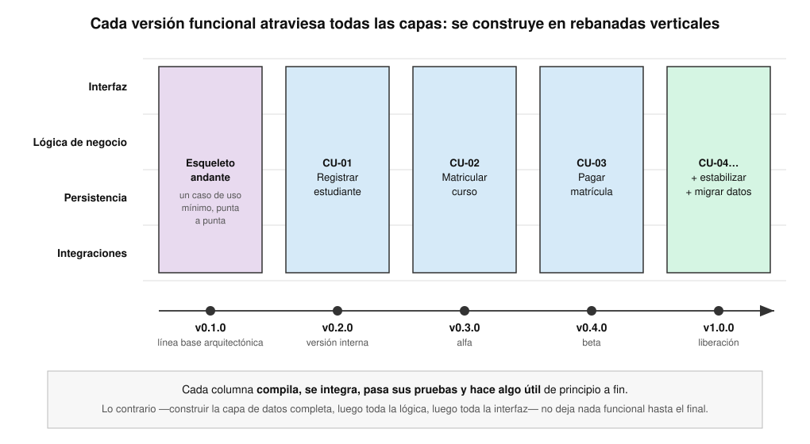
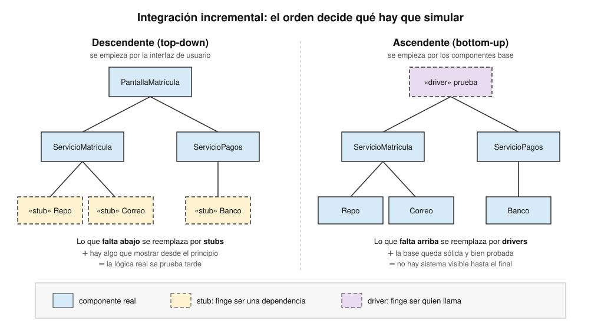
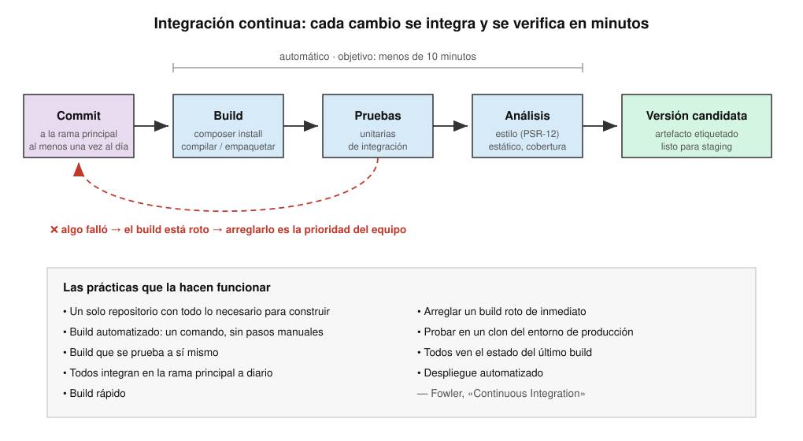

<!-- _class: cover -->
<style scoped>
section {
  --cover: url(../assets/img_00024_.png);
}
</style>
# Construcción
## Contenidos
- Fundamentos de construcción
- Prototipos en la etapa de diseño
- Transición del diseño a la implementación
- Versiones funcionales del sistema
- Integración de subsistemas y del sistema

> Curso **Análisis y Diseño de Sistemas** <br>II Semestre 2026

---

## ¿Dónde estamos?

- Ya tenemos **qué** construir: requerimientos, casos de uso, modelo de dominio
- Ya tenemos **cómo** construirlo: arquitectura, subsistemas, clases de diseño, modelo de datos
- Falta lo que el cliente de verdad paga: **software que funcione**

<div class="grid">
<div>

### 🏗️ Diseño
*Decide* la estructura
Clases con firmas, interfaces, componentes
</div>
<div>

### ⌨️ Construcción
*Materializa* la estructura
Código, pruebas, depuración, integración
</div>
<div>

### 🚀 Entrega
*Pone en manos* del usuario
Versiones, despliegue, operación
</div>
</div>

- ⚠️ La construcción es donde el diseño **se pone a prueba**: lo que se dibujó mal aparece como código que no encaja. Lo que no se dibujó, se improvisa

---

<!-- _class: cover -->
<style scoped>
section {
  --cover: url(../assets/img_00027_.png);
}
</style>
# Fundamentos de construcción
## Contenidos
- Qué es la construcción de software
- Construcción y ciclo de vida
- Los cinco fundamentos
- Gestión y calidad de la construcción

---

## ¿Qué es la construcción de software?

<steps>
<step>

### La definición

> «La construcción de software es la **creación detallada de software funcional** mediante una combinación de codificación, verificación, pruebas unitarias, pruebas de integración y depuración»
> — *SWEBOK v3, capítulo 3*

- No es «teclear el diseño»: en la construcción se toman **cientos de decisiones pequeñas** que el diseño no cubre
- Es la actividad que produce **el único artefacto que no se puede omitir**: el código

</step>
<step>

### Las actividades que la componen

<div class="grid">
<div>

### ✍️ Codificar
Escribir el código fuente siguiendo el diseño y los estándares
</div>
<div>

### 🔍 Verificar
Revisiones de código, análisis estático, programación en pareja
</div>
<div>

### 🧪 Probar
Pruebas **unitarias** y de **integración** escritas por quien construye
</div>
<div>

### 🐞 Depurar
Encontrar la causa de un defecto, no solo el síntoma
</div>
<div>

### 🔗 Integrar
Unir las piezas en un sistema que compila y funciona
</div>
</div>

</step>
</steps>

---

## Construcción y ciclo de vida

<split-slide style="--left: 50%; --right: 50%;">
<div>

### Ciclos lineales (cascada)
- La construcción ocurre **después** de un diseño completo
- Se trata como una actividad casi mecánica: el diseño ya decidió todo
- La integración ocurre **al final**, de una sola vez
- ⚠️ Los errores de diseño se descubren tarde, cuando corregirlos es caro

</div>
<div>

### Ciclos iterativos (RUP, ágiles)
- Diseño y construcción **se entrelazan** en cada iteración
- Cada iteración termina con una **versión que funciona**
- La integración es **continua**
- 💡 El código retroalimenta al diseño: si algo no encaja, se corrige el modelo en la siguiente iteración

</div>
</split-slide>

| Fase de RUP | Peso de la construcción | Lo que se construye |
|:--|:--|:--|
| **Inicio** | Bajo | Prototipos para decidir si el proyecto es viable |
| **Elaboración** | Medio | La **arquitectura ejecutable**: el esqueleto que prueba las decisiones grandes |
| **Construcción** | **Máximo** | Los casos de uso restantes, versión tras versión |
| **Transición** | Bajo | Correcciones, ajustes y la versión final |

---

## Los cinco fundamentos

- El SWEBOK reúne en cinco principios lo que distingue construir bien de «hacer que funcione»

<div class="grid">
<div>

### 🧩 Minimizar la complejidad
Nadie retiene mucha información a la vez. El código se escribe para **ser leído**
</div>
<div>

### 🔄 Anticipar el cambio
El software **va a cambiar**. Hay que construirlo para que cambiar no duela
</div>
<div>

### ✅ Construir para verificar
Que los defectos se puedan **encontrar fácil**: pruebas, revisiones, aserciones
</div>
<div>

### ♻️ Reutilizar
Aprovechar lo que ya existe y construir lo nuevo para que **se pueda aprovechar**
</div>
<div>

### 📏 Aplicar estándares
Acordar **una sola manera** de hacer las cosas: formato, nombres, interfaces, notación
</div>
</div>

---

## Minimizar la complejidad

<split-slide style="--left: 50%; --right: 50%; --font-size: 0.95rem;">
<div>

### Complejo

```php
function p($d, $t) {
    if ($t == 1) {
        if ($d > 7) {
            return ($d - 7) * 100;
        }
    } else {
        if ($d > 30) {
            return ($d - 30) * 50;
        }
    }
    return 0;
}
```

- ¿Qué es `p`? ¿Qué es `$t == 1`? ¿Qué significan `7` y `100`?
- Para entenderlo hay que **ejecutarlo en la cabeza**

</div>
<div>

### Simple

```php
function calcularMulta(
    int $diasPrestado,
    TipoUsuario $tipo,
): int {
    $atraso = $diasPrestado - $tipo->plazoDias();

    if ($atraso <= 0) {
        return 0;
    }

    return $atraso * $tipo->multaPorDia();
}
```

- Nombres del **dominio**, sin números mágicos
- Una sola responsabilidad y un solo nivel de abstracción
- Se lee **de arriba abajo**, como un párrafo

</div>
</split-slide>

- 💡 Técnicas: nombres que revelan la intención · funciones cortas · retornos tempranos · evitar estructuras «ingeniosas» · eliminar código muerto

---

## Anticipar el cambio y construir para verificar

<split-slide style="--left: 50%; --right: 50%; --font-size: 0.82rem;">
<div>

### Difícil de probar y de cambiar

```php
class ServicioPrestamo
{
    public function prestar(Ejemplar $e): Prestamo
    {
        $hoy = new DateTimeImmutable();
        $db  = new MySqlConexion('10.0.0.5');
        // ...
    }
}
```

- La fecha es **siempre hoy**: ¿cómo se prueba un préstamo vencido?
- La base de datos está **cableada**: cambiarla obliga a editar esta clase

</div>
<div>

### Preparado para ambos

```php
class ServicioPrestamo
{
    public function __construct(
        private Reloj $reloj,
        private RepositorioPrestamos $prestamos,
    ) {}

    public function prestar(Ejemplar $e): Prestamo
    {
        $hoy = $this->reloj->hoy();
        // ...
    }
}
```

- En una prueba se inyecta un `RelojFijo` y un repositorio en memoria
- Cambiar MySQL por otra cosa es **otra implementación**, no otra edición

</div>
</split-slide>

- 🔑 Las mismas decisiones que facilitan las pruebas son las que facilitan el cambio: **dependencias explícitas** e **interfaces** en los puntos que pueden variar

---

## Reutilizar y aplicar estándares

<split-slide style="--left: 50%; --right: 50%;">
<div>

### ♻️ Reutilización

| Tipo | Ejemplo |
|:--|:--|
| **Con** reutilización | Usar Laravel, Pest, una librería de fechas de Packagist |
| **Para** reutilización | Escribir un componente de pagos que usen tres sistemas |

- ⚠️ Cada dependencia es **una decisión**: licencia, mantenimiento, seguridad, tamaño
- 💡 Regla de tres: la **tercera** vez que se repite algo, se generaliza

</div>
<div>

### 📏 Estándares en construcción

| Área | Ejemplo |
|:--|:--|
| **Formato** | PSR-12 |
| **Autocarga** | PSR-4: un archivo por clase, espacio de nombres = carpeta |
| **Nombres** | `PascalCase` clases, `camelCase` métodos |
| **Notación** | UML para comunicar el diseño |
| **Interfaces** | HTTP/REST, JSON, OpenAPI |
| **Proceso** | Convención de commits, revisión obligatoria |

- 💡 El mejor estándar es el que **una herramienta aplica sola** (PHP-CS-Fixer, Pint)

</div>
</split-slide>

---

## Gestión y calidad de la construcción

<steps>
<step>

### Planificar y medir

- **Plan de construcción**: en qué orden se construyen los componentes, quién los construye y cuándo se integran — lo dicta el **diseño**, no el gusto de cada quien
- **Qué se mide**

| Métrica | Qué indica |
|:--|:--|
| Defectos encontrados y corregidos | La calidad y la estabilidad del producto |
| Cobertura de pruebas | Qué parte del código ejecutan las pruebas (no que esté **bien** probado) |
| Complejidad ciclomática | Qué funciones son difíciles de entender y de probar |
| Esfuerzo y avance por caso de uso | Si el plan se está cumpliendo |

</step>
<step>

### Las prácticas de calidad

<div class="grid">
<div>

### 👀 Revisión de código
Otra persona lee el cambio **antes** de que entre a la rama principal
</div>
<div>

### 👥 Programación en pareja
Revisión continua mientras se escribe
</div>
<div>

### 🤖 Análisis estático
PHPStan, linters: encuentran errores sin ejecutar
</div>
<div>

### 🧪 Pruebas primero
TDD: la prueba define qué debe hacer el código antes de escribirlo
</div>
</div>

- ⚠️ **Deuda técnica**: cada atajo que se toma «por ahora» se paga después con intereses. Se vale endeudarse, pero **a conciencia y con registro**

</step>
</steps>

---

<!-- _class: cover -->
<style scoped>
section {
  --cover: url(../assets/img_00030_.png);
}
</style>
# Prototipos en la etapa de diseño
## Contenidos
- Prototipo de requerimientos vs. prototipo de diseño
- Tipos de prototipo técnico
- El ciclo de un prototipo
- Desechable o evolutivo

---

## Dos prototipos, dos preguntas

<split-slide style="--left: 50%; --right: 50%;">
<div>

### 🧑‍💼 Prototipo de requerimientos
*Ya lo vimos en ingeniería de requerimientos*

- Pregunta: **¿esto es lo que el usuario necesita?**
- Lo evalúa: el **usuario**
- Suele ser: pantallas, bocetos, maquetas navegables
- Resultado: requerimientos corregidos

</div>
<div>

### 🛠️ Prototipo de diseño
*El tema de hoy*

- Pregunta: **¿esta solución técnica funciona?**
- Lo evalúa: el **equipo técnico**
- Suele ser: código mínimo, sin interfaz pulida
- Resultado: una **decisión de diseño** respaldada con evidencia

</div>
</split-slide>

- 🔑 En diseño, un prototipo existe para **reducir un riesgo técnico** antes de que la arquitectura dependa de él
- 💡 Preguntas típicas: ¿alcanza el rendimiento? ¿se puede integrar con el sistema X? ¿esta librería hace lo que promete? ¿el equipo puede aprender esta tecnología a tiempo?

---

## Tipos de prototipo técnico

| Tipo | Qué es | Pregunta típica | Destino |
|:--|:--|:--|:--|
| **Prueba de concepto** (PoC) | Demuestra que una idea es **posible** | ¿Se puede firmar digitalmente un PDF desde PHP? | Se desecha |
| **Spike** | Investigación con tiempo acotado sobre **una** incógnita | ¿Cuánto tarda la API del banco en responder? | Se desecha; queda el conocimiento |
| **Prototipo arquitectónico** | Implementa los caminos **críticos** de la arquitectura | ¿Las capas y la base de datos soportan la carga de matrícula? | Suele evolucionar |
| **Esqueleto andante** | La versión más pequeña que recorre **todas las capas** de punta a punta | ¿Están bien cableadas las piezas y el despliegue? | Evoluciona: es la v0.1 |
| **Prototipo de interfaz** | Pantallas navegables | ¿El flujo de navegación tiene sentido? | Se desecha o se vuelve la guía de estilo |

<div class="grid">
<div>

### ↔️ Horizontal
Mucha **amplitud**, poca profundidad: todas las pantallas, ninguna lógica real
</div>
<div>

### ↕️ Vertical
Poca amplitud, mucha **profundidad**: una función, pero completa hasta la base de datos
</div>
</div>

---

## El ciclo de un prototipo de diseño

<steps>
<step>

### Seis pasos

1. **Formular la pregunta** — una sola, concreta, que se pueda responder sí o no
2. **Fijar el criterio de éxito** — medible: «menos de 300 ms con 500 usuarios»
3. **Acotar el tiempo** (*timebox*) — dos días, no «hasta que funcione»
4. **Construir lo mínimo** que responde la pregunta, nada más
5. **Medir** contra el criterio y **decidir**
6. **Registrar** la decisión (un ADR) y **desechar** o **evolucionar** el código

</step>
<step>

### Un ejemplo

- **Contexto**: el catálogo de la biblioteca tiene 400 000 títulos; se espera un pico de 150 búsquedas por segundo al inicio de semestre
- **Pregunta**: ¿basta una búsqueda con `LIKE` en MySQL o hace falta un índice de texto completo?
- **Criterio**: el 95 % de las búsquedas en menos de 500 ms
- **Tiempo**: 2 días · un script que carga datos sintéticos y una prueba de carga
- **Resultado**: `LIKE '%texto%'` tarda 2,1 s; `FULLTEXT` responde en 80 ms
- **Decisión** (ADR-007): se usa `FULLTEXT` de MySQL; se descarta un motor de búsqueda externo porque no hace falta todavía

- 💡 El prototipo costó 2 días. Descubrirlo en producción habría costado un semestre de quejas

</step>
</steps>

---

## ¿Desechable o evolutivo?

| | Desechable | Evolutivo |
|:--|:--|:--|
| **Propósito** | Aprender, responder una pregunta | Ser la base del producto |
| **Calidad del código** | La mínima necesaria | La del producto final: pruebas, estándares, revisión |
| **Velocidad** | Muy rápido | Más lento |
| **Qué se conserva** | El **conocimiento** y la decisión | El **código** |
| **Ejemplos** | PoC, spike | Esqueleto andante, prototipo arquitectónico |

- ⚠️ El riesgo clásico: un prototipo desechable que **se queda en producción** porque «ya funciona». Nació sin pruebas, sin manejo de errores y sin seguridad
- 🔑 La decisión se toma **antes** de escribir la primera línea, no después
- 💡 Truco práctico: construir el desechable en una **rama o repositorio aparte**, o incluso en otro lenguaje, para que sea imposible «promoverlo»

---

<!-- _class: cover -->
<style scoped>
section {
  --cover: url(../assets/img_00031_.png);
}
</style>
# Transición del diseño a la implementación
## Contenidos
- El modelo de implementación
- De la clase UML a la clase PHP
- Asociaciones, multiplicidad, agregación y composición
- Herencia y clases asociación
- De la secuencia a los métodos · de los paquetes a las carpetas
- Ingeniería directa e inversa

---

## El modelo de implementación

<split-slide style="--left: 50%; --right: 50%;">
<div>

### Qué es
- Describe **cómo se organizan** los elementos del diseño en archivos de código, componentes y artefactos desplegables
- En RUP es el artefacto que produce la disciplina de **implementación**
- Se representa con diagramas de **componentes** y de **despliegue**
- Cada elemento debe poder **rastrearse** al diseño

</div>
<div>

### Qué se traduce en qué

| Diseño | Implementación |
|:--|:--|
| Subsistema | Paquete / módulo / carpeta |
| Clase de diseño | Clase en un archivo |
| Interfaz | `interface` |
| Clase entidad | Modelo + tabla |
| Clase límite | Controlador, vista, API |
| Clase control | Servicio, caso de uso |
| Nodo de despliegue | Servidor, contenedor |

</div>
</split-slide>

- 🔑 El diseño y el código **no son dos verdades**: si el código se aparta del modelo, se actualiza el modelo o se corrige el código. Lo que no se vale es que convivan contradiciéndose

---

## De la clase UML a la clase PHP

<split-slide style="--left: 42%; --right: 58%; --font-size: 0.85rem;">
<div>

### El diagrama

```text
┌──────────────────────────────┐
│          Mascota             │  ← cursiva: abstracta
├──────────────────────────────┤
│ - nombre: string             │
│ - nacimiento: Date           │
│ # peso: float                │
│ - total: int  (subrayado)    │  ← estático
├──────────────────────────────┤
│ + edad(): int                │
│ + especie(): string  {abs}   │
└──────────────────────────────┘
```

| UML | PHP |
|:--|:--|
| `+` público | `public` |
| `-` privado | `private` |
| `#` protegido | `protected` |
| subrayado | `static` |
| cursiva | `abstract` |

</div>
<div>

### El código

```php
<?php

namespace App\Models;

abstract class Mascota
{
    private static int $total = 0;

    public function __construct(
        private string $nombre,
        private DateTimeImmutable $nacimiento,
        protected float $peso,
    ) {
        self::$total++;
    }

    public function edad(): int
    {
        return $this->nacimiento
            ->diff(new DateTimeImmutable())->y;
    }

    abstract public function especie(): string;
}
```

</div>
</split-slide>

---

## Asociaciones y multiplicidad

<split-slide style="--left: 50%; --right: 50%; --font-size: 0.78rem;">
<div>

### Unidireccional: `Cita → Veterinario`
Solo la cita conoce al veterinario

```php
class Cita
{
    public function __construct(
        private DateTimeImmutable $fecha,
        private Veterinario $veterinario, // 1
        private ?Sala $sala = null,       // 0..1
    ) {}
}
```

| Multiplicidad | En PHP |
|:--|:--|
| `1` | Propiedad obligatoria, en el constructor |
| `0..1` | Propiedad *nullable*: `?Tipo` |
| `*` · `1..*` | `array` o colección + métodos para agregar |

</div>
<div>

### Bidireccional: `Dueño ↔ Mascota`
Cada lado conoce al otro: **hay que mantenerlos sincronizados**

```php
class Dueno
{
    /** @var Mascota[] */
    private array $mascotas = [];      // 0..*

    public function adoptar(Mascota $m): void
    {
        $this->mascotas[] = $m;
        $m->asignarDueno($this);       // el otro lado
    }
}

class Mascota
{
    private ?Dueno $dueno = null;      // 0..1

    public function asignarDueno(Dueno $d): void
    {
        $this->dueno = $d;
    }
}
```

</div>
</split-slide>

- 💡 Prefiera la **unidireccional**: cada flecha doble es una invariante más que cuidar

---

## Agregación y composición en código

<split-slide style="--left: 50%; --right: 50%; --font-size: 0.9rem;">
<div>

### ◇ Agregación: `Clínica ◇— Veterinario`
El veterinario **existe por su cuenta** y puede estar en varias clínicas

```php
class Clinica
{
    /** @var Veterinario[] */
    private array $veterinarios = [];

    // recibe un objeto que ya existía
    public function contratar(Veterinario $v): void
    {
        $this->veterinarios[] = $v;
    }
}
```

- Si la clínica desaparece, los veterinarios **siguen existiendo**

</div>
<div>

### ◆ Composición: `Expediente ◆— Consulta`
La consulta **nace y muere** con su expediente

```php
class Expediente
{
    /** @var Consulta[] */
    private array $consultas = [];

    // el todo CREA la parte: nadie más la tiene
    public function registrarConsulta(
        DateTimeImmutable $fecha,
        string $diagnostico,
    ): Consulta {
        $c = new Consulta($fecha, $diagnostico);
        $this->consultas[] = $c;
        return $c;
    }
}
```

- En base de datos: `ON DELETE CASCADE` desde el expediente

</div>
</split-slide>

- 🔑 La diferencia no está en la sintaxis sino en **quién crea la parte** y **quién más puede tenerla**

---

## Generalización y clase asociación

<split-slide style="--left: 45%; --right: 55%; --font-size: 0.85rem;">
<div>

### Generalización → `extends`

```php
class Perro extends Mascota
{
    public function __construct(
        string $nombre,
        DateTimeImmutable $nacimiento,
        float $peso,
        private string $raza,
    ) {
        parent::__construct(
            $nombre, $nacimiento, $peso
        );
    }

    public function especie(): string
    {
        return 'Canino';
    }
}
```

- Realización (`- - -▷`) → `implements`

</div>
<div>

### Clase asociación → una clase más
`Mascota * —— * Vacuna`, y de **cada aplicación** interesa la fecha y la dosis

```php
class Aplicacion   // la clase asociación
{
    public function __construct(
        private Mascota $mascota,
        private Vacuna $vacuna,
        private DateTimeImmutable $fecha,
        private float $dosisMl,
    ) {}
}
```

- En la base de datos se vuelve la **tabla intermedia** con columnas propias
- En Eloquent:

```php
return $this->belongsToMany(Vacuna::class, 'aplicaciones')
            ->withPivot('fecha', 'dosis_ml');
```

</div>
</split-slide>

---

## De la secuencia a los métodos

<split-slide style="--left: 45%; --right: 55%; --font-size: 0.9rem;">
<div>

### La regla
- Cada **mensaje** que llega a un objeto en el diagrama de secuencia es un **método público** de su clase
- Los parámetros del mensaje son los **parámetros** del método; el retorno punteado es el **tipo de retorno**
- El orden vertical de los mensajes es el **orden de las instrucciones**
- Un fragmento `alt` es un `if`; un `loop`, un `foreach`

```text
:FormCita  :ServicioCitas  :Agenda   :RepoCitas
   │ agendar(datos) │           │          │
   │──────────────▶│ libre(f,v)│          │
   │               │──────────▶│          │
   │               │◀─ ─ bool ─│          │
   │               │ guardar(cita)        │
   │               │─────────────────────▶│
```

</div>
<div>

### El código que resulta

```php
class ServicioCitas               // «control»
{
    public function __construct(
        private Agenda $agenda,
        private RepositorioCitas $citas,
    ) {}

    public function agendar(DatosCita $d): Cita
    {
        if (! $this->agenda->libre(
                $d->fecha, $d->veterinario)) {
            throw new HorarioOcupado();   // alt
        }

        $cita = new Cita($d->fecha, $d->veterinario);
        $this->citas->guardar($cita);

        return $cita;
    }
}
```

</div>
</split-slide>

---

## De los paquetes a las carpetas

<split-slide style="--left: 50%; --right: 50%; --font-size: 0.95rem;">
<div>

### Clases de análisis → estructura del proyecto

```text
app/
├── Http/Controllers/     ← «boundary»
│   └── CitaController.php
├── Services/             ← «control»
│   └── ServicioCitas.php
├── Models/               ← «entity»
│   ├── Cita.php
│   ├── Mascota.php
│   └── Dueno.php
└── Contracts/            ← interfaces
    └── RepositorioCitas.php
database/migrations/      ← modelo de datos
tests/
├── Unit/                 ← pruebas por clase
└── Feature/              ← pruebas de integración
```

</div>
<div>

### Reglas que conviene respetar
- **Un archivo por clase**, con el mismo nombre (PSR-4)
- El **espacio de nombres** refleja la carpeta: `App\Services\ServicioCitas`
- Las dependencias entre carpetas siguen la **dirección de las capas** del diseño: un modelo nunca usa un controlador
- Si el diseño tiene subsistemas, cada uno puede ser un **módulo** con su propia estructura interna

- 💡 En el proyecto del curso, cada clase del diagrama es un **modelo** de la carpeta `app/Models`, y se instancia desde una **prueba** en `tests/`

</div>
</split-slide>

---

## Instanciar el diseño desde una prueba

<split-slide style="--left: 50%; --right: 50%; --font-size: 0.95rem;">
<div>

### Por qué en una prueba
- Una prueba es el **primer cliente** del código: si instanciar las clases es incómodo, el diseño tiene un problema
- Documenta **cómo se usa** cada clase
- Verifica las relaciones del diagrama: multiplicidad, navegabilidad, composición
- Se ejecuta en segundos con `./vendor/bin/pest`

</div>
<div>

### Pest

```php
test('un dueño adopta una mascota', function () {
    $ana = new Dueno('Ana Mora');
    $luna = new Perro(
        'Luna',
        new DateTimeImmutable('2021-03-10'),
        12.5,
        'Beagle',
    );

    $ana->adoptar($luna);

    expect($ana->mascotas())->toContain($luna)
        ->and($luna->dueno())->toBe($ana)
        ->and($luna->especie())->toBe('Canino');
});
```

</div>
</split-slide>

- 🔑 La prueba comprueba la **bidireccionalidad**: si `adoptar()` olvidara el otro lado, la segunda expectativa fallaría

---

## Ingeniería directa, inversa y de ida y vuelta

| Dirección | Qué hace | Cuándo sirve | Herramienta |
|:--|:--|:--|:--|
| **Directa** (*forward*) | Genera **esqueletos de código** desde el diagrama de clases | Al iniciar un módulo con muchas clases | Visual Paradigm, StarUML, Enterprise Architect |
| **Inversa** (*reverse*) | Genera **diagramas** a partir del código existente | Documentar o entender un sistema heredado | Visual Paradigm, PhpStorm, `phpuml` |
| **Ida y vuelta** (*round-trip*) | Sincroniza en ambos sentidos | Cuando el modelo se mantiene vivo durante todo el proyecto | Visual Paradigm, Enterprise Architect |

- ⚠️ La generación produce **estructura**, no comportamiento: firmas, atributos, relaciones. La lógica la escribe una persona
- ⚠️ El modelo E-R también se puede generar desde la base de datos (inversa) o producir las migraciones (directa). Revise siempre lo que genera: las herramientas no conocen sus reglas de negocio
- 💡 En la práctica, los equipos modelan **lo arquitectónicamente significativo** y dejan que el código sea la fuente de verdad del detalle

---

## Errores frecuentes en la transición

<div class="grid">
<div>

### 🧱 Getters y setters para todo
Convierte cada clase en una estructura de datos. El comportamiento termina en otro lado
</div>
<div>

### 🔀 Bidireccional sin sincronizar
Un lado dice que la mascota tiene dueño; el otro no la tiene en su lista
</div>
<div>

### 🧬 Herencia donde iba asociación
`Veterinario extends Persona` está bien; `Cita extends Veterinario` no
</div>
<div>

### 📦 Composición sin dueño
La parte se crea afuera y se comparte: ya no es composición
</div>
<div>

### 🗄️ Diseñar desde la tabla
Las clases copian las columnas y pierden las reglas del dominio
</div>
<div>

### 📝 Diagrama y código divorciados
Nadie actualiza el modelo; a los tres meses nadie le cree
</div>
</div>

---

## Actividad 1: del diagrama al código

<split-slide style="--left: 50%; --right: 50%;">
<div>

### El escenario
En la universidad, un **curso** tiene un código y un nombre, y se ofrece en uno o varios **grupos** cada semestre. Un grupo tiene un número y un cupo, y no existe sin su curso. Cada grupo lo imparte un **docente**; al docente no le interesa saber qué grupos tiene.

Un **estudiante** se matricula en varios grupos, y un grupo tiene muchos estudiantes. De cada matrícula interesa la **fecha** y la **nota final**.

</div>
<div>

### Qué entregar
1. El **diagrama de clases** con multiplicidad, navegabilidad y tipo de relación
2. El **código PHP** de las clases, en `app/Models`
3. Una **prueba Pest** que cree un grupo con dos estudiantes matriculados
4. Las **tablas** que resultarían

### Preguntas de control
- ¿Qué relación es composición y por qué?
- ¿Qué asociación es unidireccional?
- ¿Dónde vive la nota?

</div>
</split-slide>

- ⏱️ 25 minutos · en parejas

---

## Actividad 1: una solución posible

<hidden label="Solución">

<split-slide style="--left: 38%; --right: 62%; --font-size: 0.78rem;">
<div>

### Las decisiones
- `Curso ◆— 1..* Grupo`: **composición**, el grupo no existe sin su curso
- `Grupo → 1 Docente`: **unidireccional**, el docente no navega a sus grupos
- `Estudiante * —— * Grupo` con la clase asociación **`Matricula`** (fecha, nota): la nota no es del estudiante ni del grupo, es **de la relación**

### Las tablas
`cursos` · `grupos` (FK `curso_id`, `ON DELETE CASCADE`; FK `docente_id`) · `docentes` · `estudiantes` · `matriculas` (FK `estudiante_id`, FK `grupo_id`, `fecha`, `nota`)

</div>
<div>

```php
class Curso {
    private array $grupos = [];
    public function __construct(private string $codigo, private string $nombre) {}
    public function abrirGrupo(int $numero, int $cupo, Docente $d): Grupo {
        $g = new Grupo($this, $numero, $cupo, $d);   // composición: el curso crea
        $this->grupos[] = $g;
        return $g;
    }
}
class Grupo {
    private array $matriculas = [];
    public function __construct(private Curso $curso, private int $numero,
                                private int $cupo, private Docente $docente) {}
    public function matricular(Estudiante $e, DateTimeImmutable $f): Matricula {
        if (count($this->matriculas) >= $this->cupo) throw new GrupoLleno();
        return $this->matriculas[] = new Matricula($e, $this, $f);
    }
    public function matriculas(): array { return $this->matriculas; }
}
class Matricula {
    private ?float $nota = null;
    public function __construct(private Estudiante $estudiante,
                                private Grupo $grupo, private DateTimeImmutable $fecha) {}
}

test('un grupo matricula a dos estudiantes', function () {
    $g = (new Curso('IF-7100', 'Ingeniería de Software'))
        ->abrirGrupo(1, 30, new Docente('D. Solís'));
    $g->matricular(new Estudiante('B12345'), new DateTimeImmutable());
    $g->matricular(new Estudiante('C67890'), new DateTimeImmutable());
    expect($g->matriculas())->toHaveCount(2);
});
```

</div>
</split-slide>

</hidden>

---

<!-- _class: cover -->
<style scoped>
section {
  --cover: url(../assets/img_00032_.png);
}
</style>
# Versiones funcionales del sistema
## Contenidos
- Qué es una versión funcional
- Construcción incremental por rebanadas verticales
- Qué entra en cada versión
- Tipos de versión y versionado semántico
- Gestión de configuración

---

## ¿Qué es una versión funcional?

<steps>
<step>

### La idea

- Una **versión funcional** es un estado del sistema que **compila, está integrado, pasa sus pruebas y hace algo útil** de principio a fin
- No es «el 60 % del código escrito»: es un subconjunto del sistema que **ya funciona**
- En RUP, cada iteración termina con una **versión ejecutable**; en Scrum, cada sprint con un **incremento** utilizable

</step>
<step>

### Por qué construir así

<div class="grid">
<div>

### 👁️ Visibilidad
El avance se mide en **funcionalidad que corre**, no en porcentajes de avance declarados
</div>
<div>

### 🧪 Retroalimentación
El usuario prueba algo real **meses antes** del final
</div>
<div>

### 🎯 Riesgo
Los problemas de integración aparecen **en cada iteración**, no al final
</div>
<div>

### 🛟 Seguro
Si el proyecto se corta, queda **algo que sirve**
</div>
</div>

</step>
</steps>

---

## Construir en rebanadas verticales

[](../assets/ads-con-incrementos.svg)

---

## ¿Qué entra en cada versión?

<split-slide style="--left: 50%; --right: 50%;">
<div>

### Criterios para ordenar
1. **Riesgo arquitectónico** primero: los casos de uso que ponen a prueba las decisiones grandes van en la línea base
2. **Valor para el negocio** después: lo que el usuario más necesita
3. **Dependencias**: no se puede pagar una matrícula que no existe
4. **Capacidad** del equipo en la iteración

</div>
<div>

### Partir casos de uso grandes
- Un caso de uso no tiene que entrar **completo**
- Versión 1: el **flujo básico**
- Versión 2: los **flujos alternos** más frecuentes
- Versión 3: las **excepciones** y los casos raros

- 💡 Así una versión siempre entrega algo que funciona, aunque sea el camino feliz

</div>
</split-slide>

| Versión | Contenido | Por qué en ese orden |
|:--|:--|:--|
| **v0.1** | Esqueleto: iniciar sesión y consultar cursos | Prueba capas, base de datos, despliegue |
| **v0.2** | Matricular — flujo básico | El caso de uso más riesgoso y más valioso |
| **v0.3** | Matricular — choques de horario y requisitos | Flujos alternos del anterior |
| **v0.4** | Pagar matrícula | Depende de matricular; integra con el banco |

---

## Tipos de versión

| Tipo | Para quién | Qué garantiza |
|:--|:--|:--|
| **Build** (diario, por commit) | El equipo | Compila y pasa las pruebas automáticas |
| **Versión interna** / de iteración | El equipo y el cliente en la revisión | Los casos de uso planificados funcionan |
| **Alfa** | Usuarios internos o de prueba | Funcionalidad casi completa; se esperan defectos |
| **Beta** | Un grupo de usuarios reales | Funcionalidad completa; se busca retroalimentación de uso |
| **Candidata** (*release candidate*) | Pruebas de aceptación | Lista para salir si no aparecen defectos graves |
| **Liberación** (*release*, GA) | Todos los usuarios | La versión oficial, soportada |
| **Parche** (*hotfix*) | Todos | Corrige un defecto urgente sin agregar nada |

- 🔑 Cada tipo tiene un **criterio de salida** explícito. Una beta que nadie sabe cuándo termina es un sistema en producción sin soporte

---

## Versionado semántico

<split-slide style="--left: 50%; --right: 50%;">
<div>

### `MAYOR.MENOR.PARCHE`

| Se incrementa | Cuando… | Ejemplo |
|:--|:--|:--|
| **MAYOR** | Hay cambios **incompatibles** con la versión anterior | `1.4.2 → 2.0.0` |
| **MENOR** | Se agrega funcionalidad **compatible** | `1.4.2 → 1.5.0` |
| **PARCHE** | Se corrigen defectos, compatible | `1.4.2 → 1.4.3` |

- `0.y.z`: desarrollo inicial, **cualquier cosa puede cambiar**
- Sufijos: `2.0.0-beta.1`, `2.0.0-rc.2`

</div>
<div>

### Notas de versión

```markdown
## [0.3.0] - 2026-10-14
### Agregado
- Validación de choque de horario (CU-02, FA-1)
- Validación de requisitos (CU-02, FA-2)

### Corregido
- El cupo no se liberaba al retirar un curso (#41)

### Conocido
- La matrícula no funciona en Safari 15
```

- 💡 Cada línea se puede **rastrear** a un caso de uso o a un defecto

</div>
</split-slide>

---

## Gestión de configuración

<split-slide style="--left: 50%; --right: 50%; --font-size: 0.95rem;">
<div>

### Qué es
- Controlar **qué versión de cada cosa** compone cada versión del sistema: código, configuración, migraciones, dependencias, documentación
- **Línea base**: una versión revisada y acordada que sirve de punto de partida; solo cambia mediante un proceso controlado
- Sin gestión de configuración, la pregunta *«¿qué tiene instalado el cliente?»* no tiene respuesta

### Estrategias de ramas
- **Trunk-based**: todos integran en `main` a diario; ramas cortas. Favorece la integración continua
- **GitFlow**: ramas `develop`, `release/*`, `hotfix/*`. Más control, más fricción

</div>
<div>

### Marcar una versión

```bash
# fijar las dependencias exactas
composer install          # usa composer.lock

# etiquetar la versión
git tag -a v0.3.0 -m "Iteración 3: flujos alternos de matrícula"
git push origin v0.3.0

# reconstruir exactamente esa versión, meses después
git checkout v0.3.0
composer install
php artisan migrate
```

- 🔑 `composer.lock` y las **migraciones** también se versionan: son parte de la configuración

</div>
</split-slide>

---

## Terminado significa terminado

<split-slide style="--left: 50%; --right: 50%; --font-size: 0.95rem;">
<div>

### Definición de terminado
Un caso de uso entra a la versión solo si:

- [x] El código está en la rama principal
- [x] Pasó revisión de código
- [x] Tiene pruebas unitarias y de integración que pasan
- [x] Cumple el estándar (Pint, PHPStan sin errores)
- [x] Las migraciones corren en limpio
- [x] El modelo de diseño está actualizado
- [x] El dueño del producto lo aceptó en la demostración

- ⚠️ «Está listo, solo falta probarlo» significa **no está listo**

</div>
<div>

### Separar desplegar de liberar
Un *feature flag* permite integrar código **inconcluso** sin que el usuario lo vea

```php
if (Feature::active('pago-en-linea')) {
    return $this->pagoEnLinea->iniciar($matricula);
}

return $this->pagoEnVentanilla->generarBoleta($matricula);
```

- El código se integra a diario; la funcionalidad se **enciende** cuando está lista
- ⚠️ Cada bandera es deuda: se elimina cuando la funcionalidad se estabiliza

</div>
</split-slide>

---

<!-- _class: cover -->
<style scoped>
section {
  --cover: url(../assets/img_00033_.png);
}
</style>
# Integración de subsistemas y del sistema
## Contenidos
- Qué es integrar y por qué duele
- Big bang vs. integración incremental
- Stubs y drivers
- El plan de integración
- Integración continua
- Pruebas e integración del sistema

---

## ¿Qué es integrar?

<steps>
<step>

### Tres niveles

| Nivel | Qué se une | Ejemplo |
|:--|:--|:--|
| **De componentes** | Clases y componentes dentro de un subsistema | `ServicioCitas` + `Agenda` + `RepositorioCitas` |
| **De subsistemas** | Subsistemas entre sí, a través de sus **interfaces** | Gestión académica + Pagos + Notificaciones |
| **Del sistema** | El sistema completo con su entorno: sistemas externos, datos reales, infraestructura | El sistema + el banco + el directorio institucional + el servidor de producción |

</step>
<step>

### Por qué duele

- Cada pieza funciona **sola**; los defectos viven **entre** las piezas
- Causas típicas en las interfaces:
  - Supuestos distintos: ¿la fecha viene en UTC o en hora local? ¿el monto en colones o en céntimos?
  - Contratos mal especificados: ¿qué pasa si el estudiante no existe? ¿excepción, `null`, código 404?
  - Orden y tiempo: el subsistema A llama a B antes de que B esté listo
  - Entornos distintos: «en mi máquina funciona»

- 🔑 Por eso el diseño insiste en **interfaces explícitas**: son el contrato que la integración va a verificar

</step>
</steps>

---

## Big bang vs. incremental

<split-slide style="--left: 50%; --right: 50%;">
<div>

### 💥 Big bang
Se construyen todas las piezas por separado y se **unen al final, de una vez**

- ➕ No hay que escribir stubs ni drivers
- ➖ Cuando algo falla, **cualquier** interfaz puede ser la culpable
- ➖ Los defectos aparecen todos juntos, al final, sin tiempo
- ⚠️ Solo es razonable en sistemas **muy pequeños**

</div>
<div>

### 🧱 Incremental
Se integra **una pieza a la vez** y se prueba antes de agregar la siguiente

- ➕ Si algo falla, el culpable es **lo último que se agregó**
- ➕ Siempre hay una versión funcional
- ➖ Hay que simular lo que todavía no existe
- 💡 Variantes: **descendente**, **ascendente**, **sándwich** y **por casos de uso**

</div>
</split-slide>

---

## Descendente y ascendente

[](../assets/ads-con-integracion.svg)

---

## Sándwich y por casos de uso

<split-slide style="--left: 50%; --right: 50%;">
<div>

### 🥪 Sándwich (mixta)
- Se integra **desde arriba y desde abajo a la vez**, y se encuentran en una capa intermedia
- Un equipo trabaja la interfaz con stubs; otro, la persistencia con drivers
- ➕ Combina ventajas de ambas
- ➖ La capa intermedia se prueba tarde

</div>
<div>

### 🧵 Por casos de uso (por hilos)
- Se integran **todas las piezas que necesita un caso de uso**, de punta a punta
- Es exactamente la **rebanada vertical** de las versiones funcionales
- ➕ Cada integración entrega funcionalidad visible
- ➕ Encaja con el desarrollo iterativo: un hilo por iteración
- 💡 Es la estrategia **más usada** hoy

</div>
</split-slide>

| Estrategia | Simula | Primer resultado visible | Cuándo |
|:--|:--|:--|:--|
| Descendente | Lo de abajo (**stubs**) | Pronto | Interfaz y flujo son el riesgo |
| Ascendente | Lo de arriba (**drivers**) | Tarde | Los componentes base son el riesgo |
| Sándwich | Ambos | Medio | Sistemas grandes con varios equipos |
| Por casos de uso | Lo que falta del hilo | Pronto | Desarrollo iterativo |

---

## Stubs y drivers en código

<split-slide style="--left: 50%; --right: 50%; --font-size: 0.9rem;">
<div>

### La interfaz del diseño

```php
interface PasarelaPago
{
    public function cobrar(
        string $cuenta,
        int $montoCentimos,
    ): Comprobante;
}
```

### 🧩 Stub: finge la dependencia
El banco todavía no da acceso a su ambiente de pruebas

```php
class PasarelaPagoStub implements PasarelaPago
{
    public function cobrar(string $cuenta,
                           int $montoCentimos): Comprobante
    {
        return new Comprobante('STUB-0001', $montoCentimos);
    }
}
```

</div>
<div>

### 🚗 Driver: finge a quien llama
Todavía no existe la pantalla de pago; la prueba **la reemplaza**

```php
test('pagar una matrícula genera comprobante', function () {
    $servicio = new ServicioPagos(
        new PasarelaPagoStub(),
        new RepositorioMatriculasEnMemoria(),
    );

    $comprobante = $servicio->pagar(
        matriculaId: 42,
        cuenta: 'CR05015202001026284066',
    );

    expect($comprobante->monto())->toBe(8_500_000);
});
```

- 🔑 Gracias a la **interfaz**, cambiar el stub por la pasarela real es cambiar **una línea** de configuración

</div>
</split-slide>

---

## El plan de integración

<split-slide style="--left: 48%; --right: 52%;">
<div>

### Qué define
- El **orden** en que se integran los componentes y subsistemas
- Qué **stubs y drivers** hacen falta y quién los construye
- Qué **versión funcional** resulta de cada paso
- Qué **pruebas** se ejecutan en cada paso
- En qué **entorno** se integra

### De dónde sale
- Del **diagrama de componentes**: las dependencias dictan el orden
- Del **plan de iteraciones**: qué casos de uso entran en cada versión
- De los **riesgos**: lo más incierto se integra primero

</div>
<div>

### Ejemplo

| Paso | Integra | Simula | Resultado |
|:--|:--|:--|:--|
| 1 | Autenticación + Usuarios + BD | Directorio UCR | v0.1 |
| 2 | + Matrícula | Pagos, Correo | v0.2 |
| 3 | + Directorio UCR real | Pagos, Correo | v0.3 |
| 4 | + Pagos (ambiente de pruebas del banco) | Correo | v0.4 |
| 5 | + Correo | — | v0.5 beta |

- 💡 Las integraciones con **sistemas externos** van lo antes posible: son las que el equipo no controla

</div>
</split-slide>

---

## Integración continua

[](../assets/ads-con-ci.svg)

---

## Integración continua con GitHub Actions

<split-slide style="--left: 56%; --right: 44%; --font-size: 0.9rem;">
<div>

### `.github/workflows/ci.yml`

```yaml
name: CI
on:
  push:
    branches: [main]
  pull_request:

jobs:
  pruebas:
    runs-on: ubuntu-latest
    steps:
      - uses: actions/checkout@v4
      - uses: shivammathur/setup-php@v2
        with:
          php-version: '8.3'
      - run: composer install --no-interaction
      - run: cp .env.example .env
      - run: php artisan key:generate
      - run: ./vendor/bin/pint --test
      - run: ./vendor/bin/pest
```

</div>
<div>

### Qué logra
- **Cada push** y cada *pull request* construye el sistema desde cero en una máquina limpia
- Si el estilo o una prueba fallan, el cambio **no se integra**
- Se elimina el «en mi máquina funciona»: la máquina de referencia es la del CI
- El resultado queda **visible** para todo el equipo en el repositorio

- ⚠️ La integración continua es una **práctica del equipo**, no una herramienta: si nadie integra a diario, el pipeline solo automatiza el big bang

</div>
</split-slide>

---

## Los niveles de prueba en la integración

<split-slide style="--left: 45%; --right: 55%; --font-size: 0.95rem;">
<div>

### La pirámide

| Nivel | Qué verifica | Cuántas | Velocidad |
|:--|:--|:--|:--|
| **Aceptación** | Que resuelve el caso de uso | Pocas | Lentas |
| **Sistema** | El sistema completo en su entorno | Algunas | Lentas |
| **Integración** | Las piezas **juntas** | Bastantes | Medias |
| **Unitaria** | Una clase aislada | Muchas | Milisegundos |

- 💡 Muchas pruebas rápidas abajo, pocas lentas arriba

</div>
<div>

### Una prueba de integración en Laravel
Controlador + servicio + modelo + base de datos, juntos

```php
uses(RefreshDatabase::class);

test('matricular guarda la matrícula', function () {
    $estudiante = Estudiante::factory()->create();
    $grupo = Grupo::factory()->create(['cupo' => 30]);

    $this->actingAs($estudiante->usuario)
        ->post('/matriculas', ['grupo_id' => $grupo->id])
        ->assertCreated();

    $this->assertDatabaseHas('matriculas', [
        'estudiante_id' => $estudiante->id,
        'grupo_id'      => $grupo->id,
    ]);
});
```

</div>
</split-slide>

---

## Integración del sistema

<steps>
<step>

### Los entornos

| Entorno | Para qué | Datos |
|:--|:--|:--|
| **Desarrollo** | Construir y probar localmente | Sintéticos |
| **Integración / QA** | Integrar todo lo de la rama principal; pruebas de sistema | Sintéticos o anonimizados |
| **Preproducción** (*staging*) | Réplica de producción: pruebas de aceptación y de carga | Copia anonimizada de producción |
| **Producción** | Los usuarios reales | Reales |

- 🔑 Cuanto más se parece el entorno de pruebas al de producción, **menos sorpresas** en la liberación

</step>
<step>

### Lo que solo aparece al integrar el sistema completo

<div class="grid">
<div>

### 🌐 Sistemas externos
Tiempos de respuesta, caídas, formatos que la documentación no mencionaba
</div>
<div>

### 🗃️ Datos reales
Volumen, caracteres especiales, registros heredados que rompen las reglas
</div>
<div>

### ⚙️ Configuración
Variables de entorno, certificados, permisos, zona horaria del servidor
</div>
<div>

### 📈 Carga
Lo que funcionaba con 5 usuarios, con 4 000 no
</div>
</div>

- 💡 Después de cada despliegue, una **prueba de humo**: los 5 o 6 caminos críticos, en minutos, para saber si vale la pena seguir probando

</step>
</steps>

---

## Errores frecuentes en la integración

<div class="grid">
<div>

### 💥 Integrar al final
El big bang disfrazado de plan: «la última semana unimos todo»
</div>
<div>

### 🌿 Ramas eternas
Una rama de tres semanas es una integración big bang esperando pasar
</div>
<div>

### 🔴 Build roto normalizado
«Siempre está en rojo, ignórelo». El CI deja de informar
</div>
<div>

### 🤝 Contratos verbales
Dos equipos que «se pusieron de acuerdo» en el pasillo sobre el formato del JSON
</div>
<div>

### 🧪 Stubs eternos
El stub de pagos llega a producción porque nadie integró el real
</div>
<div>

### 🖥️ Entorno distinto
Se prueba en PHP 8.3 y producción corre 8.1
</div>
</div>

---

## Actividad 2: planifica versiones e integración

<split-slide style="--left: 50%; --right: 50%;">
<div>

### El sistema
Clínica veterinaria con estos subsistemas y dependencias:

- **Citas** → usa Expedientes, Notificaciones
- **Expedientes** → usa Mascotas
- **Mascotas** → usa la base de datos
- **Facturación** → usa Citas y la **pasarela de pago** del banco (externa; su ambiente de pruebas estará listo en la semana 6)
- **Notificaciones** → usa el **servicio de SMS** (externo)

Casos de uso: registrar mascota · agendar cita · atender consulta · facturar · recordar cita por SMS

</div>
<div>

### Qué entregar
1. Un **plan de 4 versiones** funcionales: qué casos de uso (o flujos) entran en cada una y por qué
2. La **estrategia de integración** y el **orden** de los subsistemas
3. Los **stubs y drivers** que hacen falta en cada paso
4. El número de versión semántica de cada entrega

### Preguntas de control
- ¿Qué va en el esqueleto andante?
- ¿Qué haría si en la semana 6 el banco no cumple?

</div>
</split-slide>

- ⏱️ 20 minutos · en grupos

---

## Actividad 2: una solución posible

<hidden label="Solución">

| Versión | Casos de uso | Integra | Simula (stub) |
|:--|:--|:--|:--|
| **v0.1.0** esqueleto | Registrar mascota (flujo básico) | Mascotas + BD + despliegue | — |
| **v0.2.0** | Agendar cita · atender consulta | + Expedientes + Citas | Notificaciones |
| **v0.3.0** alfa | Recordar cita por SMS · agendar (flujos alternos) | + Notificaciones + SMS real | Pasarela de pago |
| **v0.4.0** beta | Facturar | + Facturación + pasarela (ambiente de pruebas, semana 6) | — |

- **Estrategia**: por casos de uso, que resulta **ascendente** en el orden de subsistemas (Mascotas → Expedientes → Citas → Facturación), porque las dependencias apuntan hacia abajo
- **Drivers**: las pruebas Pest de cada servicio hacen de driver mientras no exista la interfaz de usuario
- **Esqueleto**: registrar una mascota recorre interfaz, servicio, modelo, base de datos y despliegue: prueba el cableado completo con el caso más simple
- **Si el banco no cumple**: la v0.4 sale con `PasarelaPagoStub` detrás de un *feature flag* y el cobro sigue en ventanilla; la integración real pasa a la siguiente versión y se registra el riesgo
- 🎯 El SMS se integra **antes** que la pasarela porque es externo y está disponible: lo externo, lo antes posible

</hidden>

---

<!-- _class: cover -->
<style scoped>
section {
  --cover: url(../assets/img_00035_.png);
}
</style>
# Cierre
## Contenidos
- Cómo se conecta todo
- Referencias

---

## Cómo se conecta todo

| Viene del diseño | Actividad de construcción | Produce | Lo consume |
|:--|:--|:--|:--|
| Riesgos técnicos, decisiones abiertas | Prototipos de diseño | Evidencia, ADR, esqueleto andante | Arquitectura |
| Clases de diseño, secuencias | Transición a la implementación | Código fuente, pruebas unitarias | Integración |
| Subsistemas e interfaces | Integración | Componentes integrados, stubs, drivers | Versiones |
| Plan de iteraciones, casos de uso | Versiones funcionales | Builds, versiones etiquetadas, notas de versión | Usuario, pruebas de aceptación |
| Diagrama de despliegue | Integración del sistema | Sistema en preproducción y producción | Operación |

<div class="grid">
<div>

### 🧵 Trazabilidad
Caso de uso → clase de diseño → código → prueba → versión. Cada eslabón se puede seguir
</div>
<div>

### 🔁 Iteración
Cada versión retroalimenta el diseño de la siguiente
</div>
<div>

### ✅ Evidencia
Una versión funcional **demuestra** el avance; un informe solo lo **afirma**
</div>
</div>

---

## Referencias

<style scoped>
ul { font-size: 0.82rem; }
ul li { margin-block: 0.15em; }
</style>

- Bourque, P., Fairley, R. (2014). *[Guide to the Software Engineering Body of Knowledge (SWEBOK v3.0)](https://www.computer.org/education/bodies-of-knowledge/software-engineering)*. IEEE Computer Society. {Cap. 3: Construcción de software}
- Washizaki, H. (ed.) (2024). *SWEBOK Guide v4.0*. IEEE Computer Society. {Fundamentos de construcción, integración}
- McConnell, S. (2004). *Code Complete*. 2da. edición. Microsoft Press. {Construcción, estrategias de integración, prototipos}
- Sommerville, I. (2016). *Software Engineering*. 10ma. edición. Pearson. {Prototipado, integración y gestión de versiones}
- Pressman, R., Maxim, B. (2020). *Software Engineering: A Practitioner's Approach*. 9na. edición. McGraw-Hill. {Integración descendente, ascendente y sándwich}
- Kruchten, P. (2003). *The Rational Unified Process: An Introduction*. 3ra. edición. Addison-Wesley. {Modelo de implementación, fases, arquitectura ejecutable}
- Larman, C. (2004). *Applying UML and Patterns*. 3ra. edición. Prentice Hall. {Del diseño al código}
- Humble, J., Farley, D. (2010). *Continuous Delivery*. Addison-Wesley. {Pipeline de despliegue, gestión de configuración}
- Freeman, S., Pryce, N. (2009). *Growing Object-Oriented Software, Guided by Tests*. Addison-Wesley. {Esqueleto andante}
- Fowler, M. (2024). *[Continuous Integration](https://martinfowler.com/articles/continuousIntegration.html)* · *[Feature Toggles](https://martinfowler.com/articles/feature-toggles.html)*
- [Versionado Semántico 2.0.0](https://semver.org/lang/es/) · [Keep a Changelog](https://keepachangelog.com/es-ES/1.1.0/) · [PHP-FIG: PSR-4 y PSR-12](https://www.php-fig.org/psr/)
- [Documentación de Pest](https://pestphp.com/docs) · [Laravel: Eloquent Relationships](https://laravel.com/docs/eloquent-relationships) · [GitHub Actions](https://docs.github.com/actions)

<script src="../assets/steps.js"></script>
<script src="../assets/image-modal.js"></script>
<script src="../assets/hidden.js"></script>
