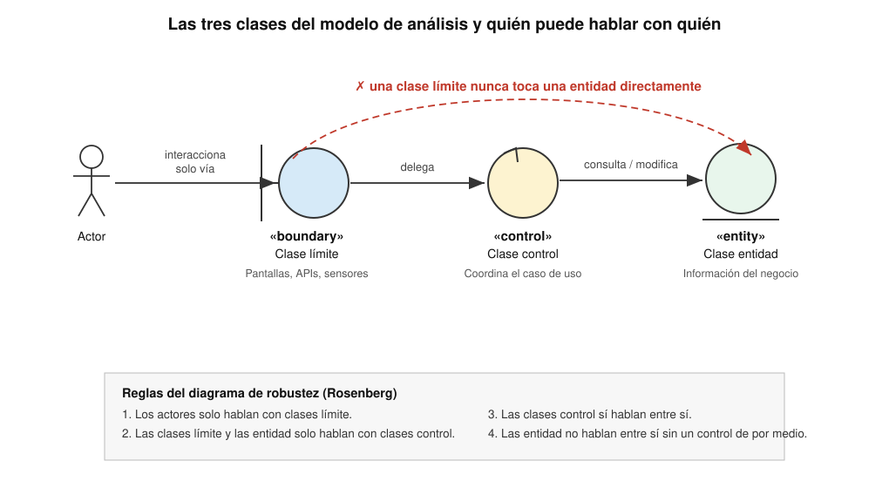
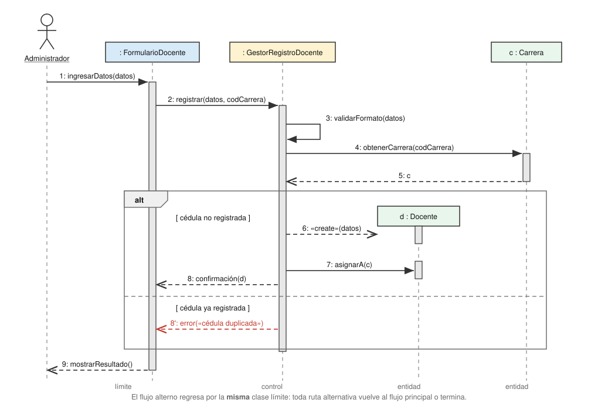
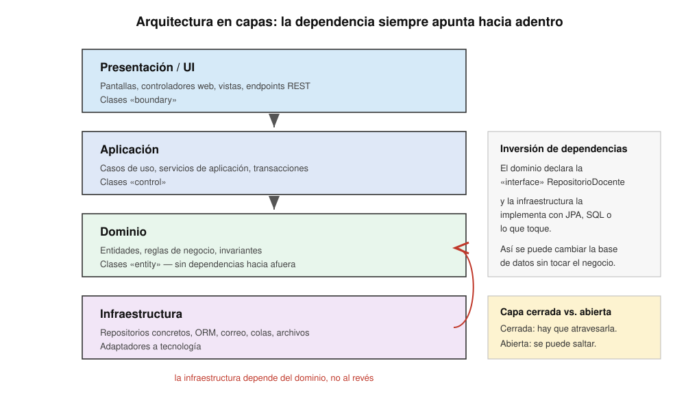
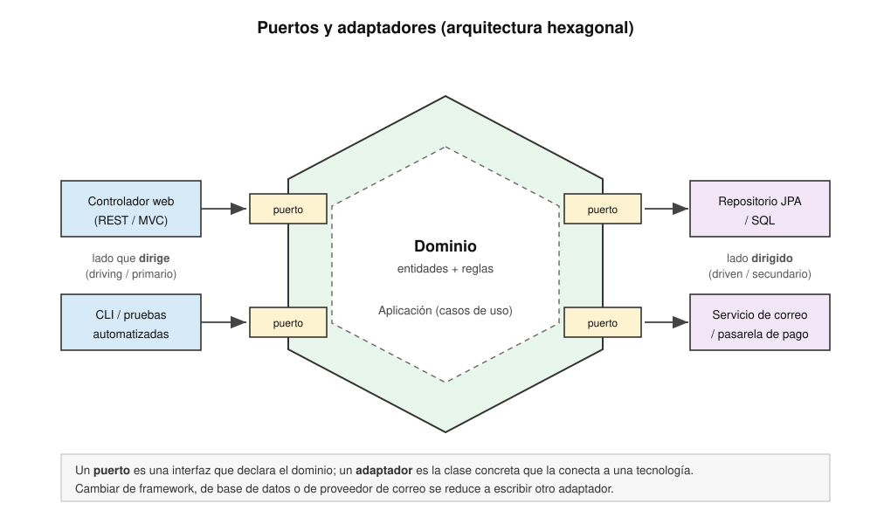
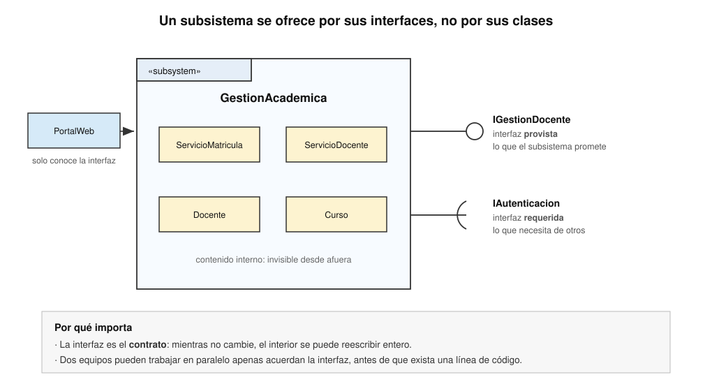
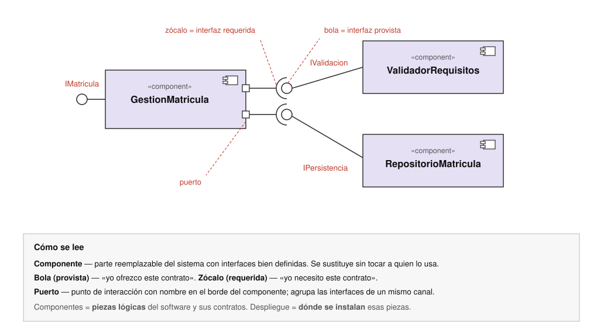
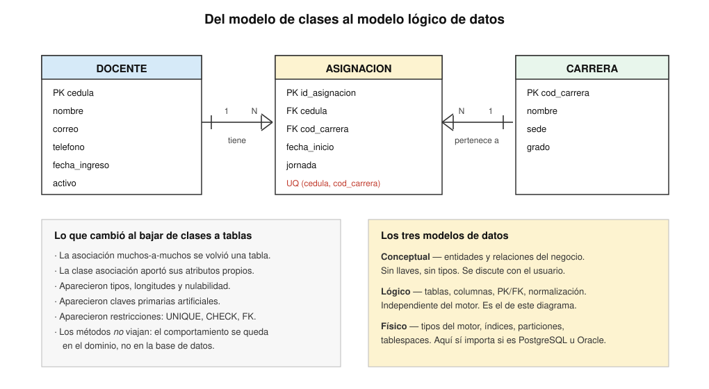
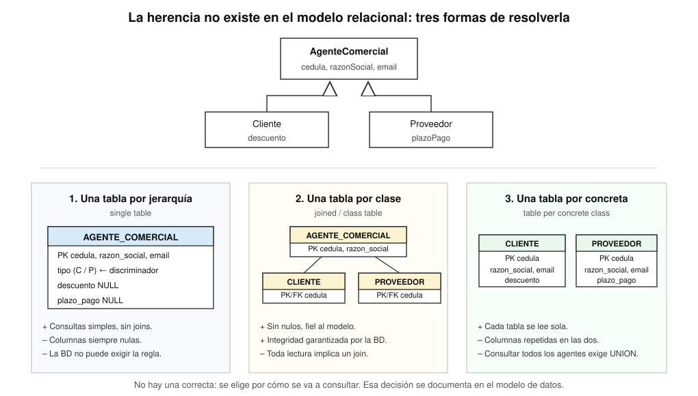
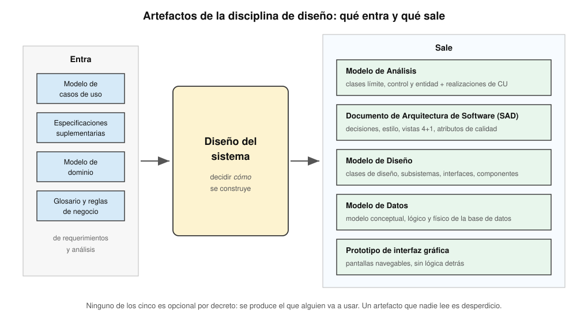

<!-- _class: cover -->
<style scoped>
section {
  --cover: url(../assets/img_00017_.png);
}
</style>
# Diseño de sistemas
## Contenidos
- Fundamentos y propósitos de la disciplina
- Realización de los casos de uso
- Arquitectura, subsistemas y componentes
- Diseño de la base de datos
- Diagramación del diseño y DFD
- Patrones de diseño y artefactos

> Curso **Análisis y Diseño de Sistemas** <br>II Semestre 2026

---

## ¿Dónde estamos?

- Ya sabemos **qué** debe hacer el sistema: visión, requerimientos, casos de uso, modelo de dominio
- Ya sabemos **cómo dibujarlo**: UML es la notación
- Falta la pregunta cara: **¿cómo se va a construir?** Y esa pregunta tiene muchas respuestas correctas y muchísimas equivocadas

<div class="grid">
<div>

### 🎯 Análisis
*¿Qué necesita el negocio?*
Vocabulario del **usuario**. Sin tecnología
</div>
<div>

### 🏗️ Diseño
*¿Cómo lo resuelve el software?*
Vocabulario de la **solución**. Con restricciones reales
</div>
<div>

### ⌨️ Implementación
*¿Cómo se escribe?*
Vocabulario del **lenguaje**. Con un compilador de por medio
</div>
</div>

- ⚠️ El diseño es el puente. Si el puente no se construye a conciencia, **el código lo improvisa** — y ese diseño improvisado también es un diseño, solo que nadie lo decidió

---

<!-- _class: cover -->
<style scoped>
section {
  --cover: url(../assets/img_00018_.png);
}
</style>
# Fundamentos del diseño
## Contenidos
- Qué es diseñar un sistema
- Los propósitos de la disciplina
- Del análisis al diseño
- Diseño lógico y diseño físico
- Los principios que sostienen todo lo demás

---

## ¿Qué es diseñar un sistema?

<steps>
<step>

### La definición

> «El diseño de software es el proceso de **transformar los requerimientos en una descripción** de la estructura interna del software que sirva de base para su construcción»
> — *SWEBOK v3, capítulo 2*

- Diseñar es **tomar decisiones bajo restricciones**: presupuesto, plazo, personal, tecnología disponible, sistemas heredados
- Cada decisión **cierra puertas**. Por eso las importantes se documentan y se justifican

</step>
<step>

### Lo que hace un diseñador todo el día

<div class="grid">
<div>

### ✂️ Descompone
Parte el problema en piezas que **quepan en una cabeza**
</div>
<div>

### 🔌 Asigna
Decide **qué pieza es responsable** de qué
</div>
<div>

### 🤝 Conecta
Define **cómo se hablan** las piezas entre sí
</div>
<div>

### ⚖️ Concilia
Balancea **atributos de calidad** que se pelean entre ellos
</div>
</div>

</step>
</steps>

---

## Los propósitos de la disciplina

| Propósito | Qué significa en la práctica |
|:--|:--|
| **Adquirir un entendimiento profundo** | Entender los requerimientos no funcionales y las restricciones del entorno de implementación |
| **Crear una entrada apropiada** | Producir un punto de partida para la implementación que no obligue a adivinar |
| **Descomponer** | Partir el trabajo en piezas manejables, posiblemente para equipos distintos |
| **Capturar interfaces tempranas** | Definir los contratos entre subsistemas **antes** de construirlos, para trabajar en paralelo |
| **Visualizar y razonar** | Poder discutir el diseño con una notación común, sin leer código |
| **Crear abstracciones** | Aislar lo estable de lo volátil: la tecnología cambia, el negocio menos |

- 💡 Ojo con el propósito que **no** está en la lista: *«producir documentación»*. La documentación es un medio, nunca el fin

---

## Del análisis al diseño

<split-slide style="--left: 50%; --right: 50%;">
<div>

### 🔍 Análisis
**El espacio del problema**

- Se pregunta **qué** hace el sistema
- Ignora la tecnología a propósito
- Las clases son **conceptuales**: pocas operaciones, sin tipos
- Los errores aquí son **de comprensión**
- El interlocutor es el **usuario**
- Producto: **Modelo de Análisis**
</div>
<div>

### 🛠️ Diseño
**El espacio de la solución**

- Se pregunta **cómo** lo hace
- La tecnología es una restricción de primera clase
- Las clases son **de software**: visibilidad, tipos, firmas
- Los errores aquí son **de construcción**
- El interlocutor es el **programador**
- Producto: **Modelo de Diseño**
</div>
</split-slide>

- 🔑 No es una frontera de calendario, es una frontera de **preguntas**. En un proyecto iterativo se cruza muchas veces al día

---

## Diseño lógico vs. diseño físico

<steps>
<step>

### La distinción

| | Diseño **lógico** | Diseño **físico** |
|:--|:--|:--|
| **Pregunta** | ¿Qué debe pasar? | ¿Con qué se hace? |
| **Independencia** | De la tecnología | Atado a una tecnología concreta |
| **Ejemplo de dato** | «Se guarda el expediente del estudiante» | Tabla `ESTUDIANTE` en PostgreSQL 16, índice por `cedula` |
| **Ejemplo de proceso** | «Se valida que el cupo alcance» | Método `Grupo.tieneCupo()` en Java, con bloqueo optimista |
| **Vida útil** | Años | Hasta la próxima migración |
| **Quién lo revisa** | Analista, usuario experto | Arquitecto, DBA, programador |

</step>
<step>

### Por qué se separan

- El **lógico** sobrevive al cambio de tecnología: si mañana se migra de Oracle a PostgreSQL, el diseño lógico sigue siendo válido
- El **físico** es donde vive el rendimiento: índices, cachés, particiones, tamaños de *pool*
- Mezclarlos produce el síntoma clásico: *«no podemos cambiar de base de datos porque las reglas del negocio están en los procedimientos almacenados»*
- 💡 Regla práctica: si al leer un documento de diseño aparece el nombre de un producto comercial, ya está en el terreno físico

</step>
</steps>

---

## Los principios que sostienen todo

<div class="grid">
<div>

### 🎭 Abstracción
Exponer **qué** hace algo, esconder **cómo**. Una interfaz es una abstracción con nombre
</div>
<div>

### 📦 Ocultación de información
Cada módulo guarda **una decisión de diseño** que puede cambiar. Si cambia, cambia un módulo
</div>
<div>

### 🧩 Modularidad
Partes con **fronteras claras** que se pueden entender, probar y reemplazar por separado
</div>
<div>

### 🪜 Jerarquía
Capas de abstracción: cada nivel usa el de abajo sin conocer sus tripas
</div>
<div>

### ♻️ Separación de asuntos
Cada pieza atiende **una preocupación**: persistencia, presentación, reglas
</div>
<div>

### 🔁 No repetición (DRY)
Cada conocimiento vive en **un solo lugar** del sistema
</div>
</div>

> «Los módulos deben diseñarse de forma que oculten las decisiones difíciles o susceptibles de cambio»
> — *D. L. Parnas, 1972*

---

## Cohesión y acoplamiento

<split-slide style="--left: 50%; --right: 50%;">
<div>

### 🧲 Cohesión — **alta**
*Qué tan relacionadas están las responsabilidades **dentro** de un módulo*

- **Funcional** (la mejor): todo colabora para una sola tarea
- **Secuencial**: la salida de una parte es entrada de la siguiente
- **Comunicacional**: operan sobre los mismos datos
- **Temporal**: se ejecutan al mismo tiempo
- **Coincidental** (la peor): están juntas por casualidad — la clase `Utilidades`
</div>
<div>

### 🔗 Acoplamiento — **bajo**
*Cuánto depende un módulo **de otro***

- **De datos** (el mejor): se pasan parámetros simples
- **De estampa**: se pasa una estructura de la que se usa una parte
- **De control**: se pasa una bandera que decide qué hacer
- **Común**: comparten datos globales
- **De contenido** (el peor): un módulo toca las entrañas de otro
</div>
</split-slide>

- 🎯 La meta es siempre la misma: **alta cohesión, bajo acoplamiento**. Casi todos los patrones de diseño existen para lograr eso
- ❓ *«Una clase `Reporte` que además envía correos y calcula impuestos»* → <spoiler>cohesión coincidental: hay tres clases ahí adentro</spoiler>

---

## Entradas y salidas del diseño

| Entra | De dónde viene | Sale | Para quién |
|:--|:--|:--|:--|
| Modelo de casos de uso | Requerimientos | **Modelo de Análisis** | El propio diseño |
| Especificaciones suplementarias | Requerimientos | **Documento de Arquitectura** | Todo el equipo |
| Modelo de dominio | Análisis del negocio | **Modelo de Diseño** | Implementación |
| Glosario y reglas de negocio | Análisis del negocio | **Modelo de Datos** | DBA e implementación |
| Restricciones del entorno | Visión, factibilidad | **Prototipo de interfaz** | Usuario y pruebas |

- ⚠️ Si falta la entrada, el diseño la **inventa**. Y lo que el diseño inventa, el usuario lo descubre en la demostración

---

<!-- _class: cover -->
<style scoped>
section {
  --cover: url(../assets/img_00019_.png);
}
</style>
# Realización de los casos de uso
## Contenidos
- Qué es una realización y para qué sirve
- Las entidades de negocio
- Clases de análisis: límite, control y entidad
- Los cuatro pasos del análisis de un caso de uso
- El diagrama de secuencia como reparto de responsabilidades

---

## El problema que resuelve

<steps>
<step>

### La brecha

- Un caso de uso dice: *«El administrador registra un docente y el sistema confirma el registro»*
- El programador pregunta: **¿qué clases? ¿qué método? ¿quién valida? ¿dónde se guarda?**
- Entre las dos frases hay un salto que alguien tiene que dar. Si no lo da el diseño, lo da el programador **solo, y sin dejar rastro**

</step>
<step>

### La respuesta: la realización de caso de uso

> Una **realización de caso de uso** es la descripción de **cómo un caso de uso concreto se lleva a cabo** en términos de clases que colaboran

<div class="grid">
<div>

### 🎬 Es una traducción
Del **texto** del caso de uso a **objetos** que se envían mensajes
</div>
<div>

### 🧵 Es trazable
Cada caso de uso tiene **su** realización. Si el caso de uso cambia, se sabe qué revisar
</div>
<div>

### 📐 Son tres vistas
Un **diagrama de clases**, uno o varios de **interacción** y, a veces, uno de **actividad**
</div>
</div>

</step>
</steps>

---

## Notación de la realización

<split-slide style="--left: 46%; --right: 54%;">
<div>

### Cómo se dibuja
- El caso de uso: elipse de línea continua
- Su realización: elipse de **línea punteada**
- Entre ambos, una relación de **realización** (línea punteada con triángulo hueco)
- Suelen vivir en paquetes distintos: `Casos de uso` y `Realizaciones`
</div>
<div>

### Qué contiene por dentro

| Diagrama | Qué aporta |
|:--|:--|
| **Clases** | Las clases participantes y sus relaciones |
| **Secuencia** | El orden de los mensajes, escenario por escenario |
| **Comunicación** | Quién está conectado con quién |
| **Actividad** | El flujo cuando hay muchas ramas |

</div>
</split-slide>

- 🔑 Un caso de uso **no** tiene una sola realización: puede haber una de **análisis** (gruesa, sin tecnología) y otra de **diseño** (con la arquitectura ya decidida)

---

## Propósitos del análisis de casos de uso

<div class="grid">
<div>

### 1️⃣ Identificar
Encontrar las **clases de análisis** que van a ejecutar el flujo de eventos del caso de uso
</div>
<div>

### 2️⃣ Distribuir
Repartir el **comportamiento** del caso de uso entre esas clases, usando realizaciones
</div>
<div>

### 3️⃣ Detallar
Identificar **atributos, responsabilidades y asociaciones** de las clases de análisis
</div>
</div>

> «El análisis de casos de uso es donde el modelo de dominio deja de ser un dibujo bonito y empieza a tener operaciones»

- ⚠️ Lo que **no** se hace todavía: elegir el framework, definir tipos de datos, diseñar la base de datos, optimizar nada

---

## Entidades de negocio

<steps>
<step>

### Qué son

> Cualquier elemento del **dominio del problema** es una entidad potencial que puede modelarse como una clase

| Dominio | Entidades de negocio |
|:--|:--|
| Banca | Cliente, cuenta, transacción, préstamo |
| Educación superior | Estudiante, curso, grupo, matrícula, docente |
| Hospital | Paciente, expediente, cita, tratamiento |
| Comercio | Producto, pedido, factura, proveedor |

- Son importantes porque **a partir de ellas se identifican las clases** que modelan el espacio del problema

</step>
<step>

### De dónde salen

<div class="grid">
<div>

### 📄 Especificación de casos de uso
**La fuente principal.** Los sustantivos del flujo de eventos
</div>
<div>

### 📚 Documentación existente
Manuales del sistema actual, procedimientos formales e informales
</div>
<div>

### 🗣️ Expertos del dominio
Conversaciones con quien conoce el negocio de verdad
</div>
<div>

### 🖼️ Prototipos
Los campos de una pantalla suelen delatar atributos y entidades
</div>
<div>

### 🔀 Diagramas previos
Actividad y secuencia del modelado del negocio
</div>
</div>

- 💡 El vocabulario es el **del dominio**, no el del programador: se dice `Matricula`, no `MatriculaDTO`

</step>
</steps>

---

## Recordatorio: clase y objeto

<split-slide style="--left: 50%; --right: 50%;">
<div>

### 📐 Clase
- Es una **plantilla** para crear objetos
- Es la **abstracción** de varios objetos con características similares
- Define atributos y operaciones
- Ejemplo: `Vehiculo` con `marca` y `color`
</div>
<div>

### 🎯 Objeto
- Es una **instancia** de una clase
- Tiene **identidad**: se distingue de los demás
- Tiene **estado**: los valores de sus atributos
- Tiene **comportamiento**: ejecuta tareas
- Ejemplo: `v1` con `marca = "Toyota"`
</div>
</split-slide>

- Los objetos representan cosas **concretas** (perro, escritorio, bicicleta) y también **abstractas** (cuenta, territorio, país)
- Un objeto de software **guarda su estado en atributos** y **expone su comportamiento en métodos** — igual que uno del mundo real esconde su interior y muestra lo que hace
- ❓ *«`Estudiante` es…»* → <spoiler>una clase</spoiler> · *«`e1` con carné B12345 es…»* → <spoiler>un objeto</spoiler>

---

## Qué clasifican las clases

| Tipo de objeto | Ejemplos | Dónde aparece |
|:--|:--|:--|
| **Del dominio del problema** | `Estudiante`, `Profesor`, `Aula`, `Cuenta`, `Curso`, `Matricula` | Modelo de análisis |
| **De la tecnología empleada** | `Label`, `Button`, `TextBox`, `HttpRequest` | Modelo de diseño, por extensión o composición |
| **De la solución de diseño** | `EstudianteRestController`, `EstudianteRepository`, `EstudianteTest` | Modelo de diseño e implementación |

- ⚠️ En **análisis** solo interesan las de la primera fila. Las otras dos aparecen cuando ya se decidió la arquitectura
- 💡 Si en el modelo de análisis aparece `EstudianteController`, alguien se saltó una etapa

---

## Los cuatro pasos

<div class="grid">
<div>

### 1️⃣ Crear la realización
Un contenedor para el caso de uso, con sus diagramas de clase e interacción
</div>
<div>

### 2️⃣ Identificar clases entidad
Buscar los sustantivos del dominio en la especificación del caso de uso
</div>
<div>

### 3️⃣ Armar el diagrama de clases
Clases de análisis, atributos, asociaciones, multiplicidades y roles
</div>
<div>

### 4️⃣ Armar el diagrama de secuencia
Repartir el comportamiento entre las clases, escenario por escenario
</div>
</div>

- 🔁 No es una cascada: el paso 4 casi siempre **obliga a volver** al paso 3, porque al repartir mensajes aparecen clases y operaciones que no se habían visto
- ⏱️ Se hace **por caso de uso**, no para todo el sistema de una vez

---

## Paso 2: identificar las clases del dominio

<steps>
<step>

### La técnica base

- Buscar **sustantivos y frases sustantivas** en la especificación del caso de uso
- Considerar que algunos sustantivos serán **atributos**, no clases
- Recordar la naturaleza **iterativa-incremental**: habrá oportunidad de refinar; no hay que acertar a la primera

</step>
<step>

### Las categorías de Tockey (2019)

| Categoría | Qué buscar | Ejemplos |
|:--|:--|:--|
| **Actores** | Cada actor del diagrama de casos de uso, estereotipado `«actor»` | Cliente, analista de crédito, cajero |
| **Cosas físicas** | Objetos tangibles del dominio | Persona, vehículo, fuente de poder |
| **Conceptos** | No físicos pero relevantes | Cuenta bancaria, deducción fiscal, reservación |
| **Roles** | Papeles que juega alguien | Estudiante, docente, vendedor, piloto |
| **Especificaciones** | Características compartidas por colecciones similares | Modelo de avión, tipo de habitación |
| **Eventos** | Cosas donde el tiempo importa | Orden de compra, matrícula, reservación |
| **Asociaciones** | Algo que conecta dos o más cosas y tiene datos propios | Licencia de conducir, asignación |

- 💡 El autor sugiere **no categorizar** cada clase que se encuentre: la lista es solo un disparador de memoria

</step>
</steps>

---

## Paso 2: el filtro

- Ninguna lista de sustantivos sobrevive intacta. Cada candidata pasa por una tabla como esta:

| Clase candidata | Atributos posibles | Asociaciones | ¿Es clase de análisis? | Por qué |
|:--|:--|:--|:--|:--|
| Paciente | nombre, cédula, fecha nacimiento | Registro, Tratamiento | **Sí** | Concepto central, con estado propio |
| Nombre | — | — | **No** | Es un **atributo** de Paciente |
| Registro | fecha, número | Paciente | **Sí** | Evento con datos propios |
| Sistema | — | — | **No** | Es el sistema entero, no una clase |
| Detalles personales | — | — | **No** | Sinónimo de los atributos de Paciente |
| Compañía de seguros | nombre, código | Paciente | **Sí** | Sistema externo → clase `«boundary»` |

- 🎯 Tres preguntas para descartar: ¿tiene **estado propio**? ¿tiene **comportamiento**? ¿alguien lo **necesita recordar** entre casos de uso?

---

## Ejemplo: sustantivos del CU «Registrar paciente»

<split-slide style="--left: 46%; --right: 54%;">
<div>

### Lo que se subrayó
`Paciente` · `Administrador` · `Registro` · `Sistema de salud del gobierno` · `Compañía de seguros` · `Hospital` · `Tratamiento médico` · `Detalles personales` · `Nombre` · `Dirección` · `Teléfono` · `Fecha de nacimiento` · `Contacto de emergencia` · `Sistema` · `Número de asegurado` · `Identidad` · `Registrado condicionalmente` · `Paciente que paga tarifa completa`
</div>
<div>

### Lo que sobrevive

- **Clases**: `Paciente`, `Registro`, `Tratamiento`, `Hospital`
- **Actores / sistemas externos**: `Administrador`, `SistemaSaludGobierno`, `AseguradoraPrivada`
- **Atributos**: nombre, dirección, teléfono, fecha de nacimiento, contacto de emergencia, número de asegurado
- **Estados, no clases**: *registrado condicionalmente*, *paga tarifa completa* → son valores de un atributo `estado`
- **Ruido**: `Sistema`, `Identidad`, `Detalles personales`
</div>
</split-slide>

- ⚠️ Los sinónimos son la trampa principal: `Registro`, `Registration` y `Existing Registration` eran **la misma clase** escrita de tres formas

---

## Paso 3: el diagrama de clases de análisis

<steps>
<step>

### Qué se agrega

- Las **clases de análisis** identificadas en el paso 2
- Para cada una, sus **atributos** probables, con nombres que signifiquen algo
- **Sin preocuparse por los tipos**: estamos en análisis, no en diseño

</step>
<step>

### Las asociaciones

- Establecer las asociaciones entre clases e identificar su **semántica**: asociación simple, agregación, composición o herencia
- Asignar **multiplicidad** y **roles** a cada extremo
- Nombrar la asociación con un verbo que se lea en una dirección: `Docente ——imparte——> Curso`

<div class="grid">
<div>

### 🎯 Enfoque
En este diagrama, concéntrese en las clases de tipo **entidad**
</div>
<div>

### 📏 Multiplicidad
`1` · `0..1` · `*` · `1..*` · `2..4` — cada extremo responde *«¿cuántos?»*
</div>
<div>

### 🏷️ Roles
El nombre con que **una clase ve a la otra**: `empleador`, `empleados`
</div>
</div>

</step>
</steps>

- 📎 La notación completa (asociación, agregación, composición, clase asociación, generalización) está en el mazo de **UML**

---

## Las tres clases del modelo de análisis

[](../assets/ads-dis-bce.svg)

---

## Clase límite — `«boundary»`

<split-slide style="--left: 52%; --right: 48%;">
<div>

### Qué modela
- La **interacción entre el entorno del sistema y sus trabajos internos**
- Modela los componentes que **dependen del entorno**: si cambia el entorno, cambia esta clase y ninguna otra
- Ejemplos: ventanas, protocolos de comunicación, interfaces de impresoras, sensores, terminales
</div>
<div>

### Sus tres fuentes

| Fuente | De dónde sale |
|:--|:--|
| **Interfaz de usuario** | Una por cada pantalla o formulario del caso de uso |
| **Interfaz de sistema** | Una por cada sistema externo con el que se habla |
| **Interfaz de dispositivo** | Una por cada sensor, lector o impresora |

</div>
</split-slide>

- 🔑 Regla de dedo: **una clase límite por actor y por caso de uso**. Si un caso de uso tiene dos actores, probablemente tiene dos clases límite
- ⚠️ La clase límite **no** contiene reglas del negocio. Si valida algo más que el formato de un campo, la regla está en el lugar equivocado

---

## Clase control — `«control»`

<steps>
<step>

### Qué modela

- El **comportamiento de control** específico a uno o varios casos de uso
- Cuando el sistema ejecuta el caso de uso, **se crea un objeto de control**; cuando termina, se destruye
- Proporciona el **comportamiento de coordinación**: es quien sabe el orden de los pasos
- La misma clase de control puede reutilizarse en sistemas con **interfaces distintas** y **almacenes distintos**

</step>
<step>

### Cuándo una responsabilidad pertenece al control

<div class="grid">
<div>

### 🌐 Es independiente del entorno
No cambia cuando cambia la pantalla o el canal
</div>
<div>

### 🔢 Define la lógica de control
El **orden** entre sucesos y las transacciones del guion de uso
</div>
<div>

### 🧊 Es estable
Cambia poco si cambia la estructura interna de las entidades
</div>
<div>

### 🎼 Coordina entidades
Usa o establece el contenido de **varias** clases entidad
</div>
<div>

### 🔀 No siempre igual
El flujo pasa por estados distintos según el caso
</div>
</div>

- 💡 Nombre típico: `GestorMatricula`, `ControladorRegistroDocente`, `ProcesadorPago`

</step>
</steps>

---

## Clase entidad — `«entity»`

<split-slide style="--left: 50%; --right: 50%;">
<div>

### Qué modela
- Clases de análisis **de nivel de negocio**
- Guardan y administran **información que persiste**: usualmente sobreviven al caso de uso que las creó
- Ejemplos: `Cliente`, `Cuenta`, `Transaccion`, `Docente`, `Matricula`
- Vienen casi directo del **modelo de dominio** y del glosario
</div>
<div>

### Qué comportamiento tienen
- El que **protege sus propios datos**: `cuenta.debitar(monto)`, no `cuenta.saldo = saldo - monto`
- Las **reglas invariantes**: una `Matricula` no puede existir sin estudiante y sin grupo
- Los **cálculos derivados** de sus atributos: `factura.total()`
- ⚠️ **No** saben de pantallas, ni de SQL, ni del orden del caso de uso
</div>
</split-slide>

- ❓ *«Verificar que la cédula tenga 9 dígitos»* → <spoiler>límite (formato) o entidad (regla de negocio), nunca control</spoiler>
- ❓ *«Decidir si primero se cobra o primero se asigna el cupo»* → <spoiler>control</spoiler>

---

## Paso 4: el diagrama de secuencia

<steps>
<step>

### La regla de cobertura

- De acuerdo con los **escenarios** que conforman el caso de uso, se desarrolla un diagrama de secuencia
- **Al menos uno** para el flujo básico de eventos
- **Uno o más** para cada flujo alterno o excepcional que valga la pena

</step>
<step>

### Repartir responsabilidades

> Una **responsabilidad** es un comportamiento sobre algo que se le puede pedir a un objeto

Puede ser:
- Las **acciones** que ejecuta el objeto
- El **conocimiento** que mantiene y que proporciona a otros objetos

<div class="grid">
<div>

### 📨 De mensaje a operación
Las responsabilidades **se derivan de los mensajes**: todo mensaje recibido se vuelve una operación de la clase receptora
</div>
<div>

### ⚖️ El reparto es la decisión
Dos diseños válidos del mismo caso de uso se diferencian en **quién hace qué**, no en qué se hace
</div>
</div>

</step>
</steps>

---

## Secuencia de análisis vs. secuencia de diseño

<split-slide style="--left: 50%; --right: 50%;">
<div>

### 🔍 Nivel de análisis
- Modela el comportamiento **desde el punto de vista del actor**
- Es una buena técnica de **pizarra** para capturar los escenarios que describen los usuarios
- Participantes: las clases límite, control y entidad
- Mensajes con nombres del negocio, sin firmas
</div>
<div>

### 🛠️ Nivel de diseño
- **Más detallado**: muestra los objetos que colaboran en una secuencia determinada
- Mensajes con **parámetros**, **valores de retorno** y el orden exacto
- Aparecen objetos de la arquitectura: repositorios, servicios, adaptadores
- Es lo que el programador convierte en código casi línea por línea
</div>
</split-slide>

- 🔑 El mismo caso de uso puede tener los dos. El de análisis se dibuja con el usuario; el de diseño, con el equipo técnico

---

## Ejemplo: CU «Registrar docente de la carrera»

[](../assets/ads-dis-secuencia-registro.svg)

---

## Cómo se leyó ese diagrama

| Lo que se ve | Lo que significa para el diseño |
|:--|:--|
| El actor solo toca `FormularioDocente` | La clase límite es el único punto de entrada: **respeta la regla de robustez** |
| `GestorRegistroDocente` recibe `registrar(...)` | Esa firma **será una operación pública** de la clase control |
| `validarFormato` es un auto-mensaje | Es una operación **privada**: nadie de afuera la invoca |
| El fragmento `alt` | El caso de uso tenía un flujo alterno *«cédula ya registrada»* |
| `«create»` hacia `d : Docente` | El objeto **nace dentro** del caso de uso; antes no existía |
| Los retornos punteados | Se dibujan **solo cuando dicen algo**; si no, ensucian |

- 💡 Cada flecha que entra a una caja se convirtió en una fila del diagrama de clases de diseño

---

## Un diagrama de secuencia no es suficiente

<steps>
<step>

### Cuántos hacen falta

- Modele **la mayoría de los flujos de eventos** para asegurar que el comportamiento quede repartido entre las clases participantes
- ➡️ Inicie con el **flujo básico**: es el más importante
- ➡️ Continúe con las **variantes**
- No tiene que describir **todos** los flujos, siempre que se ejemplifiquen todas las operaciones de los objetos participantes
- Los flujos **triviales pueden omitirse**

</step>
<step>

### Los flujos de excepción que sí valen la pena

<div class="grid">
<div>

### ⚠️ Manejo de errores
¿Qué debe hacer el sistema cuando algo falla a medio camino?
</div>
<div>

### ⏰ Tiempo muerto
Si la persona usuaria no responde en cierto periodo, ¿qué medidas toma el caso de uso?
</div>
<div>

### ⌨️ Errores de entrada
Datos incorrectos de los objetos que participan en el caso de uso
</div>
</div>

- 🔁 Toda ruta alternativa **regresa al flujo principal o termina**. No hay terceras opciones

</step>
</steps>

---

## Actividad 1: realiza un caso de uso

<split-slide style="--left: 52%; --right: 48%;">
<div>

### El caso de uso
**«Prestar un libro»** — Biblioteca universitaria

1. El usuario presenta su carné al bibliotecario
2. El sistema verifica que el usuario esté activo y sin multas pendientes
3. El bibliotecario digita el código del ejemplar
4. El sistema verifica que el ejemplar esté disponible
5. El sistema registra el préstamo con la fecha de devolución según el tipo de usuario
6. El sistema imprime el comprobante

**Alterno**: si el usuario tiene multas, el sistema rechaza el préstamo y muestra el monto adeudado
</div>
<div>

### Qué entregar
1. La lista de **sustantivos** con el filtro aplicado (candidata · atributos · ¿es clase?)
2. El **diagrama de secuencia** del flujo básico, con un fragmento `alt` para el flujo alterno
3. Una frase que justifique **por qué** el cálculo de la fecha de devolución quedó donde lo pusieron

### Preguntas de control
- ¿Cuántas clases límite hay? ¿Por qué?
- ¿`Multa` es clase o atributo?
- ¿Quién decide la fecha: el control o la entidad?
</div>
</split-slide>

- ⏱️ 30 minutos · en grupos

---

## Actividad 1: una solución posible

<hidden label="Solución">

<split-slide style="--left: 50%; --right: 50%;">
<div>

### Las clases que sobreviven al filtro

| Candidata | ¿Clase? | Por qué |
|:--|:--|:--|
| Usuario | **Sí** `«entity»` | Estado propio: activo, multas |
| Ejemplar | **Sí** `«entity»` | Es la copia física, no el título |
| Libro | **Sí** `«entity»` | Un libro tiene muchos ejemplares |
| Prestamo | **Sí** `«entity»` | Evento con fecha y estado |
| Multa | **Sí** `«entity»` | Tiene monto y fecha propios |
| Carné | **No** | Atributo de `Usuario` |
| Tipo de usuario | **Sí** `«entity»` | *Especificación*: define el plazo |
| Comprobante | **No** | Salida de la clase límite |

</div>
<div>

### Robustez

- **Límite**: `PantallaPrestamo` (una sola: un actor, un caso de uso) y `ImpresoraComprobante`
- **Control**: `GestorPrestamo` — decide el orden: primero valida usuario, luego ejemplar, luego registra
- **Entidad**: `Usuario`, `Ejemplar`, `Prestamo`, `Multa`, `TipoUsuario`

### La decisión que se pedía justificar
El cálculo de la fecha va en **`TipoUsuario.plazoDias()`**, consumido por `Prestamo`: es una **regla del negocio**, no un paso del caso de uso. Si mañana los estudiantes de posgrado tienen 21 días, cambia un dato, no el control.

- ⚠️ Si el cálculo hubiera quedado en `GestorPrestamo`, cada caso de uso que preste algo tendría que repetirlo
</div>
</split-slide>

</hidden>

---

<!-- _class: cover -->
<style scoped>
section {
  --cover: url(../assets/img_00020_.png);
}
</style>
# Arquitectura del software
## Contenidos
- Qué es y qué decisiones incluye
- Arquitectura y atributos de calidad
- Estilos arquitectónicos
- Capas, puertos y adaptadores
- Las vistas 4+1 y el documento de arquitectura

---

## ¿Qué es la arquitectura del software?

<steps>
<step>

### Tres definiciones que se complementan

> «El conjunto de estructuras necesarias para razonar sobre el sistema: **elementos de software, relaciones entre ellos y propiedades** de ambos»
> — *Bass, Clements & Kazman*

> «Las decisiones de diseño **significativas**, medidas por el **costo de cambiarlas**»
> — *Grady Booch*

> «Las cosas que a la gente le cuesta cambiar después»
> — *Martin Fowler*

</step>
<step>

### Qué las tres tienen en común

<div class="grid">
<div>

### 🧱 Estructura
Habla de **piezas y relaciones**, no de algoritmos internos
</div>
<div>

### 💰 Costo de cambio
Es arquitectónico lo que **duele cambiar** a mitad del proyecto
</div>
<div>

### 🎯 Atributos de calidad
Existe para **satisfacer los no funcionales**, no los funcionales
</div>
<div>

### 🗣️ Comunicación
Es el vocabulario común de **todo el equipo** y del cliente técnico
</div>
</div>

- 🔑 Casi cualquier arquitectura puede cumplir los requerimientos funcionales. **Los no funcionales son los que deciden**

</step>
</steps>

---

## Qué decisiones son arquitectónicas

| Decisión | ¿Arquitectónica? | Por qué |
|:--|:--|:--|
| Separar en capas presentación, dominio e infraestructura | **Sí** | Atraviesa todo el sistema; cambiarla después es reescribir |
| Usar PostgreSQL en vez de MongoDB | **Sí** | Cambia el modelo de datos, las consultas y las transacciones |
| Comunicar los módulos por REST o por mensajería | **Sí** | Define acoplamiento temporal y manejo de fallas |
| Nombrar una variable `total` o `montoTotal` | No | Cuesta un *rename* |
| Usar `for` o `stream` en un método | No | Es local, se cambia en minutos |
| Autenticar con OAuth 2.0 contra el IdP institucional | **Sí** | Afecta cada punto de entrada del sistema |
| Ordenar una lista con `sort()` o con un índice en la BD | Depende | Si el volumen es de millones, sí lo es |

- 💡 La prueba: *«si mañana cambiamos esto, ¿cuántos archivos se tocan y cuántas conversaciones hay que tener?»*

---

## La arquitectura existe por los atributos de calidad

<split-slide style="--left: 50%; --right: 50%;">
<div>

### El vínculo
- Un **requerimiento funcional** («registrar un docente») se puede cumplir con cualquier arquitectura, hasta con un solo archivo
- Un **atributo de calidad** («responder en menos de 2 s con 5 000 usuarios concurrentes») **decide la arquitectura**
- Por eso el insumo principal del arquitecto son las **especificaciones suplementarias**, no los casos de uso
</div>
<div>

### Los que más presionan

| Atributo | Qué fuerza a decidir |
|:--|:--|
| **Rendimiento** | Caché, réplicas de lectura, procesamiento asíncrono |
| **Disponibilidad** | Redundancia, *failover*, sin punto único de falla |
| **Seguridad** | Frontera de confianza, cifrado, auditoría |
| **Modificabilidad** | Capas, interfaces, inversión de dependencias |
| **Escalabilidad** | Servicios sin estado, particionamiento |
| **Testeabilidad** | Dependencias inyectadas, dominio puro |

</div>
</split-slide>

- ⚠️ Los atributos **se pelean entre ellos**: más seguridad cuesta rendimiento; más disponibilidad cuesta dinero. Diseñar es escoger a quién se le da prioridad

---

## Estilos arquitectónicos

| Estilo | Idea central | Va bien cuando | Duele cuando |
|:--|:--|:--|:--|
| **Monolito en capas** | Un despliegue, capas internas | Equipo pequeño, dominio conocido | El equipo crece y todos tocan lo mismo |
| **Cliente-servidor** | El cliente pide, el servidor responde | Aplicaciones de escritorio y web clásicas | El cliente necesita trabajar sin red |
| **MVC / MVVM** | Separar modelo, presentación y coordinación | Interfaces con mucha lógica de vista | Se confunde el modelo con las entidades |
| **Hexagonal (puertos y adaptadores)** | El dominio no conoce la tecnología | Se prevén varios canales o cambio de tecnología | El proyecto es pequeño y sobra ceremonia |
| **Microservicios** | Servicios independientes, desplegados por separado | Equipos múltiples, escalado desigual | El dominio aún no está entendido |
| **Orientado a eventos** | Los componentes reaccionan a eventos | Integraciones asíncronas, alta carga | Hay que depurar un flujo completo |
| **Tubos y filtros** | Datos que pasan por etapas | ETL, procesamiento de archivos | Se necesita interacción en tiempo real |

- 🔑 Un sistema real **combina varios**: un monolito en capas cuyo módulo de reportes es orientado a eventos es perfectamente sano

---

## Arquitectura en capas

[](../assets/ads-dis-capas.svg)

---

## Puertos y adaptadores

[](../assets/ads-dis-hexagonal.svg)

---

## Monolito o microservicios

<split-slide style="--left: 50%; --right: 50%;">
<div>

### 🧱 Monolito modular
- Un solo despliegue, módulos con fronteras claras
- Transacciones **fáciles**: una base de datos
- Depurar es leer una pila de llamadas
- Refactorizar entre módulos es barato
- El escalado es **todo o nada**
- 💡 **Es el punto de partida correcto** para casi todo proyecto nuevo
</div>
<div>

### 🧩 Microservicios
- Servicios desplegables por separado, cada uno con sus datos
- Transacciones **distribuidas**: consistencia eventual, sagas
- Depurar exige trazabilidad distribuida
- Cambiar un contrato compartido cuesta coordinación
- Se escala **la parte que lo necesita**
- ⚠️ Exige madurez en despliegue, monitoreo y equipos autónomos
</div>
</split-slide>

> «No empiece con microservicios. Empiece con un monolito bien modularizado y sepárelo cuando el dolor lo justifique»
> — *Martin Fowler, "MonolithFirst"*

- ❓ *Proyecto de curso, 4 personas, 4 meses* → <spoiler>monolito en capas, sin discusión</spoiler>

---

## Las vistas 4+1

| Vista | Responde | Para quién | Diagramas UML |
|:--|:--|:--|:--|
| **Lógica** | ¿Qué funcionalidad ofrece? | Usuario final, analistas | Clases, secuencia, estados |
| **De procesos** | ¿Cómo se comporta en ejecución? | Integradores | Actividad, secuencia, componentes |
| **De desarrollo** | ¿Cómo se organiza el código? | Programadores, gerente | Paquetes, componentes |
| **Física** | ¿Dónde se ejecuta? | Ingenieros de infraestructura | Despliegue |
| **+1: Escenarios** | ¿Cómo encaja todo? | Todos | Casos de uso |

- 🔑 La vista **+1 amarra las otras cuatro**: un puñado de casos de uso arquitectónicamente significativos se recorre en las cuatro vistas para probar que la arquitectura funciona
- 💡 No hay que producir las cinco siempre. Se produce **la vista que alguien va a leer**

---

## El Documento de Arquitectura de Software

<split-slide style="--left: 48%; --right: 52%;">
<div>

### Qué es
- El artefacto que **captura las decisiones arquitectónicas** y las justifica
- Se organiza por las **vistas 4+1**
- No es un manual del sistema: es el conjunto de decisiones **que costaría caro descubrir tarde**
- Se escribe **temprano** y se actualiza cuando una decisión cambia
</div>
<div>

### Secciones típicas

1. Introducción, alcance y definiciones
2. **Representación arquitectónica**: qué vistas se usan
3. **Metas y restricciones**: los atributos de calidad priorizados
4. Vista de **casos de uso** (los significativos)
5. Vista **lógica** — paquetes y clases clave
6. Vista de **procesos** — hilos, concurrencia
7. Vista de **despliegue** — nodos y red
8. Vista de **implementación** — estructura del código
9. Vista de **datos** — modelo de la base de datos
10. **Tamaño y rendimiento** · **Calidad**
</div>
</split-slide>

- ⚠️ El error clásico: un SAD de 80 páginas que nadie lee. Mejor 8 páginas con **las decisiones y su porqué**

---

## Registrar las decisiones: ADR

<steps>
<step>

### El formato mínimo

- Un **ADR** (*Architecture Decision Record*) es una página por decisión, con cuatro apartados:

| Apartado | Qué contiene |
|:--|:--|
| **Contexto** | La situación y las fuerzas que empujan: requerimientos, restricciones, plazos |
| **Decisión** | Lo que se decidió, en voz activa: *«Usaremos…»* |
| **Alternativas** | Qué más se consideró y por qué se descartó |
| **Consecuencias** | Lo bueno y lo malo que se acepta al decidir así |

</step>
<step>

### Un ejemplo

- **Contexto**: el sistema debe funcionar con la red institucional caída hasta por 2 horas. La matrícula ocurre 3 veces al año con picos de 4 000 usuarios en 30 minutos
- **Decisión**: la validación de requisitos se resuelve contra una **réplica local de solo lectura**, sincronizada cada noche
- **Alternativas**: consultar el sistema central en línea (descartada: depende de la red); replicar en tiempo real (descartada: costo y complejidad)
- **Consecuencias**: ➕ la matrícula sobrevive a una caída de red · ➖ un estudiante que aprobó ayer aparece hasta mañana; hay que documentarlo con el usuario

- 💡 El valor está en la **cuarta** sección: obliga a admitir el precio de la decisión

</step>
</steps>

---

<!-- _class: cover -->
<style scoped>
section {
  --cover: url(../assets/img_00021_.png);
}
</style>
# Subsistemas, interfaces y componentes
## Contenidos
- Qué es un subsistema y cómo se identifica
- La interfaz como contrato
- Diseño de componentes
- Principios de cohesión y acoplamiento entre componentes

---

## El subsistema

[](../assets/ads-dis-subsistema.svg)

---

## Cómo se identifican los subsistemas

<steps>
<step>

### Los criterios

<div class="grid">
<div>

### 🏢 Por área del negocio
`Matricula`, `Facturacion`, `Expediente` — la frontera sigue al dominio
</div>
<div>

### 👥 Por equipo
Un subsistema que un equipo pueda desarrollar y liberar sin pedir permiso
</div>
<div>

### 🔌 Por tecnología
Todo lo que dependa de un sistema externo se aísla en un subsistema
</div>
<div>

### 🔄 Por ritmo de cambio
Lo que cambia todos los meses no vive junto a lo que cambia cada tres años
</div>
</div>

</step>
<step>

### Las señales de una mala frontera

- Casi todos los casos de uso **atraviesan** todos los subsistemas → la partición no sigue al dominio
- Dos subsistemas comparten la **misma tabla** de la base de datos → no son dos, son uno
- Un cambio pequeño obliga a coordinar **tres equipos** → el acoplamiento está en el lugar equivocado
- Un subsistema expone **20 interfaces** → adentro había varios subsistemas
- ⚠️ La prueba definitiva: si no se puede describir lo que hace **en una frase**, la frontera está mal trazada

</step>
</steps>

---

## La interfaz como contrato

<split-slide style="--left: 50%; --right: 50%;">
<div>

### Qué declara una interfaz
- Las **operaciones**: nombre, parámetros, tipo de retorno
- Las **precondiciones**: qué debe cumplirse antes de llamar
- Las **poscondiciones**: qué garantiza al terminar
- Las **excepciones**: qué puede salir mal y cómo se avisa
- ⚠️ Lo que **no** declara: cómo lo hace por dentro
</div>
<div>

### Interfaz provista y requerida

| | Provista | Requerida |
|:--|:--|:--|
| **Símbolo** | Círculo (*lollipop*) | Semicírculo (*socket*) |
| **Significa** | «Yo ofrezco esto» | «Necesito que alguien me dé esto» |
| **Quién la define** | El proveedor | El consumidor |
| **Ejemplo** | `IGestionDocente` | `IAutenticacion` |

- 🔗 Un componente **encaja** con otro cuando el círculo de uno entra en el semicírculo del otro
</div>
</split-slide>

- 🎯 El beneficio real: definida la interfaz, **dos equipos arrancan el mismo día**. Uno construye el proveedor, el otro programa contra un doble de prueba

---

## Componente, clase, paquete y subsistema

| Concepto | Qué es | Existe en | Se sustituye |
|:--|:--|:--|:--|
| **Clase** | Unidad de diseño: atributos y operaciones | Modelo de diseño | Editando el código |
| **Paquete** | Agrupador **lógico** de elementos del modelo | Modelo de diseño | Moviendo archivos |
| **Subsistema** | Parte del sistema con **interfaces propias** y comportamiento | Modelo de diseño | Reimplementando sus interfaces |
| **Componente** | Pieza **modular y reemplazable** con interfaces bien definidas | Modelo de implementación | En caliente, si el contrato se respeta |
| **Artefacto** | El archivo concreto: `.jar`, `.dll`, imagen de contenedor | Modelo de despliegue | Copiando un archivo |
| **Nodo** | El elemento físico donde se ejecuta el artefacto | Modelo de despliegue | Cambiando el servidor |

- 🔑 La diferencia entre subsistema y componente es sobre todo de **momento**: el subsistema es una decisión de diseño; el componente, una unidad de construcción y despliegue

---

## Diseño de componentes

<steps>
<step>

### Los pasos

1. **Agrupar** las clases de diseño que colaboran fuertemente y comparten razones de cambio
2. **Extraer la interfaz**: qué necesita el mundo exterior de ese grupo, y nada más
3. **Declarar lo requerido**: de qué depende el componente para funcionar
4. **Verificar la dirección de las dependencias**: ninguna debe apuntar hacia lo volátil
5. **Definir el artefacto** que lo empaqueta y el nodo donde se despliega

</step>
<step>

### Las tres preguntas de control

<div class="grid">
<div>

### 🎯 ¿Una razón para cambiar?
Si el componente cambia por dos motivos distintos, son dos componentes
</div>
<div>

### 🔁 ¿Hay ciclos?
Si A depende de B y B de A, no se pueden liberar por separado. Hay que romperlo con una interfaz
</div>
<div>

### 📦 ¿Se puede liberar solo?
Si para publicar una versión hay que publicar otros cuatro, no es un componente
</div>
</div>

</step>
</steps>

---

## Principios de componentes

<split-slide style="--left: 50%; --right: 50%;">
<div>

### 🧲 Cohesión: qué va junto

- **REP** — *Reuse/Release Equivalence*: se reutiliza lo que se libera; el componente es la unidad de versión
- **CCP** — *Common Closure*: las clases que **cambian por la misma razón** van en el mismo componente
- **CRP** — *Common Reuse*: las clases que **se usan juntas** van juntas; no obligue a depender de lo que no se usa

- ⚖️ CCP y CRP **se contradicen**: uno agrupa, el otro separa. Se balancean según la etapa del proyecto
</div>
<div>

### 🔗 Acoplamiento: cómo se conectan

- **ADP** — *Acyclic Dependencies*: el grafo de dependencias **no tiene ciclos**
- **SDP** — *Stable Dependencies*: se depende siempre **hacia lo más estable**
- **SAP** — *Stable Abstractions*: lo estable debe ser **abstracto** — por eso el dominio se expresa con interfaces

- 🔑 De ahí sale la regla práctica: **lo que más cambia depende de lo que menos cambia, nunca al revés**
</div>
</split-slide>

- 📎 Los mismos principios aplicados a clases son **SOLID**; aplicados a paquetes, esto. La idea de fondo no cambia

---

## El diagrama de componentes

[](../assets/ads-uml-componentes.svg)

---

## Actividad 2: propón una arquitectura

<split-slide style="--left: 52%; --right: 48%;">
<div>

### El escenario
Sistema de **matrícula** de una universidad pública:

- 38 000 estudiantes; la matrícula ocurre 3 veces al año, con picos de 4 000 usuarios concurrentes en media hora
- El resto del año hay menos de 50 usuarios simultáneos
- Debe integrarse con el sistema de **cobros** (institucional, SOAP, no se puede modificar) y con el de **expediente académico**
- El expediente debe consultarse aunque el sistema central esté caído
- Un docente debe ver sus listas desde el celular
</div>
<div>

### Qué entregar
1. El **estilo arquitectónico** escogido y dos alternativas descartadas, con su razón
2. Los **subsistemas** con una frase que describa cada uno
3. Las **interfaces** entre subsistemas: provistas y requeridas
4. Un **ADR** completo para la decisión más cara del diseño
5. Los tres **atributos de calidad** priorizados, en orden

### Preguntas de control
- ¿Qué hace el sistema cuando cobros no responde?
- ¿Qué se escala en el pico: todo o una parte?
- ¿Dónde vive la regla «no puede matricular con deuda»?
</div>
</split-slide>

- ⏱️ 30 minutos · en grupos · se presentan 3 propuestas y se comparan

---

## Actividad 2: una solución posible

<hidden label="Solución">

<split-slide style="--left: 50%; --right: 50%;">
<div>

### Estilo
**Monolito modular en capas**, desplegado en varias instancias tras un balanceador, con el módulo de integración aislado.

- ❌ *Microservicios*: cuatro personas, un dominio conocido y una sola base de datos transaccional. El costo operativo no se paga
- ❌ *Cliente-servidor de escritorio*: el docente necesita el celular

### Subsistemas
- **Matricula** — decide si un estudiante puede llevar un grupo y le reserva el cupo
- **Expediente** — responde qué ha aprobado un estudiante (réplica local de solo lectura)
- **Cobros** — traduce entre el dominio y el SOAP institucional
- **Acceso** — autentica y autoriza
</div>
<div>

### Interfaces
- `Matricula` **requiere** `IExpediente` e `ICobros`; **provee** `IMatricula` al portal web
- `Cobros` **provee** `ICobros` y adentro habla SOAP: si mañana cambia a REST, cambia un adaptador

### La decisión más cara
Réplica local del expediente (ver el ADR de ejemplo): compra disponibilidad al precio de datos de hasta 24 horas.

### Atributos priorizados
1. **Disponibilidad** en el pico — es cuando el sistema importa
2. **Rendimiento** — 2 s por operación con 4 000 concurrentes
3. **Modificabilidad** — el reglamento cambia cada año

- 💡 La regla «no matricula con deuda» vive en el **dominio**, no en el adaptador: este solo trae el saldo
</div>
</split-slide>

</hidden>

---

<!-- _class: cover -->
<style scoped>
section {
  --cover: url(../assets/img_00022_.png);
}
</style>
# Diseño de la base de datos
## Contenidos
- Los tres modelos de datos
- Del modelo de dominio a las tablas
- Herencia, normalización y claves
- Índices, transacciones y concurrencia
- El desfase objeto-relacional

---

## Por qué merece una disciplina aparte

<div class="grid">
<div>

### ⏳ Sobrevive al código
La aplicación se reescribe cada 5 años; **los datos duran décadas**
</div>
<div>

### 💸 El error es caro
Un error en una clase se corrige y se recompila. Un error en el modelo de datos se **migra**, con el sistema en producción
</div>
<div>

### 🔗 Es compartido
Otros sistemas, reportes y auditorías leen esas tablas. El esquema es una **interfaz pública**
</div>
<div>

### 🚀 Ahí vive el rendimiento
La diferencia entre 40 ms y 40 s casi siempre está en un índice o en una consulta, no en el lenguaje
</div>
</div>

- ⚠️ El error de arranque más común: **diseñar las tablas primero** y deducir las clases de ellas. El resultado es un dominio anémico, con clases que solo tienen `get` y `set`

---

## Del modelo de clases al modelo de datos

[](../assets/ads-dis-er.svg)

---

## Reglas de mapeo

| En el modelo de diseño | En el modelo de datos |
|:--|:--|
| **Clase persistente** | Una tabla; cada instancia, una fila |
| **Atributo simple** | Una columna con tipo, longitud y nulabilidad |
| **Atributo derivado** | No se guarda — se calcula. Solo se materializa si el rendimiento lo exige |
| **Atributo multivaluado** | Tabla aparte con clave foránea. **Nunca** `telefono1`, `telefono2`, `telefono3` |
| **Asociación 1 a muchos** | Clave foránea en el lado **muchos** |
| **Asociación muchos a muchos** | Tabla intermedia con las dos claves foráneas |
| **Clase asociación** | La tabla intermedia, más sus atributos propios |
| **Composición** | Tabla hija con FK **obligatoria** y borrado en cascada |
| **Agregación simple** | Tabla aparte con FK **opcional**; la parte sobrevive al todo |
| **Generalización** | Tres estrategias posibles → siguiente lámina |
| **Operación** | **No se mapea**: el comportamiento vive en el dominio |

- 💡 El sentido de la clave foránea es la pregunta clave: va donde está la **multiplicidad muchos**

---

## Herencia: tres estrategias

[](../assets/ads-dis-herencia-tablas.svg)

---

## Normalización

<steps>
<step>

### Las tres primeras formas normales

| Forma | Regla | Síntoma cuando falta |
|:--|:--|:--|
| **1FN** | Cada celda tiene **un valor atómico**; no hay grupos repetidos | Una columna `telefonos` con `"2511-0000, 8888-0000"` |
| **2FN** | 1FN + todo atributo no clave depende de **toda** la clave primaria | En `(cedula, cod_curso)` guardar `nombre_estudiante` |
| **3FN** | 2FN + ningún atributo no clave depende de **otro no clave** | En `MATRICULA` guardar `cod_carrera` y `nombre_carrera` |

- 🎯 Regla mnemotécnica: *cada atributo depende de la clave, de toda la clave y de nada más que la clave*

</step>
<step>

### Qué gana y qué cuesta

<split-slide style="--left: 50%; --right: 50%;">
<div>

### ✅ Normalizar
- Elimina **redundancia**: un dato, un lugar
- Elimina **anomalías** de inserción, actualización y borrado
- El esquema es más fácil de entender y de mantener
- Es la forma **por defecto** en un sistema transaccional
</div>
<div>

### ⚡ Desnormalizar
- Se hace **después**, con números de rendimiento en la mano
- Se paga con **redundancia controlada** y la obligación de mantenerla sincronizada
- Casos típicos: totales precalculados, tablas de reporte, vistas materializadas
- ⚠️ Nunca «por si acaso»
</div>
</split-slide>

</step>
</steps>

---

## Claves e integridad

<split-slide style="--left: 50%; --right: 50%;">
<div>

### 🔑 Clave primaria

| Tipo | Ejemplo | Cuándo |
|:--|:--|:--|
| **Natural** | `cedula`, `cod_curso` | El negocio garantiza que es único y que **no cambia** |
| **Artificial** | `id_docente` autoincremental o UUID | Casi siempre: nada del negocio es tan estable como parece |

- ⚠️ La cédula se digita mal, el correo cambia y el código de curso se reasigna. Por eso se prefiere la artificial y la natural se declara `UNIQUE`
</div>
<div>

### 🔗 Integridad referencial

- Una **clave foránea** obliga a que el valor exista en la tabla referenciada
- Qué pasa al borrar el padre:
  - `RESTRICT` — no deja borrar *(lo más seguro)*
  - `CASCADE` — borra los hijos *(solo en composición)*
  - `SET NULL` — deja al hijo huérfano *(agregación)*
- Otras restricciones: `NOT NULL`, `UNIQUE`, `CHECK`

- 💡 La regla que la base de datos **puede** verificar, que la verifique la base de datos
</div>
</split-slide>

---

## Índices y rendimiento

<steps>
<step>

### Qué es un índice

- Una **estructura auxiliar** que permite encontrar filas sin recorrer toda la tabla
- Acelera las **lecturas**; encarece las **escrituras** y ocupa espacio
- La clave primaria trae uno; las foráneas **casi siempre lo necesitan** y muchos motores no lo crean solos

</step>
<step>

### Dónde poner uno

<div class="grid">
<div>

### 🔎 Columnas del `WHERE`
Las que filtran de verdad, sobre todo si son selectivas
</div>
<div>

### 🔗 Columnas del `JOIN`
Las claves foráneas usadas para unir tablas
</div>
<div>

### 📊 Columnas del `ORDER BY`
Cuando se ordenan muchas filas repetidamente
</div>
</div>

- ⚠️ **No** indexar: tablas diminutas, columnas con dos valores posibles, tablas con muchísimas escrituras y pocas lecturas
- 🔬 La decisión se toma con el **plan de ejecución** (`EXPLAIN`), no por intuición

</step>
</steps>

---

## Transacciones y concurrencia

<split-slide style="--left: 50%; --right: 50%;">
<div>

### ACID

| Propiedad | Qué garantiza |
|:--|:--|
| **Atomicidad** | Todo o nada |
| **Consistencia** | Se respetan las restricciones |
| **Aislamiento** | Una transacción no ve lo intermedio de otra |
| **Durabilidad** | Confirmado es confirmado, aunque se caiga el servidor |

- 🎯 La frontera de la transacción es una **decisión de diseño**: normalmente **un caso de uso, una transacción**
</div>
<div>

### El problema de la actualización perdida

- Dos usuarios leen el mismo grupo con 1 cupo y ambos matriculan
- **Bloqueo pesimista**: se bloquea la fila al leer. Seguro, pero serializa y puede generar interbloqueos
- **Bloqueo optimista**: se agrega una columna `version`; al guardar se verifica que no cambió. Si cambió, se reintenta
- 💡 En web se prefiere el **optimista**: el usuario piensa por minutos y no se puede bloquear una fila ese tiempo
</div>
</split-slide>

- ⚠️ En una arquitectura distribuida esta garantía **se pierde**: aparecen consistencia eventual, sagas y compensaciones. Es una de las razones para no repartir en servicios antes de tiempo

---

## El desfase objeto-relacional

<split-slide style="--left: 50%; --right: 50%;">
<div>

### Dónde no encajan

| Objetos | Relacional |
|:--|:--|
| Herencia | No existe |
| Identidad por referencia | Identidad por clave |
| Navegación por punteros | Reunión por `JOIN` |
| Colecciones anidadas | Tablas planas |
| Encapsulamiento | Columnas públicas |
| Tipos ricos | Tipos del motor |

</div>
<div>

### Qué hace un ORM y qué cuesta
- Traduce automáticamente entre clases y tablas: Hibernate/JPA, Entity Framework, Eloquent, Prisma
- ➕ Elimina el código repetitivo de mapeo
- ➖ Esconde el costo: el problema **N+1** consultas nace de una línea inocente
- ➖ Genera SQL que a veces hay que reemplazar a mano

- 🔑 Un ORM **no exime** de entender SQL ni el modelo relacional; solo evita escribirlo cada vez
</div>
</split-slide>

- 💡 Patrón útil: **Repositorio** — el dominio declara `RepositorioDocente`, la infraestructura lo implementa con el ORM. El dominio nunca sabe que existe Hibernate

---

## ¿Relacional o NoSQL?

| Familia | Modelo | Va bien cuando | Ejemplos |
|:--|:--|:--|:--|
| **Relacional** | Tablas con esquema y transacciones | Datos estructurados, relaciones, integridad, reportes | PostgreSQL, Oracle, MySQL |
| **Documental** | Documentos JSON | El agregado se lee y escribe completo; esquema flexible | MongoDB |
| **Clave-valor** | Diccionario distribuido | Caché, sesiones, lecturas masivas por clave | Redis |
| **Columnar** | Familias de columnas | Series de tiempo, escritura masiva | Cassandra |
| **De grafos** | Nodos y aristas | Recorrer relaciones profundas: redes, recomendaciones | Neo4j |

- 🎯 Para un sistema de información administrativo típico —matrícula, planilla, inventario— la respuesta correcta **casi siempre es relacional**
- 💡 Combinar es legítimo: PostgreSQL como fuente de verdad y Redis como caché de sesiones es una decisión arquitectónica normal

---

## Errores frecuentes en el diseño de datos

<div class="grid">
<div>

### 🗑️ Tabla bolsa
Una tabla `PARAMETROS` con 60 columnas que no se parecen entre sí
</div>
<div>

### 🔢 Columnas numeradas
`producto1`, `producto2`, `producto3` — falta una tabla hija
</div>
<div>

### 🧵 Todo texto
Fechas y montos guardados como `VARCHAR`: adiós validaciones y comparaciones
</div>
<div>

### 🧠 Lógica en la base
Reglas de negocio enterradas en *triggers* que nadie encuentra
</div>
<div>

### 🚫 Sin restricciones
«Ya lo valida la aplicación» — hasta que otro sistema escribe en la misma tabla
</div>
<div>

### 🗓️ Sin historia
Se sobrescribe el dato y se pierde el pasado que la auditoría iba a pedir
</div>
</div>

- ❓ *«Guardamos el total de la factura como columna»* → <spoiler>depende: es desnormalización válida si el precio puede cambiar después, porque entonces el total ya no es derivado</spoiler>

---

## Actividad 3: diseña el modelo de datos

<split-slide style="--left: 50%; --right: 50%;">
<div>

### El enunciado
Retome la **biblioteca** de la Actividad 1 y agregue:

- Un **libro** tiene ISBN, título, año y uno o varios **autores**; un autor escribe varios libros
- De un libro hay varios **ejemplares**, cada uno con un número de inventario y un estado
- Un **préstamo** relaciona un ejemplar con un usuario, con fecha de salida y fecha pactada de devolución
- Un **usuario** puede ser **estudiante** (con carné y carrera) o **docente** (con código y unidad académica); ambos tienen nombre, cédula y correo
- Una **multa** se genera cuando el préstamo se devuelve tarde
</div>
<div>

### Qué entregar
1. El **modelo lógico**: tablas, columnas, PK y FK
2. La estrategia escogida para la **herencia** usuario / estudiante / docente, con su justificación
3. Verificación de **3FN** en cada tabla
4. Dos **índices** propuestos, con la consulta que cada uno acelera
5. Qué pasa al **borrar** un libro que tiene ejemplares prestados

### Preguntas de control
- ¿`Autor` es tabla o columna?
- ¿La multa es tabla propia o un atributo del préstamo?
- ¿El estado del ejemplar es dato o se deduce de los préstamos?
</div>
</split-slide>

- ⏱️ 30 minutos · en grupos

---

## Actividad 3: una solución posible

<hidden label="Solución">

<split-slide style="--left: 52%; --right: 48%;">
<div>

### Tablas
- `AUTOR` (**id_autor**, nombre)
- `LIBRO` (**isbn**, titulo, anio)
- `LIBRO_AUTOR` (**isbn**, **id_autor**) — resuelve el muchos a muchos
- `EJEMPLAR` (**num_inventario**, *isbn*, estado)
- `USUARIO` (**id_usuario**, cedula `UNIQUE`, nombre, correo, tipo)
- `ESTUDIANTE` (**id_usuario**, carne, cod_carrera)
- `DOCENTE` (**id_usuario**, codigo, unidad)
- `PRESTAMO` (**id_prestamo**, *num_inventario*, *id_usuario*, fecha_salida, fecha_pactada, fecha_real)
- `MULTA` (**id_multa**, *id_prestamo*, monto, pagada)
</div>
<div>

### Decisiones
- **Herencia**: una tabla por clase (*joined*). Estudiante y docente tienen atributos obligatorios distintos; con tabla única quedarían cuatro columnas siempre nulas
- **3FN**: `nombre_carrera` **no** se guarda en `ESTUDIANTE`; se llega por `cod_carrera`
- **Multa como tabla**: tiene ciclo de vida propio (se genera, se paga) y podría haber más de una
- **Estado del ejemplar**: es **dato**, no derivado — un ejemplar puede estar extraviado o en reparación sin préstamo de por medio
- **Índices**: `PRESTAMO(id_usuario, fecha_real)` para *«¿tiene préstamos activos?»*; `EJEMPLAR(isbn)` para listar ejemplares de un libro
- **Borrado**: `RESTRICT`. Un libro con historial **no se borra**: se marca inactivo
</div>
</split-slide>

</hidden>


---

<!-- _class: cover -->
<style scoped>
section {
  --cover: url(../assets/img_00025_.png);
}
</style>
# Patrones de diseño
## Contenidos
- Qué es un patrón y cómo se lee
- Los tres niveles de patrones
- GRASP: a quién le toca la responsabilidad
- Los patrones GoF más usados
- Antipatrones

---

## ¿Qué es un patrón?

<steps>
<step>

### La definición original

> «Cada patrón describe un **problema que ocurre una y otra vez** en nuestro entorno, y describe el **núcleo de la solución** a ese problema, de tal modo que se puede usar un millón de veces sin hacerlo dos veces igual»
> — *Christopher Alexander, arquitecto, 1977*

- No es una biblioteca ni un componente que se copia: es una **solución con nombre** a un problema recurrente
- Su mayor aporte no es el código: es el **vocabulario**. Decir *«aquí va un Observer»* ahorra veinte minutos de explicación

</step>
<step>

### Cómo se lee un patrón

| Sección | Qué responde |
|:--|:--|
| **Nombre** | Cómo se llama en la conversación del equipo |
| **Problema / intención** | Qué situación resuelve |
| **Solución** | Qué clases participan y cómo colaboran |
| **Aplicabilidad** | Cuándo usarlo — y cuándo no |
| **Consecuencias** | Qué se gana y **qué se paga** |

- ⚠️ La sección que la gente se salta es **consecuencias**. Todo patrón cuesta algo: casi siempre una indirección más

</step>
</steps>

---

## Los tres niveles

| Nivel | Alcance | Ejemplos |
|:--|:--|:--|
| **Patrones arquitectónicos** | Todo el sistema | Capas, MVC, puertos y adaptadores, microservicios, publicación-suscripción |
| **Patrones de diseño** | Un puñado de clases | Los 23 del GoF, GRASP, patrones de empresa (Repositorio, Unidad de trabajo) |
| **Idiomas** (*idioms*) | Un lenguaje concreto | *List comprehension* en Python, `try-with-resources` en Java, *destructuring* en JavaScript |

<div class="grid">
<div>

### 🏛️ Se escogen temprano
Los arquitectónicos: cambiarlos después es reescribir
</div>
<div>

### 🔧 Se aplican al vuelo
Los de diseño: aparecen al refactorizar, no antes
</div>
<div>

### ⌨️ Se aprenden con el lenguaje
Los idiomas: son parte de escribir bien en esa tecnología
</div>
</div>

---

## GRASP: ¿a quién le toca?

<steps>
<step>

### Los primeros cinco

| Patrón | La pregunta que responde | La respuesta |
|:--|:--|:--|
| **Experto en información** | ¿Quién debe tener esta responsabilidad? | Quien tenga **la información** para cumplirla |
| **Creador** | ¿Quién crea el objeto `A`? | Quien lo **contiene**, lo **agrega** o tiene sus datos |
| **Controlador** | ¿Quién recibe el evento del sistema? | Una clase **control** del caso de uso, no la interfaz |
| **Bajo acoplamiento** | ¿Cuál de dos diseños es mejor? | El que genere **menos dependencias** |
| **Alta cohesión** | ¿Está bien repartido? | Sí, si cada clase tiene **responsabilidades relacionadas** |

</step>
<step>

### Los otros cuatro

| Patrón | La pregunta | La respuesta |
|:--|:--|:--|
| **Polimorfismo** | ¿Cómo manejo comportamientos que varían por tipo? | Con **operaciones polimórficas**, no con `if` encadenados |
| **Fabricación pura** | ¿Y si ninguna clase del dominio debe cargar esto? | Invente una clase de **servicio** sin equivalente en el negocio |
| **Indirección** | ¿Cómo desacoplo A de B? | Meta **un intermediario** entre los dos |
| **Variaciones protegidas** | ¿Cómo aíslo lo que va a cambiar? | Envuélvalo en una **interfaz estable** |

- 🔑 GRASP es anterior a escoger patrones GoF: primero se decide **quién es responsable**, después qué patrón implementa esa decisión

</step>
</steps>

---

## Experto en información, en concreto

<split-slide style="--left: 50%; --right: 50%;">
<div>

### ❌ Sin el patrón

```java
// en GestorPrestamo
double total = 0;
for (Linea l : factura.getLineas()) {
  total += l.getCantidad()
         * l.getProducto().getPrecio();
}
factura.setTotal(total);
```

- El gestor tuvo que **abrir tres objetos** para hacer una cuenta
- Si cambia la estructura de `Linea`, cambia el gestor
- Ese cálculo se va a repetir en otros cinco lugares
</div>
<div>

### ✅ Con el patrón

```java
// en Factura
public Monto total() {
  return lineas.stream()
      .map(Linea::subtotal)
      .reduce(Monto.CERO, Monto::mas);
}

// en Linea
public Monto subtotal() {
  return producto.precio()
                 .por(cantidad);
}
```

- Cada quien calcula **con la información que tiene**
- El gestor solo pide: `factura.total()`
</div>
</split-slide>

- 🎯 La regla es corta: **no pregunte por los datos para hacer algo con ellos; pídale al dueño que lo haga**

---

## Los 23 patrones GoF

| Creacionales | Estructurales | De comportamiento |
|:--|:--|:--|
| Factory Method | Adapter | Chain of Responsibility |
| Abstract Factory | Bridge | Command |
| Builder | Composite | Interpreter |
| Prototype | Decorator | Iterator |
| Singleton | Facade | Mediator |
| | Flyweight | Memento |
| | Proxy | **Observer** |
| | | State |
| | | **Strategy** |
| | | Template Method |
| | | Visitor |

- 🎯 **Creacionales**: cómo se crean los objetos · **Estructurales**: cómo se componen · **De comportamiento**: cómo colaboran
- 💡 No hay que memorizar los 23. Con dominar seis se cubre la enorme mayoría de los casos reales

---

## Los que sí se usan todos los días

| Patrón | Problema que resuelve | Se reconoce por |
|:--|:--|:--|
| **Strategy** | Varios algoritmos intercambiables para lo mismo | Una interfaz con varias implementaciones que se inyectan |
| **Observer** | Notificar a varios interesados sin acoplarse a ellos | `suscribir()` / `notificar()`; eventos |
| **Adapter** | Usar una clase con una interfaz que no encaja | Una clase que traduce entre dos interfaces |
| **Facade** | Simplificar el acceso a un subsistema complejo | Una clase con pocos métodos que orquesta muchas |
| **Factory Method** | Crear objetos sin fijar la clase concreta | Un método `crear...()` que devuelve una interfaz |
| **Decorator** | Agregar comportamiento sin heredar | Envolver un objeto con otro de la misma interfaz |
| **Template Method** | Fijar el esqueleto y variar los pasos | Un método `final` que llama a métodos abstractos |
| **Repository** | Aislar el dominio del almacenamiento | Una interfaz `guardar/buscar` implementada en infraestructura |

- ⚠️ **Singleton**: es el más conocido y el más abusado. Es un global disfrazado — dificulta las pruebas y esconde dependencias. Casi siempre lo correcto es **inyectar** una sola instancia

---

## Ejemplo: Strategy en la biblioteca

<split-slide style="--left: 50%; --right: 50%; --font-size: 0.8rem;">
<div>

### El problema

```java
int plazo;
if (tipo.equals("ESTUDIANTE"))     plazo = 7;
else if (tipo.equals("DOCENTE"))   plazo = 30;
else if (tipo.equals("POSGRADO"))  plazo = 21;
else if (tipo.equals("ADMIN"))     plazo = 14;
```

- Cada tipo nuevo obliga a **tocar este método**
- La misma cadena se repite en el cálculo de la multa y en el de renovaciones
- Es el síntoma clásico: **un `if` sobre un tipo**
</div>
<div>

### La solución

```java
interface PoliticaPrestamo {
  int plazoDias();
  Monto multaPorDia();
}

class PoliticaEstudiante
    implements PoliticaPrestamo {
  public int plazoDias() { return 7; }
  public Monto multaPorDia() { return Monto.de(100); }
}
```

- `Prestamo` solo pide `politica.plazoDias()`
- Un tipo nuevo es una **clase nueva**, no un `if` más
- ➖ El precio: más clases y una indirección
</div>
</split-slide>

- ❓ *¿Y si solo hay dos tipos y nunca van a cambiar?* → <spoiler>el `if` está bien; el patrón sería ceremonia sin beneficio</spoiler>

---

## Antipatrones

<div class="grid">
<div>

### 👑 Objeto dios
Una clase que lo sabe y lo hace todo. Las demás son estructuras de datos
</div>
<div>

### 🍝 Código espagueti
Sin estructura reconocible: el flujo salta por todas partes
</div>
<div>

### 🧊 Modelo de dominio anémico
Clases con solo `get` y `set`; la lógica vive en «servicios». Es programación estructurada con sintaxis de objetos
</div>
<div>

### 🔨 Martillo de oro
Todo problema se resuelve con la única herramienta que se domina
</div>
<div>

### 🎩 Sobreingeniería
Cinco capas de abstracción por si algún día cambia algo que nunca cambia
</div>
<div>

### 🪵 Lava seca
Código muerto que nadie borra «por si acaso» y que todos rodean con cuidado
</div>
</div>

- ⚠️ El antipatrón más caro es la **sobreingeniería**, porque parece buen diseño. La prueba: si la abstracción tiene **una sola implementación** y nadie prevé la segunda, sobra

---

## Cuándo no usar un patrón

<split-slide style="--left: 50%; --right: 50%;">
<div>

### Las señales de alerta
- Se aplica **antes** de tener el problema
- Hay que explicar tres clases para entender lo que hacía un `if`
- El patrón se escogió porque **estaba en el libro**, no porque el problema lo pidiera
- La interfaz tiene una sola implementación y ninguna en el horizonte
- Nadie del equipo lo reconoce por el nombre
</div>
<div>

### La secuencia sana
1. Escriba la solución **directa** que funciona
2. Espere el **segundo** caso: ahí se ve el eje de variación real
3. Refactorice **hacia** el patrón cuando el eje esté claro
4. Nombre las clases con el patrón para que el equipo lo reconozca

- 🔑 *«Regla de tres»*: a la tercera repetición, abstraiga. Antes es adivinar
</div>
</split-slide>

> «Los patrones son un destino al que se llega refactorizando, no un punto de partida»
> — *Joshua Kerievsky, "Refactoring to Patterns"*

---

## Actividad 4: aplica patrones

<split-slide style="--left: 50%; --right: 50%;">
<div>

### El código que hay que arreglar
En el sistema de biblioteca aparecen estas cuatro situaciones:

1. El cálculo de la multa tiene un `switch` sobre el tipo de usuario, repetido en tres clases
2. Cuando se devuelve un ejemplar hay que: liberar el cupo, avisar al siguiente de la lista de espera, registrar la estadística y notificar al usuario
3. Hay que consultar el catálogo nacional, que expone una interfaz SOAP muy distinta a la del catálogo interno
4. Registrar un préstamo obliga a llamar a seis clases en un orden preciso; tres módulos distintos lo hacen
</div>
<div>

### Qué entregar
Para **cada** situación:
1. El **patrón** que aplicaría y por qué
2. El **diagrama de clases** de la solución
3. Las **consecuencias**: qué se gana y qué se paga
4. Una situación en la que **no** valdría la pena aplicarlo

### Preguntas de control
- ¿Cuál de las cuatro **no** necesita patrón alguno?
- ¿Qué principio GRASP sostiene cada decisión?
</div>
</split-slide>

- ⏱️ 25 minutos · en grupos

---

## Actividad 4: una solución posible

<hidden label="Solución">

| # | Patrón | Por qué | Qué se paga |
|:--|:--|:--|:--|
| **1** | **Strategy** (+ *Experto en información*) | El `switch` sobre un tipo es el síntoma canónico. Cada política se vuelve una clase y el tipo nuevo no toca código existente | Más clases; hay que decidir dónde se instancia la política |
| **2** | **Observer** | Cuatro reacciones independientes al mismo evento «ejemplar devuelto». Agregar una quinta no debe tocar `Devolucion` | El flujo deja de leerse en un solo lugar; depurar cuesta más |
| **3** | **Adapter** | La interfaz externa no encaja y **no se puede modificar**. El adaptador traduce y aísla el SOAP en un solo archivo | Una capa más de traducción y de mapeo de errores |
| **4** | **Facade** | Los tres módulos deberían llamar a **una** operación, no orquestar seis clases en orden | Riesgo de que la fachada crezca hasta volverse objeto dios |

- 🎯 La cuarta pregunta: si el catálogo nacional se consulta **una sola vez, en un solo lugar**, el adapter sobra — llame al SOAP directamente y aísle después
- 💡 GRASP detrás de cada una: **Variaciones protegidas** (1 y 3), **Bajo acoplamiento** (2), **Controlador** e **Indirección** (4)

</hidden>

---

<!-- _class: cover -->
<style scoped>
section {
  --cover: url(../assets/img_00026_.png);
}
</style>
# Artefactos de la disciplina
## Contenidos
- Qué entra y qué sale del diseño
- Modelo de Análisis y Modelo de Diseño
- Documento de Arquitectura y Modelo de Datos
- Prototipos de interfaz gráfica

---

## El mapa de artefactos

[](../assets/ads-dis-artefactos.svg)

---

## Los cinco artefactos

| Artefacto | Qué contiene | Quién lo mantiene | Quién lo consume |
|:--|:--|:--|:--|
| **Modelo de Análisis** | Clases límite, control y entidad; realizaciones de casos de uso; paquetes de análisis | Analista | El equipo de diseño |
| **Documento de Arquitectura (SAD)** | Decisiones significativas, vistas 4+1, atributos de calidad priorizados, restricciones | Arquitecto | Todo el equipo, el cliente técnico |
| **Modelo de Diseño** | Clases de diseño con firmas, subsistemas, interfaces, diagramas de interacción, componentes | Diseñador | Implementación y pruebas |
| **Modelo de Datos** | Modelo conceptual, lógico y físico; estrategia de mapeo; índices y restricciones | Diseñador de datos / DBA | Implementación, DBA, reportes |
| **Prototipo de interfaz gráfica** | Pantallas navegables, flujo de navegación, guía de estilo | Diseñador de interacción | Usuario, pruebas, implementación |

- 🔑 Los cinco son **modelos vivos**, no entregables de una vez. Si dejan de reflejar el sistema, dejan de servir y empiezan a estorbar

---

## El Modelo de Análisis

<split-slide style="--left: 50%; --right: 50%;">
<div>

### Qué contiene
- Las **clases de análisis** de todos los casos de uso, con estereotipos límite, control y entidad
- Una **realización** por caso de uso significativo
- Los **paquetes de análisis**: agrupaciones por área del negocio
- Un **glosario** consistente con el del negocio

</div>
<div>

### Para qué sirve de verdad
- Es el **borrador estructurado** del diseño: barato de cambiar porque no hay código atrás
- Sirve para **negociar el alcance**: se ve cuántas clases toca un caso de uso
- ⚠️ En proyectos pequeños **se funde con el modelo de diseño**. Mantener dos modelos que dicen casi lo mismo es desperdicio
</div>
</split-slide>

- 💡 Criterio: manténgalo separado solo si el modelo de análisis lo lee alguien que **no** lee el de diseño

---

## Prototipos de interfaz gráfica

<steps>
<step>

### Los niveles de fidelidad

| Nivel | Con qué se hace | Para qué sirve | Riesgo |
|:--|:--|:--|:--|
| **Baja** — bocetos | Papel, pizarra | Discutir **flujo** y contenido en minutos | Ninguno: se bota sin dolor |
| **Media** — *wireframes* | Figma, Balsamiq | Acordar estructura y navegación | Discutir colores antes de tiempo |
| **Alta** — maqueta navegable | Figma interactivo, HTML | Validar con el usuario, hacer pruebas de usabilidad | ⚠️ Que el cliente crea que **ya está hecho** |

</step>
<step>

### Para qué se hacen

<div class="grid">
<div>

### 🔍 Elicitar
Un usuario corrige una pantalla mucho mejor de lo que describe un requerimiento
</div>
<div>

### ✅ Validar
Confirmar que se entendió, **antes** de construir
</div>
<div>

### 🗺️ Diseñar navegación
El mapa de pantallas es un artefacto de diseño por derecho propio
</div>
<div>

### 🎯 Descubrir datos
Cada campo de una pantalla delata un atributo que faltaba
</div>
</div>

- ⚠️ El prototipo **no es el sistema**: no tiene reglas, ni persistencia, ni casos de error. Dígalo en voz alta en cada demostración
- 💡 Prototipo **desechable** cuando es para aprender; **evolutivo** solo si se construyó con la calidad del producto final

</step>
</steps>

---

## Cómo se conecta todo

| Artefacto de entrada | Actividad de diseño | Artefacto de salida | Alimenta a |
|:--|:--|:--|:--|
| Casos de uso + modelo de dominio | Análisis de casos de uso | Clases de análisis y realizaciones | Diseño de clases |
| Especificaciones suplementarias | Diseño arquitectónico | SAD, subsistemas, interfaces | Todo el diseño |
| Clases de análisis + arquitectura | Diseño de clases | Clases de diseño con firmas | Implementación |
| Clases de diseño | Diseño de componentes | Componentes y artefactos | Despliegue |
| Clases entidad | Diseño de datos | Modelo lógico y físico | DBA e implementación |
| Casos de uso + usuario | Diseño de interacción | Prototipo de interfaz | Implementación y pruebas |

<div class="grid">
<div>

### 🧵 Trazabilidad
Cada clase de diseño debe poder rastrearse a un **caso de uso**. Si no, ¿de dónde salió?
</div>
<div>

### 🔁 Iteración
Nada de esto ocurre una sola vez. En cada iteración se profundiza un pedazo
</div>
<div>

### ⚖️ Suficiencia
Se produce lo que alguien va a usar. **Un artefacto sin lector es desperdicio**
</div>
</div>

---

## Referencias

<style scoped>
ul { font-size: 0.82rem; }
ul li { margin-block: 0.15em; }
</style>

- Larman, C. (2004). *Applying UML and Patterns*. 3ra. edición. Prentice Hall. {GRASP, realización de casos de uso, diseño OO}
- Rosenberg, D., Stephens, M. (2013). *Use Case Driven Object Modeling with UML: Theory and Practice*. Apress. {Diagrama de robustez, análisis de casos de uso}
- Unhelkar, B. (2018). *Software Engineering with UML*. CRC Press. {Clases y objetos, diagramas de secuencia en análisis y diseño}
- Tockey, S. (2019). *How to engineer software: a model-based approach*. IEEE Press. {Categorías para identificar clases}
- Gamma, E., Helm, R., Johnson, R., Vlissides, J. (1994). *Design Patterns: Elements of Reusable Object-Oriented Software*. Addison-Wesley. {Los 23 patrones}
- Bass, L., Clements, P., Kazman, R. (2021). *Software Architecture in Practice*. 4ta. edición. Addison-Wesley. {Atributos de calidad y tácticas}
- Martin, R. C. (2017). *Clean Architecture*. Prentice Hall. {Principios de componentes, límites arquitectónicos}
- Fowler, M. (2002). *Patterns of Enterprise Application Architecture*. Addison-Wesley. {Repositorio, mapeo objeto-relacional, capas}
- Kendall, K., Kendall, J. (2014). *Systems Analysis and Design*. 9na. edición. Pearson. {Diagramas de flujo de datos, diseño de salidas y entradas}
- Satzinger, J., Jackson, R., Burd, S. (2016). *Systems Analysis and Design in a Changing World*. Cengage. {Diseño de sistemas, arquitectura de aplicaciones}
- Evans, G. (2004). *[Getting from use cases to code, Part 1: Use-Case Analysis](https://www.ibm.com/developerworks/rational/library/5383.html)*. IBM Rational.
- Kruchten, P. (1995). *[Architectural Blueprints — The «4+1» View Model](https://www.cs.ubc.ca/~gregor/teaching/papers/4+1view-architecture.pdf)*. IEEE Software, 12(6).
- Parnas, D. L. (1972). *[On the Criteria To Be Used in Decomposing Systems into Modules](https://dl.acm.org/doi/10.1145/361598.361623)*. CACM, 15(12).
- [Refactoring Guru — Patrones de diseño](https://refactoring.guru/es/design-patterns) · [Microservices.io — Patrones](https://microservices.io/patterns/) · [arc42 — plantilla de documentación de arquitectura](https://arc42.org/)

<script src="../assets/steps.js"></script>
<script src="../assets/image-modal.js"></script>
<script src="../assets/hidden.js"></script>
