<!-- _class: cover -->

# Ingeniería de requerimientos
## Contenidos
- Qué es la ingeniería de requerimientos
- Clasificación, calidad y atributos
- Guías de apoyo para obtener requerimientos
- Artefactos y prototipos
- Modelado y especificación de casos de uso
- Validación y trazabilidad

> Curso **Análisis y Diseño de Sistemas**  II Semestre 2026

---

## ¿Dónde estamos?

- En el mazo anterior vimos los **métodos de análisis**: la visión, el diagrama de contexto, las fases y la factibilidad
- Ahora bajamos un nivel de abstracción: del **problema del negocio** a la **especificación**

### 🎯 Ya sabemos
- Cuál es el **problema**
- Dónde están los **límites** del sistema
- Que **vale la pena** construirlo

### ❓ Nos falta
- **Qué** exactamente debe hacer
- **Cómo** lo escribimos sin ambigüedad
- **Cómo** verificamos que está bien

### 🧵 Y sobre todo
- Cómo mantener el **hilo** entre la necesidad del negocio y cada línea de código

- Ese es el trabajo de la **ingeniería de requerimientos**

---

<!-- _class: cover -->

# ¿Qué es la ingeniería de requerimientos?
## Contenidos
- Por qué fallan los proyectos
- Espacio del problema y de la solución
- Niveles de requerimiento
- Desarrollo y administración

---

## ¿Por qué fallan los proyectos de software?

- La causa dominante: **errores en la especificación de requerimientos**

<steps>
<step>

### El problema de fondo
- Los requerimientos precisan **comunicación** entre personas desarrolladoras, clientes y usuarias
- Los errores se descubren **tarde** y son **caros** de corregir a posteriori

</step>
<step>

### Cómo se manifiesta

### 🕳️ Falta de funcionalidad
El sistema no hace algo que el negocio necesitaba

### 🎯 Funcionalidad mal especificada
Lo hace, pero no como se necesitaba

### 😵 Interfaces confusas o inútiles
Existe, pero nadie logra usarlo

### 🗑️ Funcionalidad obsoleta
Se construyó algo que ya nadie necesita

</step>
</steps>

---

## ¿Dónde se originan los defectos?

<split-slide style="--left: 55%; --right: 45%;">

[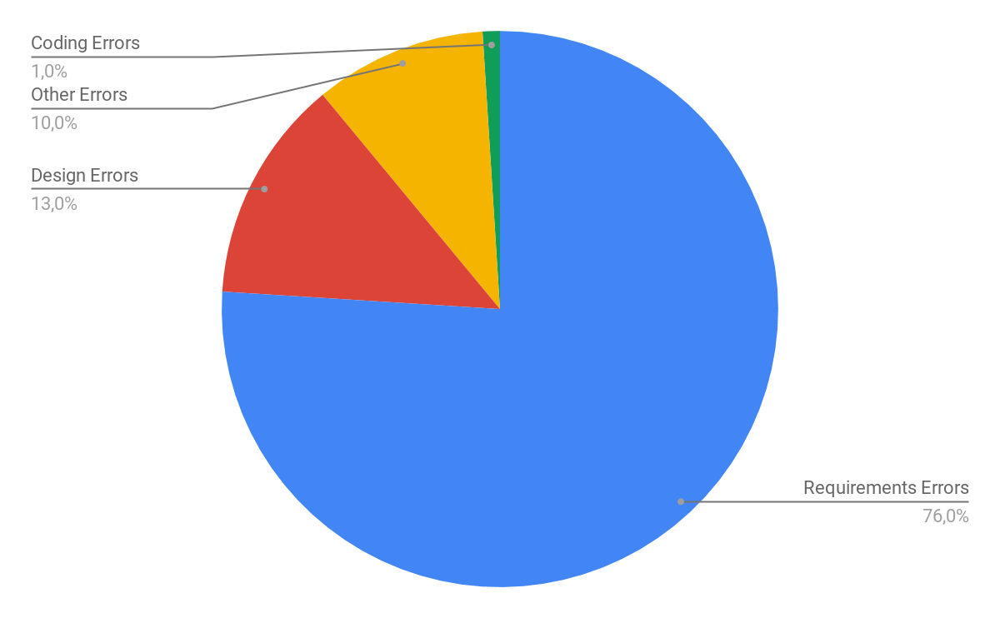](../assets/ads-ir-costo-defectos.png)

- El **76 %** de los defectos se origina en los **requerimientos**
- Solo el **1 %** proviene de errores de codificación

 

- ❓ Si la mayor parte del esfuerzo del equipo se va en **programar**, ¿por qué la mayor parte de los defectos nace **antes** de programar?

</split-slide>

> El costo de corregir un defecto crece de forma acelerada con la fase en que se detecta: lo que cuesta **1** en requerimientos puede costar **100** en producción

---

## El espacio del problema y el de la solución

<split-slide style="--left: 45%; --right: 55%;">

[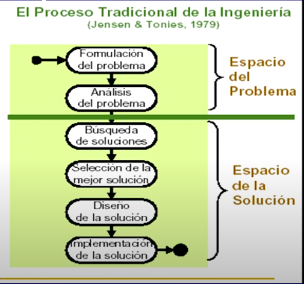](../assets/ads-ir-espacios.png)

- La **separación** entre ambos espacios es crucial en la ingeniería
- La ingeniería de sistemas físicos establece una **clara separación** entre ambos... la de software, muchas veces no

 

- **Espacio del problema** → formulación y análisis del problema
- **Espacio de la solución** → búsqueda, selección, diseño e implementación

> Jensen & Tonies (1979)

</split-slide>

- ⚠️ Saltar al espacio de la solución sin haber cerrado el del problema es el error más caro de todos

---

## La pirámide de los requerimientos

<split-slide style="--left: 48%; --right: 52%;">

[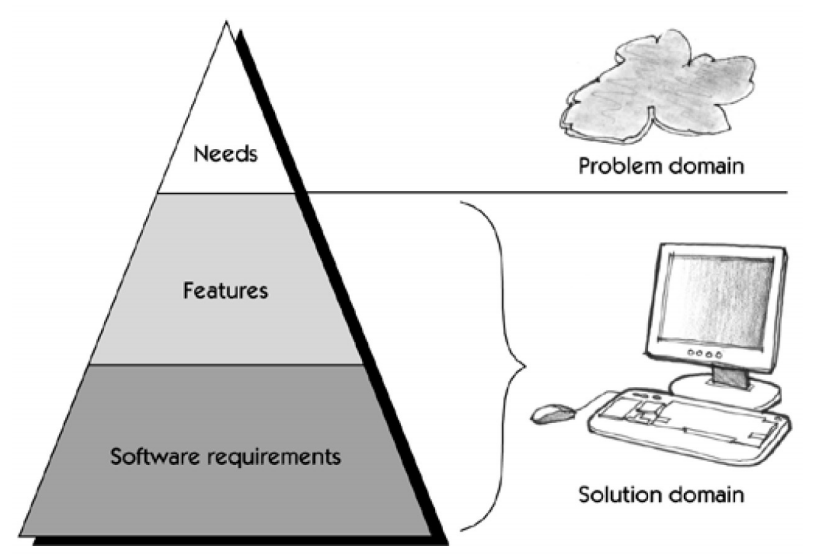](../assets/ads-ir-piramide.png)

- **Necesidades** (*needs*) → dominio del **problema**
- **Características** (*features*) → puente entre ambos
- **Requisitos de software** → dominio de la **solución**

 

| Actividad | Produce |
|:--|:--|
| Modelado de negocio | Necesidades |
| Ingeniería de requisitos | Características y requisitos |
| Diseño | Solución y documentación |

</split-slide>

- Los **procedimientos de prueba** se derivan de los requisitos → por eso la trazabilidad importa

---

## Niveles de requerimiento

- Los requisitos se pueden definir a distintos **niveles de abstracción o detalle**

<steps>
<step>

### 👤 De usuario (*needs*)
Declaraciones en **lenguaje natural** —y quizás tablas y diagramas— de los servicios que el sistema provee y sus **restricciones operacionales**

### 🖥️ De sistema (*features*)
Documento **estructurado** con las descripciones detalladas de funciones, servicios y restricciones

Son la **base del diseño**: definen lo que deberá ser implementado

Puede ser parte de un **contrato** con el cliente

### 💾 De software
Declaraciones **detalladas** de diseño e implementación del software

</step>
<step>

### Los mismos tres niveles, un solo ejemplo

| Nivel | Enunciado |
|:--|:--|
| **De usuario** | El software debe proveer un medio de representar y acceder a los ficheros externos creados por otras herramientas |
| **De sistema** | La persona usuaria debe poder elegir el tipo de fichero externo   Cada tipo de fichero externo debe poder tener asociada una herramienta externa para editarlo y mostrarlo   Cada tipo de fichero externo tiene un icono asociado |
| **De software** | Los iconos de los tipos de fichero se guardan en archivos JPG |

- 💡 Fíjate cómo el **mismo requerimiento** se vuelve más concreto —y más atado a la tecnología— al bajar de nivel

</step>
</steps>

---

## ¿Qué es un requerimiento?

- Según el estándar IEEE, un requerimiento es:

### 📋 Definición 1
Una **condición o capacidad** que debe ser reunida por un sistema o componente de un sistema para **satisfacer un contrato, estándar**, etc.

### 🎯 Definición 2
Una **condición o capacidad** necesitada por una persona usuaria para **resolver un problema** o cumplir un objetivo

- La primera mira al **cumplimiento formal**; la segunda, al **valor real**
- Un buen requerimiento satisface **las dos**: es verificable *y* le sirve a alguien

---

## La ingeniería de requerimientos

<split-slide style="--left: 52%; --right: 48%;">

[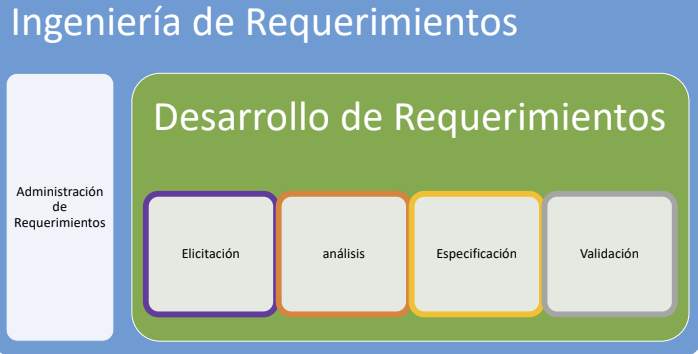](../assets/ads-ir-proceso.png)

- Se divide en dos grandes bloques:

### 🔨 Desarrollo de requerimientos
Elicitación → Análisis → Especificación → **Validación**

*Produce* los requerimientos

### 📊 Administración de requerimientos
Corre **en paralelo** durante todo el proyecto

*Cuida* los requerimientos a lo largo del tiempo

</split-slide>

- Un proyecto puede hacer excelente **desarrollo** de requerimientos y aun así fracasar por mala **administración**

---

## Desarrollo: Elicitación

<steps>
<step>

- **Definir y entender el problema**: de dónde vienen los requerimientos y cómo obtenerlos
- Es un problema de **comunicación** entre las personas usuarias y quienes hacen ingeniería
- Quien analiza actúa como **mediador**: traduce en ambas direcciones

 

- ⚠️ Elicitar **no** es «preguntarle al cliente qué quiere y anotarlo». Las personas usuarias saben su **problema**, no necesariamente la **solución**

</step>
<step>

### Fuentes y técnicas

<split-slide style="--left: 50%; --right: 50%;">

### 🔎 Fuentes de requerimientos
- Objetivos del negocio
- Dominio de la aplicación
- Personas interesadas (*stakeholders*)
- Ambiente organizacional
- Ambiente operacional

### 🛠️ Técnicas
- Entrevistas
- Escenarios
- Prototipos
- Lluvia de ideas
- Observación

</split-slide>

- Las veremos a fondo en la sección de **guías de apoyo**

</step>
</steps>

---

## Desarrollo: Análisis

<split-slide style="--left: 50%; --right: 50%;">

### Qué se hace
- Entender **cómo el software debe interactuar** con su ambiente
- **Clasificar** los requerimientos
- **Detectar conflictos** entre requerimientos
- Escribir requerimientos suficientemente **precisos**

### Dónde aparecen los conflictos
- Entre **características mutuamente incompatibles**
- Entre las distintas **personas interesadas**
- Entre **requerimientos y recursos** disponibles
- Entre requerimientos **funcionales y no funcionales**

</split-slide>

- 💡 Un conflicto detectado en análisis se **negocia**; el mismo conflicto detectado en construcción se **paga**
- Ejemplo clásico: *máxima seguridad* vs. *máxima facilidad de uso*

---

## Desarrollo: Especificación

<split-slide style="--left: 50%; --right: 50%;">

### Características
- Frecuentemente en **lenguaje natural**
- Se complementa con lenguaje **formal o semiformal** (modelos, UML, tablas de decisión)
- Debe ser **entendible para el cliente** → si no lo entiende, no lo puede validar
- Se apoya en **tipos de documentos** (plantillas)

### La tensión permanente

| Más informal | Más formal |
|:--|:--|
| Fácil de leer | Difícil de leer |
| Ambiguo | Preciso |
| Rápido de escribir | Costoso de escribir |
| Difícil de verificar | Verificable |

- La respuesta práctica: **lenguaje natural disciplinado** + modelos donde la precisión importa

</split-slide>

---

## Desarrollo: Validación

- **Verificar** que lo escrito es lo correcto, **antes** de construir

### ✅ Asegurar la comprensión
Que la persona que hace ingeniería **entendió** lo que el negocio necesita

### 📏 Verificar estándares
Que el documento cumple con los **estándares** de la organización

### 🔍 Verificar la calidad
Que el documento es **entendible, consistente y completo**

### 📅 Planificarla
En el **cronograma** se incluyen puntos donde se valida el documento

- Volveremos a esto en detalle en la sección de **validación y trazabilidad**

---

## Administración de requerimientos

- Los requerimientos **cambian**. Administrarlos es aceptar ese hecho y controlarlo

<steps>
<step>

### 🔎 Revisar y evaluar el impacto
Antes de aceptar un cambio, saber **qué más se rompe**

### 🚦 Controles adecuados de los cambios
Quién los propone, quién los **aprueba**, cómo se comunican

### 📅 Mantener actualizado el plan
Un cambio aceptado sin ajustar el plan es una **deuda oculta**

### 🤝 Negociar acuerdos
Basados en los cambios: si entra algo, **sale algo** o se mueve la fecha

### 🧵 Trazar requerimientos
Hacia los diferentes **entregables**

### 📈 Seguimiento
Del **estado** y el **cambio** de cada requerimiento

</step>
<step>

### Por qué importa

- Sin administración de requerimientos aparecen dos patologías clásicas:

<split-slide style="--left: 50%; --right: 50%;">

### 📈 *Scope creep*
El alcance crece poco a poco, sin que nadie decida que creció

Cada cambio parece pequeño; la suma no lo es

### 👻 Requerimientos huérfanos
Código que nadie sabe por qué existe, y necesidades que nadie sabe si se implementaron

Es exactamente lo que la **trazabilidad** previene

</split-slide>

</step>
</steps>

---

## Actividad 1: del síntoma al requerimiento

- En grupos, tomen esta queja real de una persona usuaria:

> «El sistema de matrícula es un desastre, siempre se cae.»

### 1️⃣ Clasifiquen
¿Es una **necesidad**, una **característica** o un **requisito de software**?

### 2️⃣ Suban de nivel
¿Cuál es la **necesidad** de negocio detrás de la queja?

### 3️⃣ Bajen de nivel
Escriban el mismo requerimiento en los **tres niveles**: usuario, sistema y software

- ⏱️ 15 minutos
- ❓ Al terminar: ¿en cuál de los tres niveles fue **más difícil** escribirlo? ¿Por qué?

---

<!-- _class: cover -->

# Clasificación y calidad
## Contenidos
- FURPS+ y requerimientos funcionales
- Requerimientos no funcionales
- Reglas de negocio
- Características y atributos de un requerimiento

---

## Clasificación de requerimientos: FURPS+

- Una manera de categorizar los requerimientos está descrita en el modelo **FURPS+**

### F — *Functionality*
**Funcionalidad**: qué hace el sistema

### U — *Usability*
**Capacidad de uso**

### R — *Reliability*
**Fiabilidad**

### P — *Performance*
**Desempeño**

### S — *Supportability*
**Capacidad de soporte**

### ➕ El signo «+»
Restricciones de **diseño**, requerimientos de **implementación**, de **interfaz** y **físicos**

- La **F** son los requerimientos **funcionales**; **URPS+** son los **no funcionales**

---

## Requerimiento funcional

<split-slide style="--left: 50%; --right: 50%;">

### Definición
- Describe **qué debe hacer** el sistema respecto a su entorno: las personas usuarias u otros sistemas
- Especifica los comportamientos de **entradas y salidas** del sistema
- Se captura con los **casos de uso**

### Ejemplo: Sistema de Gestión Académica

**A los profesores**, el sistema permitirá:
- Consultar los horarios de sus cursos
- Consultar la programación de los exámenes
- Actualizar y ver su información personal
- Registrar y modificar las notas de los estudiantes a su cargo
- Cerrar un curso

</split-slide>

- ❓ ¿Y para los **estudiantes**? → <spoiler>consultar horarios y exámenes, actualizar su información y consultar notas de un curso</spoiler>

---

## Requerimiento no funcional

- Describe **atributos del sistema** o del ambiente en donde éste se desarrolla

<steps>
<step>

### Tres ejemplos reales

- La tasa de **disponibilidad** de Gehoweb debe ser de un **99 %**
- El sistema debe tener una interfaz de uso **intuitiva y sencilla**, complementada con un buen sistema de ayuda (la administración puede recaer en personal con poca experiencia en el uso de aplicaciones informáticas)
- El sistema debe disponer de una **documentación fácilmente actualizable** que permita realizar operaciones de mantenimiento con el menor esfuerzo

</step>
<step>

### ¿Cuál de los tres está bien escrito?

### ✅ El primero
«99 %» es **medible**. Se puede probar

### ⚠️ El segundo
«Intuitiva y sencilla» es **subjetivo**

¿Cómo se prueba? → *«una persona sin capacitación completa la matrícula en menos de 5 minutos»*

### ⚠️ El tercero
«Menor esfuerzo» no es verificable

→ *«el 90 % de los textos de interfaz se editan sin recompilar»*

- 💡 Regla: si no le puedes poner un **número** o un **criterio de aceptación**, todavía no es un requerimiento

</step>
</steps>

---

## No funcionales: capacidad de uso y fiabilidad

<split-slide style="--left: 50%; --right: 50%;">

### 🖐️ Capacidad de uso (*Usability*)
Facilidad o nivel de uso del producto: el grado en el que el diseño de un elemento **facilita o dificulta su manejo**

- Factores humanos
- Estética
- Consistencia de la interfaz
- Ayudas en línea
- Agentes y asistentes
- Documentación y material de entrenamiento

> *Ejemplo:* visibilidad del texto a cierta distancia · combinación de colores del texto

### 🛡️ Fiabilidad (*Reliability*)
Capacidad de un sistema o componente para **ejecutar sus funciones** requeridas bajo condiciones normales en un periodo específico (IEEE)

- Frecuencia y severidad de los errores
- Capacidad de recuperación
- Capacidad predictiva
- Exactitud
- Tiempo promedio entre fallas (**MTBF**)

> *Ejemplo:* el sistema estará disponible el 99 % del tiempo

</split-slide>

---

## No funcionales: rendimiento y soporte

<split-slide style="--left: 50%; --right: 50%;">

### ⚡ Rendimiento (*Performance*)
Afectan a los funcionales en la medida de parámetros como:

- Velocidad
- Eficiencia
- Disponibilidad
- Exactitud
- Tiempo de respuesta

> *Ejemplo:* el tiempo de respuesta es de 1 segundo

### 🔧 Soporte (*Supportability*)
Incluye la capacidad de:

- Prueba
- Extensión
- Adaptación
- Mantenimiento
- Compatibilidad
- Configuración
- Instalación y localización

> *Ejemplo:* inclusión de nuevas reglas en algún punto determinado

</split-slide>

- 🔗 Estos son los **atributos de calidad** que ya viste en el mazo de *Introducción al Análisis y Diseño*

---

## Especificaciones suplementarias

- Es el **artefacto** donde viven los requerimientos que **no** caben en un caso de uso

<split-slide style="--left: 52%; --right: 48%;">

### ¿Qué contiene?
- Los requerimientos **no funcionales** (URPS+)
- Requerimientos funcionales que **no** pertenecen a un caso de uso específico, sino que aplican a **todo** el sistema
- **Restricciones** de diseño e implementación
- **Estándares** aplicables y requisitos legales
- Interfaces con **hardware** y **software** externo

### ¿Por qué separarlo?
- Un requerimiento como *«toda pantalla debe responder en menos de 2 s»* aplica a **los 40 casos de uso**
- Repetirlo 40 veces lo vuelve **imposible de mantener**
- Se escribe **una vez** aquí y los casos de uso lo **referencian**

 

> Junto con el **Modelo de casos de uso**, forma la **especificación completa** del sistema

</split-slide>

---

## Reglas de negocio

- Políticas, estándares, prácticas, regulaciones o guías **definidas a nivel de la organización**
- ⚠️ **No** son requerimientos del sistema: **existen aunque el sistema no exista**. El sistema las *hace cumplir*

<steps>
<step>

### Los cinco tipos

### 📌 Hechos (*facts*)
Enunciados **verdaderos** sobre el negocio

*«Toda orden tiene un cargo de envío»*

### 🚧 Restricciones (*constraints*)
**Limitan** lo que el sistema o la persona usuaria puede hacer

*«Máximo 18 créditos por estudiante»*

### ⚡ Disparadores (*action enablers*)
Activan una actividad cuando se cumple una condición

*«Al vencer el plazo, notificar al responsable»*

### 🔗 Inferencias (*inferences*)
Hechos **derivados** de otros hechos, en forma *si/entonces*

*«Sin pago en 30 días → cuenta morosa»*

### 🧮 Cálculos (*computations*)
**Fórmulas** y algoritmos definidos por el negocio

*«Nota = 40 % prácticas + 60 % exámenes»*

### 💡 Regla de oro
Reglas **atómicas**: combinar varias en una sola la vuelve imposible de mantener

</step>
<step>

### Cómo se conectan con los requerimientos

| La regla de negocio... | Se traduce en... |
|:--|:--|
| **Restricción** | Una validación en un caso de uso · Una precondición |
| **Disparador** | Un flujo alternativo o un caso de uso iniciado por el *tiempo* |
| **Inferencia** | Lógica de negocio y estados del modelo de dominio |
| **Cálculo** | Un paso del flujo básico con su fórmula documentada |
| **Hecho** | Una relación o restricción del **modelo de dominio** |

- 🧵 Se numeran (**RN-001**, **RG-005**...) y los casos de uso las **referencian** → así, si cambia la política, se sabe **exactamente** qué casos de uso revisar
- ⚠️ Si copias la regla dentro de cada caso de uso, tendrás **N versiones** de la misma política

</step>
</steps>

---

## Niveles, tipos y documentos de requisitos

[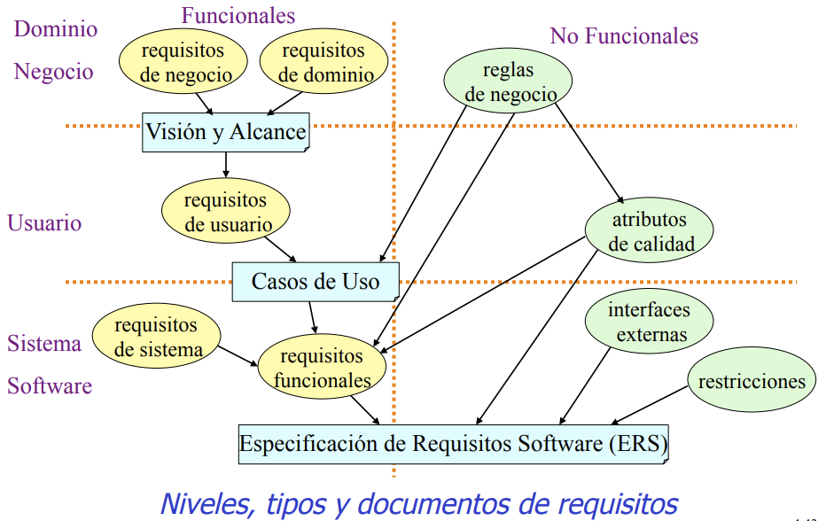](../assets/ads-ir-niveles-tipos-docs.png)

- Fíjate en la línea punteada vertical: separa lo **funcional** de lo **no funcional**; las horizontales separan los **niveles**

---

## Características de un buen requerimiento

### ✔️ Completo
Contiene la **información necesaria** para quien desarrolla

### 🎯 Correcto
Describe la funcionalidad que **se construirá**

### 🔨 Factible
Es posible implementarlo dentro de las **capacidades y limitaciones** conocidas

### 🙋 Necesario
Es lo que el cliente **realmente** necesita

### 📊 Priorizado
Indica **qué tan esencial** es para esta versión del producto

### 🔍 No ambiguo
Cada persona que lo lee entiende **lo mismo**

### 🧪 Verificable
Se puede comprobar por **inspección o demostración**

### 🔢 Cuantificable
No depende de la **interpretación o el juicio subjetivo**

---

## Aplicando las características

- Un mismo requerimiento, reescrito hasta que cumple:

| Versión | Enunciado | Problema |
|:--|:--|:--|
| **v1** | El sistema debe ser rápido | No es cuantificable ni verificable |
| **v2** | El sistema debe responder rápido a las consultas de notas | Sigue siendo ambiguo: ¿rápido para quién? |
| **v3** | La consulta de notas debe responder en menos de 2 segundos | Falta: ¿bajo qué carga? ¿siempre? |
| **v4** | La consulta de notas debe responder en **menos de 2 s** para el **95 % de las peticiones**, con hasta **500 usuarios concurrentes** | ✅ Cuantificable, verificable, no ambiguo |

- ❓ ¿La **v4** es *factible*? Eso no lo dice el requerimiento: lo dice el **análisis de factibilidad técnica**
- 💡 Truco de validación: si no puedes escribir el **caso de prueba** a partir del requerimiento, todavía no está listo

---

## Atributos de los requerimientos

- Un requerimiento no es solo su **texto**: lleva **metadatos** que permiten administrarlo

<steps>
<step>

| Atributo | Para qué sirve | Valores típicos |
|:--|:--|:--|
| **Estado** | Saber en qué punto del ciclo está | Propuesto · Aprobado · Incorporado · Validado · Rechazado |
| **Prioridad** | Decidir qué entra en cada versión | Alta · Media · Baja · *(o MoSCoW)* |
| **Beneficio** | Cuánto valor aporta al negocio | Crítico · Importante · Útil |
| **Esfuerzo** | Cuánto cuesta implementarlo | Puntos · horas · talla |
| **Riesgo** | Probabilidad de causar problemas | Alto · Medio · Bajo |
| **Estabilidad** | Qué tan probable es que cambie | Alta · Media · Baja |
| **Versión objetivo** | En qué entrega se compromete | 1.0 · 1.1 · Futuro |
| **Asignado a** | Quién es responsable | Persona o equipo |
| **Origen / razón** | De dónde salió y por qué | *Stakeholder*, documento, regulación |

</step>
<step>

### Para qué sirven en la práctica

### 📊 Priorizar con criterio
**Beneficio alto + esfuerzo bajo** primero. Sin estos atributos, la priorización es una opinión

### ⚠️ Anticipar el riesgo
Requerimientos de **estabilidad baja** no deben congelarse temprano: se diseñan para el cambio

### 🔎 Rastrear el origen
Cuando alguien pregunte «¿por qué hacemos esto?», el atributo **origen** responde

### 📈 Medir el avance
Contar requerimientos por **estado** dice más del proyecto que contar líneas de código

- 💡 Los atributos son lo que convierte una **lista de deseos** en un **conjunto administrable**

</step>
</steps>

---

## Actividad 2: clasifica y evalúa

- Para cada enunciado: clasifíquenlo (**funcional / no funcional / regla de negocio**) y evalúen si cumple las características de un buen requerimiento

<split-slide style="--left: 50%; --right: 50%;">

### Enunciados
1. El sistema debe permitir matricular cursos
2. Un estudiante no puede matricular un curso si no aprobó el requisito
3. El sistema debe ser seguro
4. La nota final se calcula como 40 % prácticas y 60 % exámenes
5. El sistema debe soportar 3000 usuarios concurrentes
6. Al cerrar el curso, notificar a los estudiantes

### Para cada uno
- ¿Qué **tipo** es?
- Si es no funcional, ¿en qué categoría **FURPS+**?
- ¿Qué **características** incumple?
- **Reescríbanlo** para que las cumpla
- Asígnenle **prioridad**, **riesgo** y **estabilidad**

</split-slide>

- ⏱️ 20 minutos · ❓ ¿Cuántos de los seis eran en realidad **reglas de negocio** disfrazadas de requerimiento?

---

<!-- _class: cover -->

# Guías de apoyo
## Contenidos
- Entrevistas, cuestionarios y sesiones de trabajo
- Lluvia de ideas, storyboarding y roles
- Espina de pescado, Pareto y afinidad

---

## Mapa de las técnicas

- No compiten entre sí: cada una sirve para un **momento** distinto

| Quiero... | Técnica |
|:--|:--|
| **Entender en profundidad** a una persona | Entrevista |
| Llegar a **muchas** personas rápido | Cuestionario |
| **Decidir en grupo** y resolver conflictos | Sesión de trabajo (*workshop*) |
| **Generar** muchas ideas y luego filtrarlas | Lluvia y reducción de ideas |
| Hacer **tangible** algo que aún no existe | *Storyboarding* · Prototipos |
| Entender el trabajo **desde adentro** | Representación de roles · Juego de roles |
| Encontrar la **causa raíz** de un problema | Diagrama de espina de pescado |
| Saber **qué atacar primero** | Diagrama de Pareto |
| **Organizar** un montón de ideas sueltas | Diagrama de afinidad |

- 💡 En un proyecto real se **combinan**: entrevistas → taller → lluvia de ideas → afinidad → prototipo

---

## Entrevistas

<split-slide style="--left: 50%; --right: 50%;">

### Cómo se hace
- **Preparar**: estudiar el dominio y los documentos **antes**
- Combinar preguntas **abiertas** (exploran) y **cerradas** (confirman)
- Empezar por lo **general** y bajar al detalle (*embudo*)
- **Registrar** y enviar el resumen para confirmación

### La «entrevista libre de contexto»
Preguntas que evitan sesgar hacia una solución:

- ¿**Quién** es la persona usuaria? ¿Quién es el cliente?
- ¿Cuál es el **problema** de fondo?
- ¿Cuáles son las **causas** de ese problema?
- ¿Cómo lo resuelve **hoy**?
- ¿Cómo sabría que el problema **se resolvió**?

</split-slide>

- ✅ **Ventaja**: profundidad, permite repreguntar y leer el lenguaje no verbal
- ⚠️ **Riesgo**: costosa en tiempo; la persona describe lo que **cree** que hace, no siempre lo que hace

---

## Cuestionarios

<split-slide style="--left: 50%; --right: 50%;">

### Cuándo usarlo
- Hay **muchas** personas usuarias y poco tiempo
- Están **dispersas** geográficamente
- Se quiere **cuantificar** algo que ya se conoce cualitativamente
- Se necesita **evidencia** para respaldar una decisión

### Buenas prácticas
- **Pilotear** el cuestionario con 3-5 personas antes
- Preguntas **cortas** y una sola idea por pregunta
- Escalas **consistentes** (p. ej. Likert 1-5)
- Evitar preguntas que **sugieren** la respuesta
- Decir cuánto **tiempo** toma y para qué se usará

</split-slide>

- ✅ **Ventaja**: alcance y datos comparables
- ⚠️ **Riesgo**: no permite repreguntar; baja tasa de respuesta; **no descubre** lo que no preguntaste
- 💡 Úsalo **después** de las entrevistas, no antes: primero descubres, luego mides

---

## Sesiones de trabajo (*requirements workshop*)

- Reunión **facilitada** y estructurada con las personas interesadas clave, para **decidir en conjunto**

<steps>
<step>

### Los tres roles

### 🎤 Facilitador
**No opina** sobre el contenido: cuida el proceso, el tiempo y que todos participen

### 📝 Escriba
Registra decisiones, **supuestos** y temas pendientes en vivo, visibles para todos

### 👥 Participantes
Personas con **autoridad para decidir**, no solo mensajeros

</step>
<step>

### Cómo se ejecuta

<split-slide style="--left: 50%; --right: 50%;">

### Antes
- Definir **objetivo** y entregable de la sesión
- Enviar material de **preparación**
- Asegurar que asisten quienes **deciden**

### Durante
- Reglas del juego **explícitas**
- Estacionar los temas fuera de alcance en un **«parqueo»**
- Cerrar con **decisiones y responsables**, no con «lo seguimos viendo»

</split-slide>

- ✅ **Ventaja**: resuelve **conflictos entre stakeholders** en horas en lugar de semanas de correos
- ⚠️ **Riesgo**: sin facilitación, la persona de mayor jerarquía **decide sola** y el resto calla

</step>
</steps>

---

## Lluvia y reducción de ideas

- Son **dos** momentos distintos y no se deben mezclar

<split-slide style="--left: 50%; --right: 50%;">

### 💭 Lluvia de ideas (divergir)
- **Nada de crítica** durante la generación
- Buscar **cantidad**, no calidad
- Las ideas **descabelladas** son bienvenidas
- **Combinar y mejorar** las ideas ajenas
- Todo el mundo aporta, por turnos o en paralelo

### ✂️ Reducción de ideas (converger)
- **Podar** duplicados y agrupar similares
- **Depurar** el enunciado de cada idea
- **Priorizar** con votación acumulativa (cada persona reparte *N* votos)
- Descartar lo **fuera de alcance** de forma explícita

</split-slide>

- ⚠️ El error clásico: **criticar mientras se genera**. Mata la participación en los primeros 5 minutos
- 💡 La **votación acumulativa** revela qué problemas hay que resolver frente a cuáles solo *gustaría* resolver

---

## *Storyboarding*

- Representación **temprana y barata** del sistema, para provocar reacción antes de construir

<steps>
<step>

### Los tres tipos

### 👁️ Pasivo
La persona usuaria **observa**: bocetos, capturas, una secuencia narrada

*«Déjame contarte cómo funcionaría»*

### 🎬 Activo
Muestra el sistema **en movimiento**: una animación o una secuencia automática

*«Mira cómo se comportaría»*

### 🖱️ Interactivo
La persona usuaria **prueba**: navega una maqueta clicable

*«Pruébalo tú»*

</step>
<step>

### El propósito real

- El objetivo del *storyboard* **no** es que guste: es **provocar el rechazo temprano**
- Un *storyboard* que la persona usuaria aprueba sin comentarios probablemente **no se entendió**

### ✅ Hazlo
- **Fácil** de modificar
- **Barato** de desechar
- Enfocado en **una historia** de uso

### 🚫 Evítalo
- Pulirlo tanto que **parezca terminado**
- Que el cliente crea que el sistema **ya está hecho**
- Convertirlo en el diseño **definitivo** sin discusión

</step>
</steps>

---

## Representación de roles y juego de roles

- Dos técnicas de **inmersión**: entender el trabajo viviéndolo, no preguntando por él
- ⚠️ Varias personas autoras las tratan como **sinónimos**; aquí las distinguimos por su montaje

<split-slide style="--left: 50%; --right: 50%;">

### 🎭 Representación de roles
Quien analiza **asume el rol** de la persona usuaria y **hace su trabajo real** durante un tiempo

- Revela los **atajos** y trucos que nadie menciona en una entrevista
- Descubre el trabajo **invisible**: las excepciones, los post-its, el «cuadernito»

> *«Pasé un turno atendiendo la ventanilla de matrícula»*

### 🎬 Juego de roles
Sesión en grupo donde se **dramatiza un escenario**: alguien hace de persona usuaria, alguien de **sistema**, alguien observa

- Recorre un **flujo completo** paso a paso
- Quien hace de *sistema* solo puede responder con lo que el sistema **realmente sabría**
- Expone **huecos**: «¿y de dónde saco ese dato?»

> Emparienta con el recorrido de **casos de uso**

</split-slide>

- 💡 Ambas son especialmente útiles cuando el dominio es **muy ajeno** al equipo técnico

---

## Diagramas de espina de pescado (Ishikawa)

- Herramienta de **causa-efecto**: separa el **síntoma** de sus **causas raíz**

<steps>
<step>

### Cómo se construye

1. Escribir el **efecto** (el problema) en la cabeza del pescado, a la derecha
2. Trazar la **espina central** y las espinas mayores: las **categorías** de causa
3. En cada categoría, preguntar **«¿por qué?»** repetidamente y anotar las sub-causas
4. Identificar las causas que **más contribuyen** y verificarlas con datos

### Categorías clásicas (6M)
Máquina · Método · Material · Mano de obra · Medición · Medio ambiente

### Categorías para software
**Personas** · **Procesos** · **Tecnología** · **Datos** · **Políticas** · **Entorno**

</step>
<step>

### Ejemplo: «La matrícula se cae cada semestre»

| Categoría | Causas identificadas |
|:--|:--|
| **Personas** | Toda la población matricula el mismo día · No hay capacitación previa |
| **Procesos** | Los cupos se validan al final, no al asignar · No hay ventanas escalonadas |
| **Tecnología** | Un solo servidor · Sin caché · Consultas sin índices |
| **Datos** | El padrón se sincroniza manualmente · Cursos duplicados |
| **Políticas** | La normativa exige matrícula en 3 días · Sin lista de espera oficial |

- 💡 Fíjate: solo **una** de las cinco categorías es técnica
- ⚠️ Si el equipo solo agranda el servidor, el problema **vuelve** el próximo semestre

</step>
</steps>

---

## Diagramas de Pareto

- Principio **80/20**: aproximadamente el **80 %** de los efectos proviene del **20 %** de las causas

<steps>
<step>

### Ejemplo: quejas del sistema de matrícula en un semestre

<i>Caídas en hora pico</i><u style="width:100%"></u><b>420 · 48 %</b>

<i>Cupos mal asignados</i><u style="width:56%"></u><b>235 · 27 %</b>

<i>Choques de horario</i><u style="width:24%"></u><b>102 · 12 %</b>

<i>Notas desactualizadas</i><u style="width:13%"></u><b>55 · 6 %</b>

<i>Errores de impresión</i><u style="width:8%"></u><b>34 · 4 %</b>

<i>Otros</i><u style="width:6%"></u><b>26 · 3 %</b>

- Las **dos primeras** causas concentran el **75 %** de las quejas

</step>
<step>

### Cómo se usa en requerimientos

### 1️⃣ Contar, no opinar
Clasificar los problemas por **categoría** y contar su frecuencia (o su costo)

### 2️⃣ Ordenar de mayor a menor
Y acumular el porcentaje para ver dónde está el **corte**

### 3️⃣ Priorizar el alcance
Los **pocos vitales** entran en la versión 1.0; los **muchos triviales** esperan

- ✅ Convierte la priorización en una conversación sobre **datos** y no sobre quién habla más fuerte
- ⚠️ **Cuidado**: lo más frecuente no siempre es lo más **grave**. Un fallo raro que compromete datos personales puede superar en impacto a mil quejas menores → considera ponderar por **costo**, no solo por conteo

</step>
</steps>

---

## Diagramas de afinidad

- Técnica para **organizar** una gran cantidad de ideas sueltas agrupándolas por **relación natural**
- También llamada **método KJ**, por su autor Jiro Kawakita

<split-slide style="--left: 50%; --right: 50%;">

### Cómo se hace
1. Cada idea, en **una tarjeta** o *post-it* (una idea por tarjeta)
2. Agrupar **en silencio**: cada quien mueve tarjetas donde ve afinidad
3. Discutir solo cuando el movimiento se **estabiliza**
4. Ponerle **nombre** a cada grupo → ese nombre suele ser una **necesidad** o una **característica**
5. Ordenar los grupos por **prioridad**

### Por qué funciona
- El silencio inicial evita que la **jerarquía** sesgue el agrupamiento
- Los grupos **emergen** de los datos en lugar de imponerse desde una estructura previa
- Es el **complemento natural** de la lluvia de ideas: primero se genera, luego se agrupa

 

> Es la técnica que convierte **200 post-its** en **8 temas** discutibles

</split-slide>

- 💡 Encadenamiento habitual: **lluvia de ideas → afinidad → votación acumulativa → características (FEA)**

---

## Actividad 3: escoge y aplica

- Su equipo debe levantar los requerimientos de un **sistema de préstamo de equipo** para un laboratorio

### 1️⃣ Diseñen la estrategia
¿Qué **tres** técnicas usarían y **en qué orden**? Justifiquen cada una en una línea

### 2️⃣ Espina de pescado
El problema es *«se pierden equipos cada semestre»*. Construyan el diagrama con las **5 categorías** de software

### 3️⃣ Pareto
Con las causas que encontraron, ¿cuáles serían los **pocos vitales**? ¿Qué dejarían fuera de la v1.0?

- ⏱️ 25 minutos
- ❓ Discusión final: ¿su estrategia descubre lo que las personas usuarias **no saben que necesitan**? ¿Qué técnica de las diez sirve para eso?

---

<!-- _class: cover -->

# Artefactos y prototipos
## Contenidos
- Los artefactos de la ingeniería de requerimientos
- Plan de administración y peticiones
- Prototipos como medio de validación

---

## Los artefactos de la ingeniería de requerimientos

| Artefacto | Responde | Nivel |
|:--|:--|:--|
| **Plan de administración de requerimientos** | ¿**Cómo** vamos a trabajar los requerimientos? | Proceso |
| **Peticiones de los afectados** | ¿Qué **pidió** cada persona interesada, textualmente? | Crudo |
| **Visión** | ¿Cuál es el **problema** y qué capacidades hacen falta? | Problema del negocio |
| **Modelo y especificación de casos de uso** | ¿Qué **hace** el sistema y para quién? | Especificación funcional |
| **Especificaciones suplementarias** | ¿Bajo qué **atributos y restricciones** lo hace? | Especificación no funcional |
| **Glosario** | ¿Qué significa cada **término** del dominio? | Transversal |
| **Atributos de requerimientos** | ¿En qué **estado, prioridad y riesgo** está cada uno? | Administración |

- 🔗 La **Visión** ya la trabajamos a fondo en el mazo de *Métodos de análisis de sistemas*
- 💡 Juntos, **Casos de uso + Especificaciones suplementarias** forman la especificación completa

---

## Plan de administración de requerimientos

- Define **cómo** se van a manejar los requerimientos en **este** proyecto. Se escribe **antes** de tener requerimientos

<split-slide style="--left: 50%; --right: 50%;">

### Qué define
- **Tipos** de requerimiento que se usarán (STR, FEA, UC, SUPL, RN...)
- **Atributos** de cada tipo y sus valores permitidos
- **Convención de identificadores** y numeración
- **Herramienta** de gestión y su configuración
- Política de **trazabilidad**: qué se traza con qué

### Y sobre todo
- El **proceso de control de cambios**:
  - Quién puede **proponer** un cambio
  - Quién lo **evalúa** y quién lo **aprueba**
  - Cómo se mide el **impacto**
  - Cómo se **comunica** a quienes lo necesitan
- Los **roles y responsabilidades**
- Los **hitos de validación** en el cronograma

</split-slide>

- ⚠️ Sin este plan, cada persona numera y prioriza a su manera, y la trazabilidad se vuelve **imposible** a los tres meses

---

## Peticiones de los afectados

- Registro **textual** de lo que cada persona interesada pidió, **antes** de interpretarlo

<steps>
<step>

### 📥 Qué es
La lista **cruda** de solicitudes: de entrevistas, correos, tiquetes de soporte, actas de reuniones

### 🎯 Para qué sirve
Permite **rastrear** cada característica hasta la persona que la pidió y **cuándo**

### 🚫 Qué no es
**No** es la Visión. La Visión es el resultado de **analizar** y **consolidar** estas peticiones

</step>
<step>

### El flujo completo

| Paso | Artefacto | Qué ocurre |
|:--|:--|:--|
| 1 | **Peticiones de los afectados** | Se registra lo que se pidió, tal cual, con su origen |
| 2 | *Análisis* | Se depuran duplicados, se detectan conflictos, se agrupan |
| 3 | **Visión** | Se consolidan en **necesidades (STR)** y **características (FEA)** priorizadas |
| 4 | **Casos de uso** y **Suplementarias** | Se detallan en requerimientos verificables |

- 🧵 Cada paso mantiene un **vínculo hacia atrás** → eso es trazabilidad
- 💡 Cuando alguien reclame «yo pedí eso y no está», la respuesta sale de este artefacto: se pidió, se analizó y **se decidió** postergarlo... o efectivamente se perdió

</step>
</steps>

---

## Los prototipos como medio de validación

- Un prototipo convierte una especificación **abstracta** en algo **criticable**

<steps>
<step>

### Por qué funciona

### 👀 Lo abstracto no se valida
Nadie detecta un hueco leyendo 40 páginas; **todo el mundo** lo detecta usando una pantalla

### 💬 Cambia la conversación
De *«¿está completo el documento?»* a *«esto no es lo que necesito, falta X»*

### 💰 Falla barato
Es mucho más barato desechar un prototipo que **rehacer** un sistema construido

</step>
<step>

### Tipos de prototipo

<split-slide style="--left: 50%; --right: 50%;">

### 🗑️ Desechable (*throwaway*)
Se construye **rápido y sucio** solo para responder una pregunta, y luego **se bota**

- Ideal para validar **requerimientos**
- No se cuida la calidad interna

### 🌱 Evolutivo
Se construye con **calidad** y se va refinando hasta convertirse en el producto

- Ideal cuando los requerimientos se **descubren** al usar
- Requiere disciplina de diseño desde el inicio

</split-slide>

### 📐 Horizontal
Muchas pantallas, **poca** profundidad → valida el **flujo** y el alcance

### 📏 Vertical
Una función **completa** de punta a punta → valida la **factibilidad técnica**

</step>
<step>

### El riesgo que hay que gestionar

- ⚠️ El peligro central: que el cliente crea que el prototipo **ya es el sistema**

### 🚩 Síntomas
- *«Si ya se ve así, ¿por qué faltan 6 meses?»*
- Presión para **entregar el prototipo** como producto
- El prototipo desechable **se queda** en producción, sin pruebas ni arquitectura

### 🛡️ Mitigaciones
- Usar estética deliberadamente **de boceto** al inicio
- **Decir explícitamente** qué es y qué no es, en cada sesión
- Definir **desde el plan** si es desechable o evolutivo
- Usar **datos de ejemplo** obviamente falsos

- 💡 Un prototipo es una **pregunta**, no una promesa. Que quede escrito **qué pregunta** responde

</step>
</steps>

---

## Actividad 4: diseña un prototipo de validación

- Tomen la característica *«validación de choques de horario en línea»*

### 1️⃣ ¿Qué pregunta responde?
Escriban la **pregunta concreta** que el prototipo debe resolver. Una sola

### 2️⃣ ¿Qué tipo?
¿Desechable o evolutivo? ¿Horizontal o vertical? **Justifiquen**

### 3️⃣ ¿Cómo lo presentan?
¿Pasivo, activo o interactivo? ¿A **quién** se lo muestran y qué les van a **preguntar**?

- ⏱️ 15 minutos
- ❓ ¿Qué harían si, al mostrarlo, la contraparte pide **entregarlo tal cual** la próxima semana?

---

<!-- _class: cover -->

# Modelado de casos de uso
## Contenidos
- Actores y su identificación
- Casos de uso y su diagrama
- Especificación de casos de uso
- Errores comunes

---

## De requerimientos a casos de uso

- El punto de partida es la **lista de requerimientos funcionales**

| Código | Requerimiento | Caso de uso | Actor |
|:--|:--|:--|:--|
| **RF1** | El sistema debe permitir al Encargado de vuelos mantener datos de las unidades | Mantener datos de unidades *(Añadir, Modificar, Eliminar)* | Encargado de vuelos |
| **RF2** | El sistema debe permitir registrar los vuelos de carga | Registrar vuelos de carga | Encargado de vuelos |

> Ejemplo: Sistema de Transportes Aéreos

- 🧵 Esta tabla **es** trazabilidad: conecta el requerimiento con el caso de uso que lo realiza
- ❓ Fíjate en RF1: tres operaciones (añadir, modificar, eliminar) forman **un solo** caso de uso. ¿Por qué? → <spoiler>porque el objetivo del actor es «mantener los datos», no «hacer clic en Añadir»</spoiler>

---

## ¿Qué es el modelo de casos de uso?

- Es un modelo que describe los **requerimientos funcionales** del sistema en forma de **casos de uso**

### 🧑 Actor
El **rol** externo que interactúa con el sistema

### 🥚 Caso de uso
Una **pieza de funcionalidad** con valor para el actor

### 📄 Descripción de casos de uso
La **especificación** textual de cada uno

### 📊 Diagrama de casos de uso
La **vista gráfica** de actores, casos de uso y relaciones

- ⚠️ Los cuatro son necesarios: el **diagrama solo** no especifica nada. Es un índice, no la especificación

---

## ¿Qué es un actor?

- Un actor es un **rol** que desempeña **una persona** o **una cosa** que es **externa** al sistema de software
- Interactúa con el sistema para **alcanzar un objetivo de negocio**

<split-slide style="--left: 50%; --right: 50%;">

### 🔑 Es un ROL, no una persona
- Una **misma persona** puede desempeñar varios roles
- Un **mismo rol** puede ser desempeñado por muchas personas
- Por eso se nombra *«Encargado de vuelos»* y no *«doña Marta»*

### 🚧 Los actores definen la frontera
- Todo lo que es **actor** está **fuera** del sistema
- Identificar actores **es** decidir el alcance
- Es la misma idea del **diagrama de contexto**, ahora en UML

</split-slide>

> Unhelkar (2018)

---

## Los actores definen la frontera

[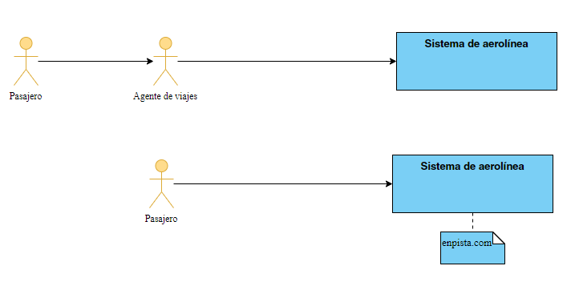](../assets/ads-cu-frontera.png)

- Arriba, el **Agente de viajes** usa el sistema y el **Pasajero** no → solo el agente es actor
- Abajo, el pasajero interactúa **directamente** con el sistema → ahora sí es actor
- 💡 El **mismo** sistema, dos fronteras distintas. Cambiar quién es actor **cambia el alcance del proyecto**

---

## ¿Qué puede ser un actor?

### 👤 Un ROL de una persona
Que **usa** el sistema

### 🎬 Un ROL que inicia
Una interacción, aunque no opere el sistema

### ⏰ El TIEMPO
Porque los eventos que activa **inician** una interacción o un proceso

### 🖥️ Un SISTEMA EXTERNO
Que interactúa con el sistema en desarrollo

*Ej.: una base de datos pública o un servicio*

### 🖨️ Un DISPOSITIVO EXTERNO
Que interactúa con el sistema en desarrollo

*Ej.: una impresora o un lector de tarjetas*

### ⚠️ Ojo
La paciente **no interactúa**, pero su presencia **invoca acciones** → puede ser actor indirecto

- 💡 El actor **Tiempo** es el más olvidado: los procesos nocturnos, los cierres mensuales y los recordatorios **también** son casos de uso

---

## Identificación de actores

- Es una de las actividades **más importantes** durante el análisis del dominio del problema
- Usualmente se recurre al involucramiento de las **personas usuarias** para que colaboren con la identificación

<steps>
<step>

### Las cinco preguntas

- ¿Quiénes serán las personas usuarias **principales y secundarias** del sistema?
- ¿Quiénes serán los principales **beneficiarios** de las interacciones con el sistema?
- ¿Quiénes serán los principales **iniciadores** de interacciones con el sistema?
- ¿Con qué **sistemas y dispositivos externos** deberá interactuar el sistema en desarrollo?
- ¿Existe un proceso basado en el **tiempo** en el sistema?

</step>
<step>

### Ejemplo: actores de un sistema de gestión hospitalaria

[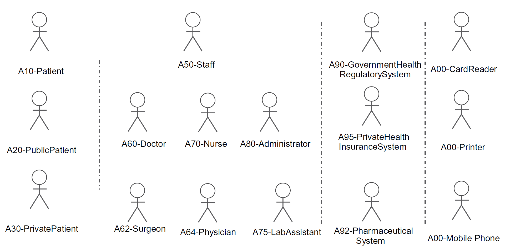](../assets/ads-cu-actores-hospital.png)

- Fíjate en los **cuatro grupos** separados por las líneas: pacientes, personal, **sistemas externos** y **dispositivos**

</step>
</steps>

---

## Clasificación de actores

<split-slide style="--left: 50%; --right: 50%;">

### Directos vs. indirectos

- **Directos / primarios**: **usan** el sistema
  - *Ej.:* la persona cajera del banco
- **Indirectos / secundarios**: son **generadores de interacciones** pero no usan el sistema
  - *Ej.:* la persona clienta del banco

 

- 💡 Los indirectos se documentan porque sus **necesidades** determinan el caso de uso, aunque no toquen el teclado

### Abstractos vs. concretos

- **Abstractos**: permiten la **generalización** de un comportamiento común del sistema
- **Concretos**: modelan el comportamiento **específico**

 

- La generalización de actores se dibuja con la flecha de **herencia**
- Sirve para no repetir las mismas asociaciones en cada rol especializado

</split-slide>

---

## Generalización de actores

[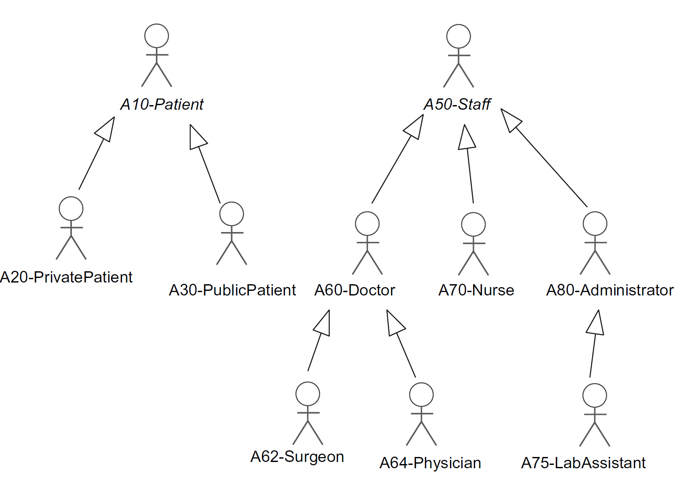](../assets/ads-cu-actores-generalizacion.png)

- *Patient* y *Staff* (en cursiva) son **abstractos**; los de abajo son **concretos**
- Todo lo que puede hacer *Staff*, lo pueden hacer *Doctor*, *Nurse* y *Administrator*

---

## ¿Qué es un caso de uso?

- Los casos de uso **documentan** las **interacciones** de un **actor** con el **sistema**

<steps>
<step>

### 💎 Resultado de valor
Estas interacciones deben producir un **resultado de valor observable** para el actor

### 🪜 Serie de pasos
Documentan una **secuencia** de pasos, no una función suelta

### 🎯 El qué, no el cómo
Especifican **lo que hace** el sistema, pero **no cómo** lo hace

- Se representan de **dos formas complementarias**:
  - **Diagramas UML** → la vista de conjunto
  - **Texto** → las interacciones detalladas del actor y el sistema

> Unhelkar (2018)

</step>
<step>

### La prueba del «resultado de valor»

| Candidato | ¿Es caso de uso? | Por qué |
|:--|:--|:--|
| *Iniciar sesión* | ⚠️ Discutible | Es un medio, no un fin. Suele ser una **precondición** |
| *Buscar cliente* | ❌ No | Nadie termina su día satisfecho por haber buscado |
| *Gestionar cliente* | ✅ Sí | El actor logra su objetivo: los datos quedan al día |
| *Hacer clic en Guardar* | ❌ No | Es un **paso** dentro de un flujo |
| *Registrar matrícula* | ✅ Sí | Produce un resultado observable y valioso |

- 💡 Prueba práctica: si el actor puede **irse a la casa satisfecho** después de hacerlo, es un caso de uso

</step>
</steps>

---

## Notación del diagrama de casos de uso

<split-slide style="--left: 45%; --right: 55%;">

[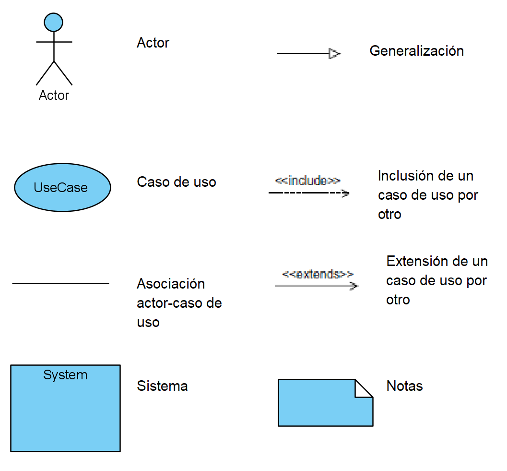](../assets/ads-cu-notacion.png)

- El **diagrama de casos de uso** muestra los actores, los casos de uso y las **relaciones** entre ellos

 

| Elemento | Significado |
|:--|:--|
| Muñeco | **Actor** |
| Elipse | **Caso de uso** |
| Línea | **Asociación** actor–caso de uso |
| Rectángulo | **Frontera** del sistema |
| Nota | Aclaración adjunta |

</split-slide>

- ⚠️ La **asociación** solo indica que se comunican: **no** indica dirección del flujo de datos ni orden temporal

---

## Relaciones entre casos de uso

### 🔁 Inclusión — `<<include>>`
Comportamiento documentado dentro de un CU que **puede ser reutilizado**: se factoriza y se muestra como otro CU

→ Es **obligatorio**: siempre ocurre

### ➕ Extensión — `<<extend>>`
El CU **extiende o especializa** el comportamiento de otro CU

→ Es **opcional**: ocurre bajo cierta condición

### 🧬 Herencia
Un CU **implementa el comportamiento** descrito por otro CU

→ Especialización, como en clases

- 💡 Truco para no confundirlas:
  - `<<include>>` → *«para hacer A, **siempre** hay que hacer B»*
  - `<<extend>>` → *«a veces, además de A, ocurre B»*
- ⚠️ La flecha apunta en **direcciones opuestas**: en *include* del base al incluido; en *extend* del extensor al base

---

## Ejemplo: consulta de pacientes

[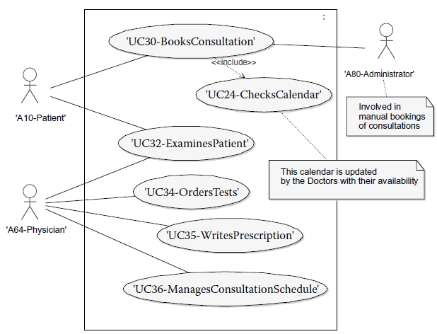](../assets/ads-cu-diagrama-pacientes.png)

- Obsérvese que **paciente** y **doctor** interactúan con *UC32*: un caso de uso puede tener **varios actores**

---

## Ejemplo: contabilidad

[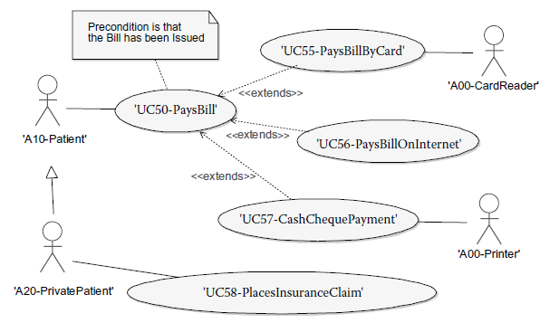](../assets/ads-cu-diagrama-contabilidad.png)

- *PrivatePatient* tiene **las mismas tareas** que *Patient* y una adicional → generalización de actores
- Tres formas de pagar la factura, todas `<<extend>>` de *UC50-PaysBill*: son **opcionales y excluyentes**

---

## Especificación de casos de uso: formato básico

<split-slide style="--left: 42%; --right: 58%;">

### La plantilla

- **Caso de uso:**
- **Actor:**
- **Precondición:**
- **Poscondición:**
- **Flujo de eventos básico**
  - 1. …
  - 2. …
- **Flujos de eventos alternativos**

### Qué va en cada campo

| Campo | Contenido |
|:--|:--|
| **Caso de uso** | El nombre del caso de uso |
| **Actor** | El nombre del actor |
| **Precondición** | Condición que debe ser **verdadera para iniciar** el caso de uso. Se definen **relativas al sistema**, no a su entorno |
| **Poscondición** | Condición que debe cumplirse para indicar que el caso de uso **terminó con éxito** |

</split-slide>

---

## Flujo básico y flujos alternativos

<split-slide style="--left: 50%; --right: 50%;">

### ➡️ Flujo de eventos básico
- **Secuencia de eventos** que describen qué hace el actor y qué hace el sistema para cumplir un objetivo
- También se conoce como **flujo normal**, pues **no** incluye variaciones ni desviaciones

### ↪️ Flujos de eventos alternativos
- Diversas secuencias que reflejan las **diferentes situaciones** que provocan una desviación del flujo básico
- Provocadas por condiciones **anormales, extremas, ocasionales, de error** o de **violación de reglas del negocio**

</split-slide>

- 💡 Se escriben **alternando**: un paso del actor, un paso del sistema. Nunca dos del mismo lado seguidos sin razón
- ⚠️ Si el flujo básico tiene un `si...` en medio, eso **no** es flujo básico: es un **alternativo** que hay que sacar

---

## Ejemplo: «Registrar notas»

<steps>
<step>

### Encabezado

| Campo | Contenido |
|:--|:--|
| **Caso de uso** | Registrar notas |
| **Actor** | Profesor |
| **Precondición** | El usuario ha sido aceptado en el sistema con el rol de profesor |
| **Poscondición** | Se han registrado en el sistema las notas de los alumnos asignados al profesor |

- Fíjate: la precondición está escrita **relativa al sistema** (*«ha sido aceptado en el sistema»*), no al entorno (*«el profesor llegó a la oficina»*)

</step>
<step>

### Flujo básico

1. El caso de uso comienza cuando el profesor indica **«Registrar notas»**
2. El **sistema** muestra los cursos asignados al profesor
3. El **profesor** selecciona el curso
4. El **sistema** muestra un listado de los estudiantes con sus notas
5. El **profesor** selecciona el estudiante e ingresa la nota de práctica, del parcial, del examen final y la nota final. Se repite para cada estudiante
6. El **profesor** indica **«guardar»**
7. El **sistema** valida toda la información, muestra un mensaje de confirmación y el caso de uso finaliza

</step>
<step>

### Flujos alternativos

- En el **paso 2**, si el profesor **no tiene curso asignado**, el sistema muestra un mensaje y el caso de uso finaliza
- En el **paso 4**, si el sistema determina que el **curso está cerrado**, muestra un mensaje y el caso de uso finaliza

 

- ❓ ¿Qué otros alternativos faltan? → <spoiler>nota fuera de rango, pérdida de conexión al guardar, la suma de porcentajes no cuadra, el profesor cancela</spoiler>
- 💡 Cada alternativo indica **en qué paso** se desvía y **cómo** termina: así queda claro dónde engancha

</step>
</steps>

---

## Plantilla completa: ejemplo «Acceso a la aplicación»

<split-slide style="--left: 38%; --right: 62%;">

[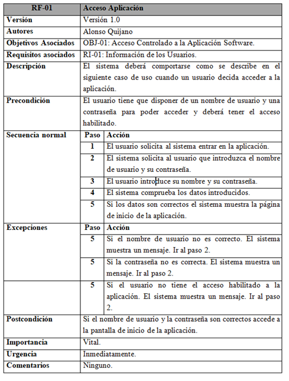](../assets/ads-cu-plantilla-acceso.png)

- Una plantilla real agrega campos de **administración** al formato básico:

| Campo | Para qué |
|:--|:--|
| **Versión** | Control de cambios |
| **Autores** | Responsabilidad |
| **Objetivos asociados** | Traza hacia el **negocio** |
| **Requisitos asociados** | Traza hacia los **requerimientos** |
| **Importancia** / **Urgencia** | **Atributos** para priorizar |
| **Comentarios** | Supuestos y pendientes |

- 🧵 *Objetivos* y *Requisitos asociados* son **trazabilidad pura**

</split-slide>

---

## Plantilla con reglas de negocio: «Registrar préstamo»

<split-slide style="--left: 36%; --right: 64%;">

[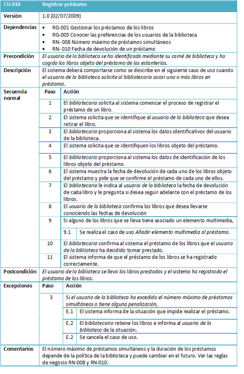](../assets/ads-cu-plantilla-prestamo.png)

- Observa el campo **Dependencias**: el caso de uso **referencia** las reglas de negocio en lugar de copiarlas
  - `RG-001` Gestionar los préstamos de los libros
  - `RN-008` Número máximo de préstamos simultáneos
  - `RN-010` Fecha de devolución de un préstamo

- En el paso **9** aparece una **inclusión**: *«Se realiza el caso de uso Añadir elemento multimedia al préstamo»*

- Los **alternativos** se numeran ligados a su paso: **E.1**, **E.2** en el paso 3

- 💡 El comentario final dice que el máximo **puede cambiar**: por eso es una **regla**, no un número enterrado en el flujo

</split-slide>

---

## Otro formato: dos columnas

<split-slide style="--left: 52%; --right: 48%;">

[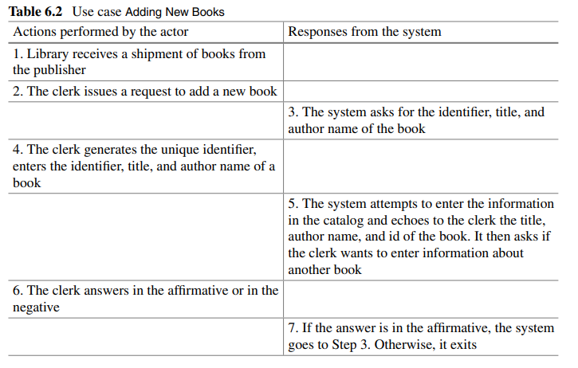](../assets/ads-cu-formato-dos-columnas.png)

- Separa explícitamente **acciones del actor** y **respuestas del sistema**

 

### ✅ Ventaja
Hace **imposible** olvidar de quién es cada paso, y evidencia los pasos donde el sistema **no responde nada**

### ⚠️ Desventaja
Ocupa más espacio y es más difícil de mantener en documentos largos

</split-slide>

- 💡 Elige **un** formato y úsalo en todo el proyecto: eso lo define el **plan de administración de requerimientos**

---

## Errores comunes: identificación de actores

<split-slide style="--left: 50%; --right: 50%;">

[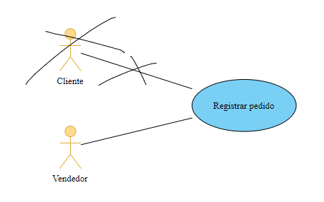](../assets/ads-cu-error-actor.png)

- En algunos casos se incluyen actores que **realmente no lo son**
- En un sistema de pedidos, se considera al **cliente** como actor
- Pero quien **ingresa** los pedidos en el sistema es el **vendedor** → el vendedor es el actor

 

- ⚠️ La pregunta correcta no es *«¿a quién le importa?»* sino *«¿quién **interactúa** con el sistema?»*

</split-slide>

- 💡 El cliente sigue siendo relevante: es un actor **indirecto**, y se documenta como tal

---

## Errores comunes: identificación de casos de uso

<split-slide style="--left: 55%; --right: 45%;">

[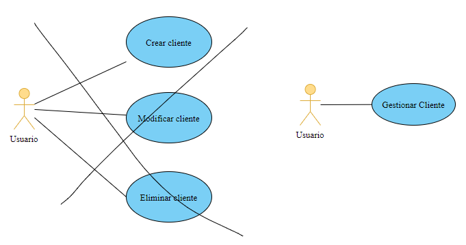](../assets/ads-cu-error-menu.png)

- Error muy extendido: considerar las **opciones del menú** o las **funciones** del sistema como casos de uso
- Los casos de uso deben mostrar **lo que la persona usuaria necesita**, no las opciones que se lo permitirán

 

- *Agregar*, *modificar* y *eliminar* cliente son **opciones de menú**
- Lo que a la persona usuaria le importa es **actualizar la información de clientes**
- → un solo caso de uso: **«Gestionar cliente»**

</split-slide>

---

## Errores comunes: especificación

- La técnica de casos de uso se usa para la **especificación de requisitos**, **no** para el diseño del sistema

### 🚫 Componentes de ventana
Introducir palabras como **botones, listas desplegables, opciones de menú**

Debe incluirse **qué información** será ingresada o mostrada, pero **no con qué componente** → eso es diseño de pantallas

### 🚫 Diseño de datos y algoritmos
Mencionar elementos del **diseño de base de datos o de algoritmos**

*«Grabar en la tabla clientes»* u *«ordenar con el algoritmo de burbuja»* **no** deben aparecer: se determinan en la etapa de **diseño**

- 💡 Prueba rápida: si al cambiar de tecnología (web → móvil, SQL → NoSQL) tuvieras que **reescribir** el caso de uso, es que colaste diseño
- ❓ ¿Y si el cliente **exige** una tecnología? → <spoiler>es una restricción de diseño: va en las especificaciones suplementarias</spoiler>

---

## Errores comunes: relaciones (1 de 2)

<split-slide style="--left: 55%; --right: 45%;">

[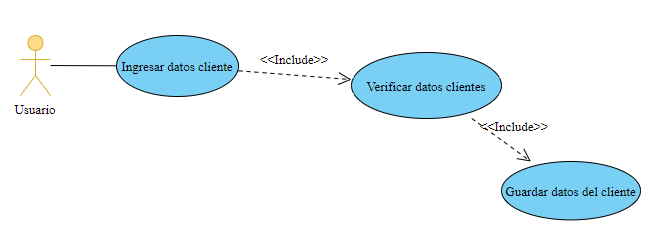](../assets/ads-cu-error-include-niveles.png)

- Los errores al incluir relaciones se deben principalmente a **confundir los casos de uso con los procesos** de un diagrama de flujo de datos (DFD)
- Aquí *Ingresar datos* → *Verificar datos* → *Guardar datos* es una **descomposición funcional**, no casos de uso

 

- 📏 Recomendación: **no más de dos niveles** de relaciones `<<include>>` o `<<extend>>` en un diagrama

</split-slide>

---

## Errores comunes: relaciones (2 de 2)

<split-slide style="--left: 55%; --right: 45%;">

[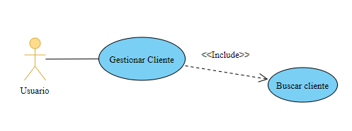](../assets/ads-cu-error-include-unico.png)

- Otro error frecuente: crear un caso de uso que es **incluido por un solo** caso de uso
- *Buscar cliente* solo es incluido por *Gestionar clientes*

 

- ⚠️ Si solo lo usa uno, **no hay reutilización** que justifique separarlo
- ✅ Debería ser simplemente un **paso** dentro del flujo de *Gestionar clientes*

</split-slide>

- 💡 Regla práctica: factoriza con `<<include>>` solo cuando **dos o más** casos de uso comparten el comportamiento

---

## Actividad 5: modela y especifica

- Sistema de **préstamo de equipo** de laboratorio. En equipos:

### 1️⃣ Actores
Identifíquenlos con las **5 preguntas**. Incluyan al menos un **sistema externo** y consideren el actor **Tiempo**

### 2️⃣ Diagrama
Dibujen el diagrama de casos de uso con la frontera. Usen `<<include>>` **solo** si se justifica

### 3️⃣ Especificación
Especifiquen **un** caso de uso completo: precondición, poscondición, flujo básico y **al menos 3** alternativos

- ⏱️ 30 minutos
- 🔍 **Revisión cruzada** con otro equipo, buscando los errores que acabamos de ver:
  - ¿Hay actores que no interactúan? ¿Casos de uso que son opciones de menú?
  - ¿Se coló **diseño** en la especificación? ¿Hay `<<include>>` usados una sola vez?

---

<!-- _class: cover -->

# Validación y trazabilidad
## Contenidos
- Validación de requerimientos
- Técnicas y lista de verificación
- Trazabilidad y su matriz

---

## Validación de requerimientos

- **Verificación** y **validación** no son lo mismo:

### 🔍 Verificación
*¿Estamos construyendo el producto **correctamente**?*

¿El documento es consistente, completo y cumple los estándares?

### 🎯 Validación
*¿Estamos construyendo el **producto correcto**?*

¿Esto es realmente lo que el negocio necesita?

- Objetivos de la validación:
  - Asegurar que quien hace ingeniería **entendió** lo que se necesita
  - Verificar que el documento es **entendible, consistente y completo**
  - Verificar que cumple con los **estándares** de la organización
  - Incluir en el **cronograma** los puntos donde se valida

- ⚠️ Un documento puede pasar la verificación **perfectamente** y estar validando el sistema equivocado

---

## Técnicas de validación

### 👥 Revisiones e inspecciones
Lectura **estructurada** por un grupo, con roles y lista de verificación

La más efectiva para encontrar defectos por unidad de esfuerzo

### 🚶 Recorridos (*walkthroughs*)
Quien escribió el documento lo **recorre** con la audiencia, paso a paso

Menos formal, útil para alinear comprensión

### 🧪 Prototipos
Se valida **usando**, no leyendo

Especialmente potente para requerimientos de interfaz y flujo

### 📋 Diseño de casos de prueba
Escribir la prueba **antes** de construir

Si no puedes escribirla, el requerimiento **no es verificable**

### ✅ Listas de verificación
Preguntas sistemáticas aplicadas a **cada** requerimiento

### 🤖 Análisis automatizado
Consistencia, terminología y **completitud** de modelos con herramientas

- 💡 La técnica del **caso de prueba** es la más barata y la que más defectos revela: obliga a hacer preciso lo vago

---

## Lista de verificación

- Aplicable a **cada** requerimiento, derivada de las características de calidad:

| Pregunta | Verifica |
|:--|:--|
| ¿Se entiende de una sola forma? | **No ambigüedad** |
| ¿Puedo escribir un caso de prueba para esto? | **Verificable** |
| ¿Tiene un número, umbral o criterio de aceptación? | **Cuantificable** |
| ¿Sé quién lo pidió y por qué? | **Necesario** · Origen |
| ¿Se puede construir con los recursos y el plazo? | **Factible** |
| ¿Contradice a otro requerimiento? | **Consistente** |
| ¿Describe *qué*, sin decir *cómo*? | **Correcto** (sin diseño colado) |
| ¿Tiene prioridad asignada? | **Priorizado** |
| ¿Está trazado hacia una necesidad y hacia un caso de uso? | **Trazable** |

- ❓ ¿Y la **completitud** del conjunto? Esa no se verifica requerimiento por requerimiento: se verifica preguntando <spoiler>¿toda necesidad de la Visión está cubierta por al menos un caso de uso?</spoiler>

---

## Trazabilidad

- Capacidad de seguir la **vida de un requerimiento** hacia adelante y hacia atrás, a través de todos los artefactos

<steps>
<step>

<split-slide style="--left: 50%; --right: 50%;">

### ⬅️ Hacia atrás (*backward*)
Del requerimiento **hacia su origen**

- ¿Quién lo pidió?
- ¿De qué necesidad de negocio nace?
- ¿Qué regla o normativa lo justifica?

> Responde: *«¿por qué estamos construyendo esto?»*

### ➡️ Hacia adelante (*forward*)
Del requerimiento **hacia su realización**

- ¿Qué caso de uso lo realiza?
- ¿Qué componentes lo implementan?
- ¿Qué pruebas lo verifican?

> Responde: *«si cambia, ¿qué se rompe?»*

</split-slide>

</step>
<step>

### La cadena completa

| Origen | → | Intermedio | → | Realización | → | Verificación |
|:--|:--|:--|:--|:--|:--|:--|
| Petición del afectado | → | Necesidad (**STR**) | → | Característica (**FEA**) | → | — |
| Característica | → | **Caso de uso** / Suplementaria | → | Componente · Código | → | **Caso de prueba** |
| Regla de negocio | → | Paso o precondición del CU | → | Lógica de negocio | → | Prueba de la regla |

- 🧵 Cada flecha se puede recorrer en **ambas direcciones**
- 💡 Es exactamente la **trazabilidad** entre niveles de abstracción del primer mazo del curso

</step>
</steps>

---

## La matriz de trazabilidad

- Relaciona dos tipos de artefacto: filas y columnas. Una marca indica que existe **vínculo**

| | CU-01 Registrar matrícula | CU-02 Consultar notas | CU-03 Cerrar curso |
|:--|:--:|:--:|:--:|
| **FEA1** Validación de choques | ✔️ | | |
| **FEA2** Alerta de cupo excedido | ✔️ | | |
| **FEA3** Panel de ocupación | | ✔️ | ✔️ |
| **FEA4** Carga masiva de listas | | | ✔️ |

### 🕳️ Fila vacía
Una característica **sin ningún caso de uso** → funcionalidad prometida y **no especificada**

### 👻 Columna vacía
Un caso de uso **sin ninguna característica** → se está construyendo algo que **nadie pidió**

### 🎯 Su verdadero valor
No es llenarla: es **leer los huecos**. Ahí están los problemas

---

## Trazabilidad: análisis de impacto

- El uso más práctico: cuando llega un **cambio**, saber qué toca

<steps>
<step>

### El escenario

> *«La Vicerrectoría cambió la regla: ahora el máximo son 20 créditos, no 18.»*

<split-slide style="--left: 50%; --right: 50%;">

### 🚫 Sin trazabilidad
- Alguien **recuerda** dónde estaba el número
- Se cambia en un lugar y se olvida en otros dos
- Las **pruebas** siguen validando 18
- El error aparece en producción, en la semana de matrícula

### ✅ Con trazabilidad
- Se busca la regla **RN-004**
- La matriz muestra: **2 casos de uso**, **1 componente**, **3 casos de prueba**
- Se estima el impacto **antes** de aceptar el cambio
- Se actualiza todo y se **verifica** la cobertura

</split-slide>

</step>
<step>

### El costo de mantenerla

- ⚠️ La trazabilidad **no es gratis**: mantenerla cuesta esfuerzo real y continuo

### 📉 Trazar de menos
Se pierde el análisis de impacto, justo cuando más se necesita

### 📈 Trazar de más
La matriz se vuelve tan grande que **nadie la actualiza** → deja de ser confiable, que es peor que no tenerla

### ⚖️ El equilibrio
Se decide en el **plan de administración de requerimientos**: qué se traza con qué, y **nada más**

- 💡 Criterio útil: traza lo que necesitarías para responder *«¿qué se rompe si esto cambia?»* y *«¿por qué existe esto?»*

</step>
</steps>

---

## Actividad 6: valida y traza

### 1️⃣ Valida
Apliquen la **lista de verificación** a los requerimientos que escribieron en la Actividad 2

¿Cuántos pasan las **9** preguntas?

### 2️⃣ Traza
Construyan la **matriz** de características × casos de uso de su sistema

Busquen filas y columnas **vacías**

### 3️⃣ Analiza el impacto
Su cliente cambia una regla de negocio. Usando la matriz, digan **exactamente** qué artefactos hay que revisar

- ⏱️ 25 minutos
- ❓ Preguntas de cierre:
  - ¿Encontraron alguna **funcionalidad huérfana**? ¿De dónde salió?
  - ¿Qué **decidirían no trazar** para que la matriz siga siendo mantenible?

---

## Cómo se conecta todo

| Tema | Pregunta | Artefacto principal |
|:--|:--|:--|
| **Qué es la IR** | ¿Cómo paso del problema a la especificación? | El proceso completo |
| **Clasificación** | ¿Qué tipo de requerimiento es? | FURPS+ · Reglas de negocio |
| **Características y atributos** | ¿Está bien escrito y bien administrado? | Lista de verificación · Atributos |
| **Guías de apoyo** | ¿Cómo lo averiguo? | Las diez técnicas |
| **Artefactos** | ¿Dónde lo escribo? | Visión · Casos de uso · Suplementarias |
| **Prototipos** | ¿Cómo lo hago criticable? | Prototipo desechable o evolutivo |
| **Casos de uso** | ¿Qué hace el sistema y para quién? | Modelo y especificación de CU |
| **Validación** | ¿Es el producto correcto? | Revisiones · Casos de prueba |
| **Trazabilidad** | ¿Qué se rompe si esto cambia? | Matriz de trazabilidad |

- 🧵 Todo el mazo es **una sola idea**: mantener el hilo entre lo que el negocio necesita y lo que el equipo construye

---

## Referencias

- Adams, K. M. (2015). *Nonfunctional Requirements in Systems Analysis and Design*. Switzerland: Springer.
- Dennis, A. (2012). *Systems Analysis and Design with UML, Version 2.0: An Object-Oriented Approach*. 4ta. edición. USA: John Wiley & Sons.
- IEEE Computer Society Professional Practices Committee (2004). *Guide to the Software Engineering Body of Knowledge (SWEBOK)*. {Cap. 2 — *Software Requirements*}
- Jensen, R. W., Tonies, C. C. (1979). *Software Engineering*. Prentice-Hall. {Espacio del problema y de la solución}
- Kawakita, J. (1991). *The Original KJ Method*. Kawakita Research Institute. {Diagramas de afinidad}
- Leffingwell, D., Widrig, D. (2003). *Managing Software Requirements: A Use Case Approach*. 2da. edición. Addison-Wesley. {Entrevistas · Sesiones de trabajo · Lluvia y reducción de ideas · *Storyboarding*}
- Rosenberg, D., Stephens, M. (2013). *Use Case Driven Object Modeling with UML: Theory and Practice*. USA: Apress.
- Sommerville, I., Kotonya, G. (1998). *Requirements Engineering: Processes and Techniques*. John Wiley & Sons. {Validación de requerimientos}
- Unhelkar, B. (2018). *Software Engineering with UML*. CRC Press. {Actores y casos de uso}
- Wiegers, K., Beatty, J. (2013). *Software Requirements*. 3ra. edición. Microsoft Press. {Cap. 9 — *Business rules*}
- Zielczynski, P. (2008). *Requirements Management Using IBM Rational RequisitePro*. USA: IBM Press. {Cap. 1 — *Requirements Management* · Cap. 5 — *Requirements Elicitation* · Cap. 7 — *Creating Use Cases* · Cap. 8 — *Supplementary Specification*}

