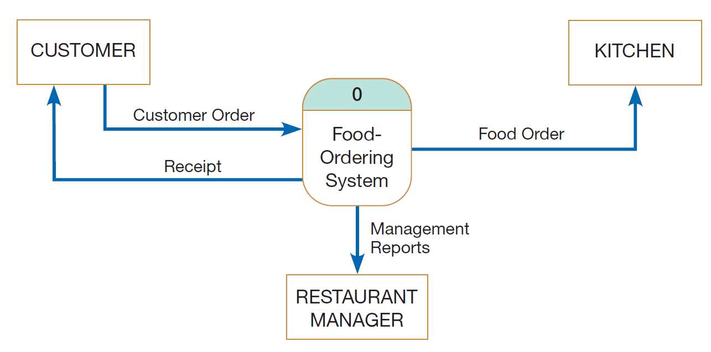
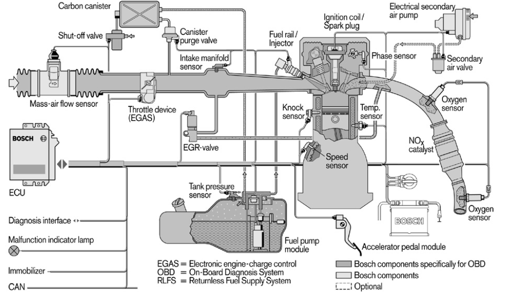
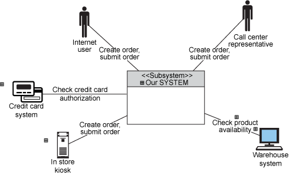
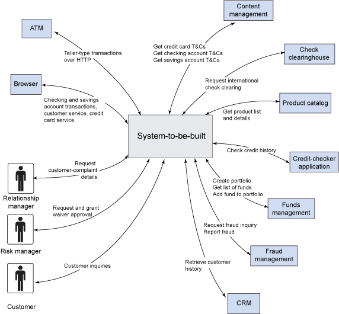
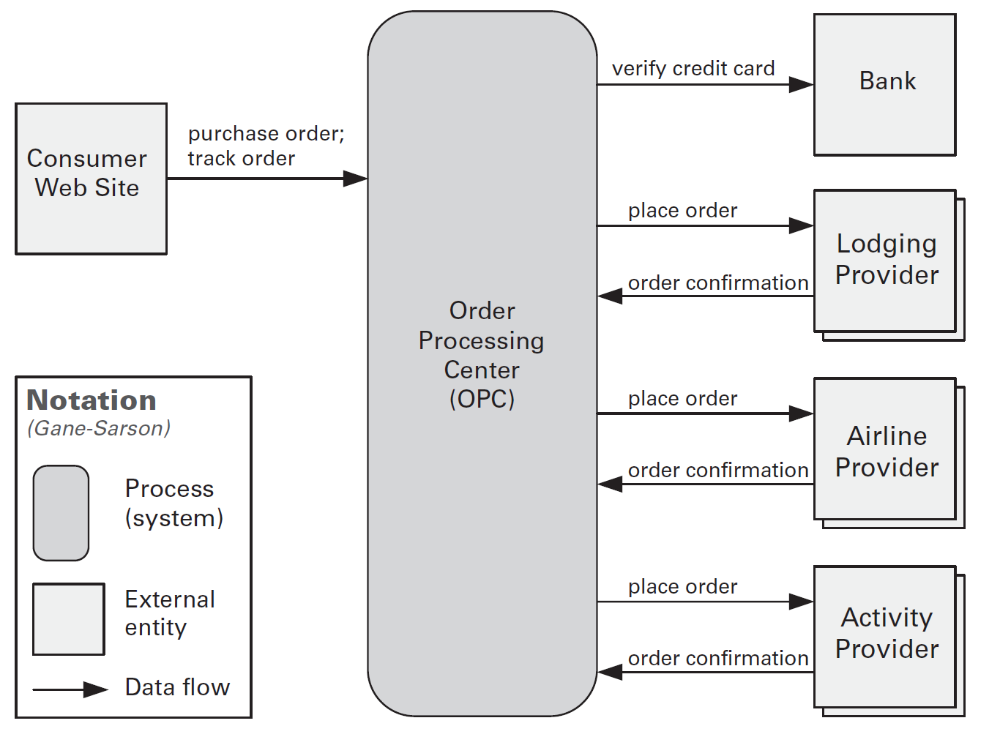
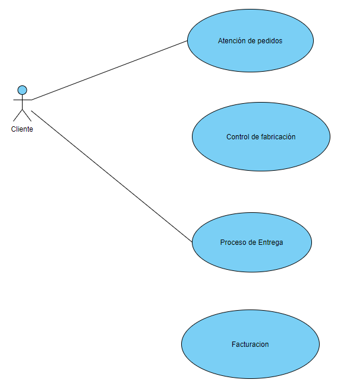
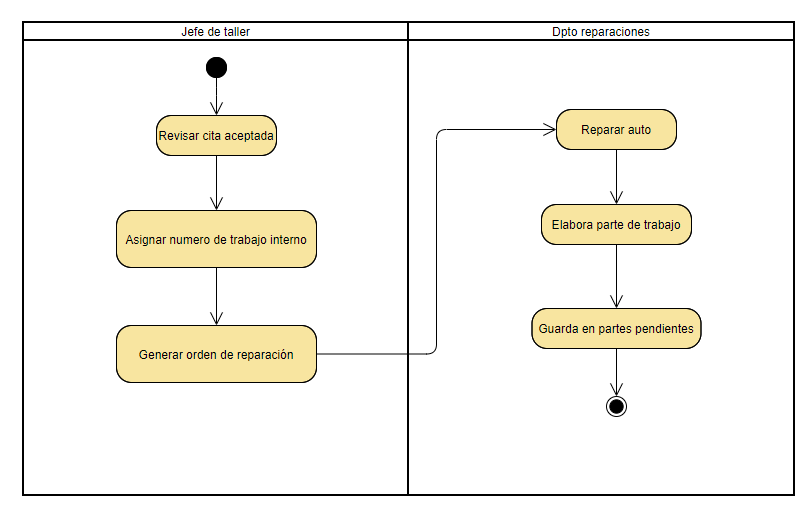

<!-- _class: cover -->

# Métodos de análisis de sistemas
## Contenidos
- Desarrollo de la visión de un sistema
- Análisis de sistemas
- Fases del análisis de sistemas
- Factibilidad del sistema
- Modelado de negocio

> Curso **Análisis y Diseño de Sistemas**  II Semestre 2026

---

## ¿Dónde estamos?

- En el mazo anterior vimos **qué es un sistema** y **cómo se organiza un proceso de desarrollo**
- Ahora nos toca el **cómo**: los métodos concretos con los que una persona analista entiende un problema antes de diseñar la solución

### 🎯 Visión
¿Qué problema resolvemos y **para quién**?

### 🔍 Análisis
¿Qué debe **hacer** el sistema y dónde están sus **límites**?

### ⚖️ Factibilidad
¿**Vale la pena** y es posible construirlo?

### 🏢 Modelado de negocio
¿En qué **contexto organizacional** va a vivir?

- Recuerda los niveles de abstracción: vamos del **problema del negocio** hacia la **especificación**

---

<!-- _class: cover -->

# Desarrollo de la visión de un sistema
## Contenidos
- ¿Qué es y para qué sirve la visión?
- Estructura del documento Visión
- Posicionamiento y sentencia del problema
- Personas interesadas, necesidades y características

---

## ¿Por qué empezar por la visión?

<steps>
<step>

- Todo proyecto arranca con una **idea difusa**: alguien cree que hace falta un sistema
- Si esa idea no se escribe, cada persona del equipo construye **su propia versión** del proyecto en la cabeza
- La **visión** es el acuerdo explícito sobre *qué vamos a construir y por qué*

</step>
<step>

### La visión responde tres preguntas

### ❓ ¿Cuál es el problema?
No la solución: el **problema del negocio**

### 👥 ¿A quién le importa?
Las **personas interesadas** y qué esperan

### ✨ ¿Qué capacidades hacen falta?
Las **características** de alto nivel del producto

</step>
</steps>

---

## El documento Visión

- Artefacto que **recolecta, analiza y define** las necesidades y características de **alto nivel** del sistema
- Se ubica en el nivel de abstracción **Problema del Negocio** → es la entrada de la especificación

<split-slide style="--left: 52%; --right: 48%;">

### ✅ Qué sí lleva
- El **por qué** existen esas necesidades
- Capacidades **generales**, sin entrar en diseño
- **Prioridad** de cada necesidad
- Restricciones y atributos de calidad

### 🚫 Qué no lleva
- **Diseño**: pantallas, tablas, clases, endpoints
- El **cómo** se implementa cada característica
- Requerimientos detallados → esos van en los **casos de uso** y la especificación suplementaria

</split-slide>

> Regla de oro: si al leer una línea sabes *cómo* se programa, esa línea no va en la visión

---

## Estructura del documento Visión

| Sección | Contenido | Pregunta que responde |
|:--|:--|:--|
| **1. Introducción** | Propósito, alcance, acrónimos, referencias | ¿De qué trata este documento? |
| **2. Posicionamiento** | Oportunidad de negocio · Sentencia del problema | ¿Por qué vale la pena? |
| **3. Personas interesadas** | Resumen de *stakeholders* y usuarios | ¿A quién le sirve y quién decide? |
| **4. Descripción del producto** | Necesidades y características | ¿Qué capacidades hacen falta? |
| **5. Restricciones y atributos de calidad** | Límites del proyecto y NFRs | ¿Bajo qué condiciones? |

- Es la **plantilla del curso** (basada en RUP): la vas a usar en el proyecto del semestre

---

## Oportunidad de negocio

- Describe **brevemente** la oportunidad que este proyecto atiende
- Habla el lenguaje del **negocio**, no el de la tecnología

### 🔻 Débil
> «Queremos una aplicación web con React y una base de datos PostgreSQL para gestionar la matrícula.»

Describe una **solución técnica**, no una oportunidad

### 🔺 Mejor
> «Cada semestre la Escuela pierde ~200 horas de personal administrativo reprocesando matrículas manuales, y un 12 % de estudiantes queda mal matriculado. Automatizar el proceso libera ese tiempo y reduce el reprocesamiento.»

Describe **valor** y está **cuantificada**

---

## Sentencia del problema

- Formato de la plantilla → obliga a separar **problema**, **afectados**, **impacto** y **beneficio**

| Componente | Detalle |
|:--|:--|
| **El problema** | *[describe el problema]* |
| **afecta a** | *[personas interesadas afectadas]* |
| **el impacto del cual es** | *[¿cuál es el impacto del problema?]* |
| **una solución exitosa sería** | *[beneficios clave de una solución exitosa]* |

- Fíjate que **nunca** se menciona el sistema propuesto: solo el problema

---

## Sentencia del problema: ejemplo

| Componente | Detalle |
|:--|:--|
| **El problema** | la asignación de cupos de laboratorio se lleva en hojas de cálculo separadas por cada docente |
| **afecta a** | estudiantes, docentes y la coordinación de la Escuela |
| **el impacto del cual es** | choques de horario detectados tarde, cupos vacíos junto a listas de espera, y ~200 horas/semestre de reprocesamiento manual |
| **una solución exitosa sería** | una única fuente de verdad de cupos, con detección de choques en el momento de la asignación y visibilidad para la coordinación |

- 💡 Escribir esto **antes** de proponer tecnología evita enamorarse de la solución equivocada

---

## Declaración de posición del producto

- Complemento clásico de RUP: un **párrafo** que cualquiera del equipo pueda repetir de memoria

<split-slide style="--left: 48%; --right: 52%;">

### Plantilla
- **Para** *[cliente objetivo]*
- **que** *[necesidad u oportunidad]*
- **el** *[nombre del producto]*
- **es un** *[categoría de producto]*
- **que** *[beneficio clave]*
- **A diferencia de** *[alternativa actual]*
- **nuestro producto** *[diferenciador]*

### Ejemplo
> **Para** las escuelas de la Facultad de Ingeniería **que** asignan cupos de laboratorio manualmente, **SIGLAB es un** sistema de gestión de cupos **que** detecta choques de horario en el momento de la asignación. **A diferencia de** las hojas de cálculo por docente, **nuestro producto** mantiene una única fuente de verdad consultable por la coordinación.

</split-slide>

---

## Resumen de personas interesadas

- No todas las personas interesadas son **usuarias**: algunas **financian**, **aprueban** o **auditan**

| Nombre | Descripción | Responsabilidades | Rol |
|:--|:--|:--|:--|
| Coordinación de Escuela | Define la oferta de cursos y laboratorios | Aprueba el presupuesto y la oferta; monitorea el avance del proyecto | *Stakeholder* |
| Persona docente | Imparte laboratorios y gestiona su lista | Define cupos y valida las listas resultantes | Usuario |
| Persona estudiante | Se matricula en los laboratorios | Consulta cupos y solicita cambios | Usuario |
| Centro de Informática | Administra la infraestructura institucional | Asegura que el sistema sea **mantenible** y cumpla los estándares de TI | *Stakeholder* |

- ⚠️ Olvidar una persona interesada es la causa más común de <spoiler>requerimientos que aparecen tarde y rompen el diseño</spoiler>

---

## Necesidades y características

- Cada **necesidad** (STR) es del negocio; cada **característica** (FEA) es una capacidad del producto que la atiende

| Necesidad | Persona interesada | Prioridad | Características |
|:--|:--|:--|:--|
| **STR1** Evitar choques de horario al asignar cupos | Coordinación, docentes | Alta | **FEA1** Validación de choques en línea   **FEA2** Alerta al exceder el cupo |
| **STR2** Tener visibilidad del estado de la oferta | Coordinación | Media | **FEA3** Panel de ocupación por laboratorio |
| **STR3** Reducir el reprocesamiento manual | Personal administrativo | Alta | **FEA4** Carga masiva de listas   **FEA5** Exportación al sistema institucional |

- La **prioridad** (*Alta / Media / Baja*) y la versión planeada permiten **negociar alcance** más adelante

---

## Restricciones y atributos de calidad

<split-slide style="--left: 50%; --right: 50%;">

### 🔒 Restricciones
Factores que **limitan** las características, no se negocian

- De **diseño**: debe integrarse con el sistema institucional existente
- **Externas**: normativa de protección de datos personales
- De **plataforma**: la infraestructura la define el Centro de Informática
- De **dependencias**: requiere el padrón oficial de estudiantes

### 📊 Atributos de calidad
Los **requerimientos no funcionales** que ya conoces

- **Performance**: respuesta < 2 s en horas pico de matrícula
- **Disponibilidad**: 99,5 % durante la semana de matrícula
- **Seguridad**: solo la persona docente titular modifica su lista
- **Escalabilidad**: soportar 3 000 estudiantes concurrentes

</split-slide>

> Un atributo de calidad sin **número** no es verificable: «debe ser rápido» no es un requerimiento

---

## Errores comunes al escribir la visión

<steps>
<step>

### 🚫 Errores de contenido
- **Colar diseño**: «la pantalla tendrá tres pestañas» → eso es diseño, no visión
- Confundir **necesidad** con **característica**: la necesidad es del negocio, la característica es del producto
- Listar **todo como prioridad Alta** → si todo es prioritario, nada lo es
- Atributos de calidad **sin métrica**

</step>
<step>

### 🚫 Errores de proceso
- Escribirla **una sola vez** y no volver a tocarla → la visión es un documento **vivo**
- Redactarla **sin las personas interesadas**, solo con el equipo técnico
- Olvidar a quien **paga** o **aprueba** el proyecto
- No dejar **trazabilidad** hacia los casos de uso → luego nadie sabe de dónde salió un requerimiento

</step>
</steps>

---

## Actividad 1: escribe una visión

- En grupos, tomen un sistema que conozcan (Ematrícula, la soda de la U, la biblioteca...) y redacten:

### 1️⃣ Posicionamiento
- Oportunidad de negocio (cuantificada)
- Sentencia del problema con el formato de la plantilla

### 2️⃣ Personas interesadas
- Al menos **4**, distinguiendo *Usuario* de *Stakeholder*

### 3️⃣ Necesidades
- **3 necesidades** (STR) con prioridad
- **1 o 2 características** (FEA) por necesidad

- ⏱️ 20 minutos · Al final, intercambien con otro grupo y busquen **diseño colado** en la visión ajena

---

<!-- _class: cover -->

# Análisis de sistemas
## Contenidos
- ¿Qué es analizar un sistema?
- Análisis vs. diseño
- El diagrama de contexto del sistema
- Notación informal y ejemplos

---

## ¿Qué es el análisis de sistemas?

- Técnica de **resolución de problemas** que *descompone* un sistema en sus partes, con el propósito de estudiar **qué tan bien funcionan e interactúan** esas partes para cumplir su propósito

<steps>
<step>

- Es un estudio del **dominio del problema** que produce:
  - **Recomendaciones** de mejora
  - Los **requerimientos** y sus **prioridades** para una solución
- La palabra clave es **descomponer** → el mismo concepto que ya viste: dividir para poder entender

</step>
<step>

### El par análisis–síntesis

### 🔬 Análisis
**Descompone** el problema en partes para entenderlo

Dominio del **problema**

### 🏗️ Síntesis (diseño)
**Ensambla** las partes en una solución que funciona

Dominio de la **solución**

- No se puede sintetizar bien lo que no se analizó bien

</step>
</steps>

---

## Análisis vs. diseño

<split-slide style="--left: 50%; --right: 50%;">

### 🔍 Análisis → el **QUÉ**
- ¿Qué problema hay que resolver?
- ¿Qué debe **hacer** el sistema?
- ¿Cuáles son sus **límites**?
- ¿Quién interactúa con él?
- Modelos **lógicos**, independientes de la tecnología

### 🏗️ Diseño → el **CÓMO**
- ¿Cómo se estructura la solución?
- ¿Qué componentes, clases y tablas?
- ¿Qué tecnología, plataforma y despliegue?
- Modelos **físicos**, atados a la tecnología

</split-slide>

- ⚠️ El error clásico: **saltar al cómo** antes de haber acordado el qué
- Síntoma típico: el equipo discute el *framework* antes de saber quién usa el sistema

---

## ¿Qué produce el análisis?

- El análisis no produce código: produce **modelos y acuerdos**

| Pregunta | Modelo / artefacto |
|:--|:--|
| ¿Dónde están los **límites** del sistema? | **Diagrama de contexto** |
| ¿Qué **hace** el sistema y para quién? | Casos de uso · Diagrama de casos de uso |
| ¿Qué **procesos** transforman la información? | Diagramas de flujo de datos (DFD) |
| ¿Qué **información** maneja el negocio? | Modelo de dominio · Diagrama entidad-relación |
| ¿Cómo **fluye** el trabajo entre las personas? | Diagrama de actividades |
| ¿Qué **reglas** aplican? | Modelado de lógica · Reglas de negocio |
| ¿Cuál alternativa **conviene**? | Análisis de factibilidad · Propuesta de sistema |

- Todos son **niveles de abstracción** del mismo problema, y entre ellos hay **trazabilidad**

---

<!-- _class: cover -->

# Diagrama de contexto del sistema
## Contenidos
- ¿Qué es y qué contiene?
- Notación informal
- Ejemplos y errores comunes

---

## Diagrama de Contexto del Sistema (DCS)

- De acuerdo con Clements et al. (2011) y Valacich & George (2017):

> El diagrama de contexto define el **límite** (*boundary*) entre un sistema —o la parte del sistema bajo consideración— y su **ambiente**, al mostrar las **entidades** con las cuales interactúa y los **flujos principales de información** entre el sistema y esas entidades

### 🎯 Es un artefacto fundamental
Forma parte de la **arquitectura de software** del sistema

### 📦 El sistema es una caja negra
En el DCS **no** nos interesa lo que hay dentro, sino qué entra y qué sale

- Es la respuesta gráfica a la pregunta: **¿qué es parte de mi sistema y qué no lo es?**

---

## Ejemplo: sistema de toma de órdenes

> Diagrama de contexto del sistema de toma de órdenes de comida de *Hoosier Burger's*. Tomado de Valacich & George (2017)

---

## Contenidos de un diagrama de contexto

### 1️⃣ El sistema de interés
El sistema —o la parte de interés— representado como una **caja negra**, con un nombre claro

### 2️⃣ Entidades externas
**Personas**, otros **sistemas** o aplicaciones, y **objetos físicos** como sensores o dispositivos de control

### 3️⃣ Relaciones
Los **flujos** entre el sistema y cada entidad externa, **etiquetados** con la información que viaja

### 4️⃣ Notación
El **detalle de la notación gráfica** utilizada → una leyenda, si la notación no es estándar

- 💡 Un solo nivel, una sola página: si necesitas más, ya estás **descomponiendo** (eso es un DFD nivel 0)

---

## ¿Para qué sirve un diagrama de contexto?

<steps>
<step>

- El beneficio central: **clarifica qué partes de la solución total serán desarrolladas** por el equipo
- Todo lo que queda **fuera** de la caja es algo que hay que **integrar**, no construir

 

- ❓ ¿Qué otras ventajas o beneficios se te ocurren?

</step>
<step>

### Otros beneficios

### 🤝 Alinea al equipo
Una sola figura que **todo el mundo** entiende, técnicos y no técnicos

### 🔗 Revela integraciones
Cada entidad externa es una **interfaz** que hay que negociar y probar

### 🛡️ Controla el alcance
Sirve de referencia contra el ***scope creep***: «eso está fuera de la caja»

### 💰 Alimenta la factibilidad
Cuantas más entidades externas, mayor el **riesgo técnico** del proyecto

</step>
</steps>

---

## Notación informal (1 de 4): control automotor

> El sistema de software cuyo contexto se define reside en **«el ECU»**, la caja etiquetada del lado izquierdo

---

## Notación informal (2 de 4): sistema de compras HOME

- Aquí las entidades externas son de **tres tipos**: personas, sistemas y dispositivos (el kiosco en tienda)

---

## Notación informal (3 de 4): aplicación bancaria

- ❓ ¿Cuántas **integraciones** tendría que construir el equipo de este sistema?

---

## Notación informal (4 de 4): notación Gane-Sarson

> Diagrama de contexto de C&C. Tomado de Clements et al. (2011) — nótese la **leyenda de notación**

---

## Errores comunes en un diagrama de contexto

### 🚫 Abrir la caja negra
Dibujar módulos internos, capas o tablas → eso es **diseño**, no contexto

### 🚫 Flujos sin etiqueta
Una flecha sin nombre no dice **qué información** viaja

### 🚫 Confundir entidad con función
«Reportes» no es una entidad externa; la **Gerencia** sí lo es

### 🚫 Olvidar los sistemas externos
Las entidades externas **no** son solo personas

### 🚫 Notación sin leyenda
Si inventas símbolos, **documéntalos**

### 🚫 Meter todo el negocio
El límite es el del **sistema**, no el de la organización

---

## Actividad 2: construye un diagrama de contexto

- Retomen el sistema de la Actividad 1 y dibujen su diagrama de contexto

<split-slide style="--left: 50%; --right: 50%;">

### Pasos
1. Nombren el **sistema** y dibújenlo como una caja
2. Listen las **entidades externas**: personas, sistemas, dispositivos
3. Dibujen y **etiqueten** cada flujo de información
4. Agreguen una **leyenda** de notación

### Preguntas de control
- ¿Alguna entidad externa es en realidad **parte** del sistema?
- ¿Hay flujos **sin etiqueta**?
- ¿Cuántas integraciones implica el diagrama?
- ¿Qué quedó **fuera** a propósito?

</split-slide>

- ⏱️ 15 minutos · Compárenlo con la sentencia del problema: **¿son consistentes?**

---

<!-- _class: cover -->

# Fases del análisis de sistemas
## Contenidos
- Ubicación del análisis en el ciclo de vida
- Las cinco fases del análisis
- Otra forma de agruparlas
- Técnicas de recolección

---

## ¿Dónde vive el análisis en el ciclo de vida?

<split-slide style="--left: 45%; --right: 55%;">

- Del ciclo de vida que ya conoces (Kendall & Kendall), el **análisis** abarca las fases **1 a 3**:
  1. Identificación de problemas, oportunidades y objetivos
  2. Determinación de los requerimientos de información
  3. Análisis de las necesidades del sistema

 

- Whitten & Bentley descomponen ese bloque en **cinco fases** más finas, que son las que veremos ahora

</split-slide>

---

## Las cinco fases del análisis de sistemas

| # | Fase | Pregunta que responde | Entregable |
|:--|:--|:--|:--|
| 1 | **Definición del alcance** | ¿Vale la pena **mirar** el proyecto? | Documento de alcance · **Diagrama de contexto** |
| 2 | **Análisis del problema** | ¿Vale la pena **construir** un sistema nuevo? | Objetivos de mejora del sistema |
| 3 | **Análisis de requerimientos** | ¿Qué **necesitan y quieren** las personas usuarias? | Enunciado de requerimientos del negocio |
| 4 | **Diseño lógico** | ¿Qué **debe hacer** el sistema? | Modelos lógicos del sistema |
| 5 | **Análisis de decisión** | ¿Cuál es la **mejor solución**? | **Propuesta de sistema** |

- Cada fase puede **terminar el proyecto**: si el alcance no se justifica, no se sigue
- 🔁 No son estrictamente secuenciales: en un proceso iterativo se recorren **varias veces**

---

## Fase 1: Definición del alcance

<split-slide style="--left: 50%; --right: 50%;">

### Actividad
- Investigación **preliminar** y breve
- Identificar el **problema o la oportunidad** que originó la solicitud
- Establecer los **límites** del sistema → qué queda dentro y qué fuera
- Estimar **grueso** de esfuerzo, costo y duración
- Negociar el **plan** de las fases siguientes

### Salida
- **Documento de alcance** o *project charter*
- El **diagrama de contexto** inicial
- Decisión: ¿**continuamos** o cancelamos?

 

> Aquí es donde la **visión** del sistema y el **diagrama de contexto** se usan por primera vez

</split-slide>

- ⚠️ Es la fase más corta y la que más proyectos salva: cancelar temprano es **barato**

---

## Fase 2: Análisis del problema

<steps>
<step>

### Actividad
- Estudiar el **sistema actual** (manual o computarizado) tal como es hoy
- Distinguir **síntomas** de **causas**
- Analizar problemas y oportunidades, y **cuantificar** su impacto
- Definir los **objetivos de mejora** del sistema

</step>
<step>

### Síntoma vs. causa

### 🤒 Síntoma
«Los estudiantes se quejan de que la matrícula se cae»

Es lo que **se ve**

### 🦠 Causa
«Los cupos se validan al final del proceso, no al asignarlos»

Es lo que hay que **arreglar**

- Si diseñas contra el síntoma, el problema **vuelve**
- Herramientas útiles: **diagrama causa-efecto** (Ishikawa), **cinco por qué**

</step>
<step>

### Salida
- **Objetivos de mejora del sistema**, medibles y priorizados
- Decisión: ¿vale la pena **construir** un sistema nuevo?

 

- Ejemplos de objetivo bien planteado:
  - Reducir el tiempo de registro de un pedido en un **20 %**
  - Bajar la tasa de errores de fabricación a **0,5 %** del total

</step>
</steps>

---

## Fase 3: Análisis de requerimientos

<split-slide style="--left: 50%; --right: 50%;">

### Actividad
- Identificar y **priorizar** los requerimientos
- Separar **funcionales** (qué hace) de **no funcionales** (atributos de calidad)
- **Validarlos** con las personas usuarias
- ⚠️ Todavía **no** se habla de tecnología

### ¿Qué debemos aprender?
- El **quién** → personas involucradas
- El **qué** → procesos de negocio
- El **dónde** → el ambiente de trabajo
- El **cuándo** → los tiempos
- El **cómo** → los procedimientos actuales
- El **porqué** → por qué se hace así hoy

</split-slide>

- **Salida** → enunciado de requerimientos del negocio, con prioridades

---

## Técnicas de recolección de requerimientos

### 🗣️ Entrevista
Profunda y flexible, pero **costosa** en tiempo

### 📝 Cuestionario
Llega a **muchas** personas, pero no permite profundizar

### 👀 Observación
Revela lo que la gente **hace**, no lo que **dice** que hace

### 📄 Análisis de documentos
Formularios, reportes y manuales muestran el proceso **real**

### 🎲 Muestreo
Cuando el volumen de datos o de personas es **inmanejable**

### 🧪 Prototipado
Convierte una idea abstracta en algo **criticable**

- 💡 Ninguna técnica basta sola: se **combinan** y se **triangulan** los resultados

---

## Fase 4: Diseño lógico

<split-slide style="--left: 50%; --right: 50%;">

### Actividad
- **Modelar** y documentar los requerimientos para validar que están completos y correctos
- Es diseño **lógico**, no físico: **independiente** de plataforma y tecnología
- Modelos típicos:
  - **Casos de uso** y sus diagramas
  - **Diagramas de flujo de datos** (procesos)
  - **Modelo de dominio** / ER (datos)
  - **Diagramas de actividades** (flujo de trabajo)

### ¿Por qué modelar?
- Un modelo **encuentra huecos** que el texto esconde
- Permite **conversar** con la persona usuaria sobre algo concreto
- Da **trazabilidad** hacia el diseño físico

 

> *A logical model shows **what** the system must do, regardless of how it will be implemented physically*

</split-slide>

- **Salida** → modelos lógicos del sistema

---

## Fase 5: Análisis de decisión

<steps>
<step>

### Actividad
- **Identificar** soluciones candidatas → normalmente hay más de una
- **Analizar la factibilidad** de cada candidata
- **Comparar** las candidatas contra criterios explícitos
- **Recomendar** una, con su justificación

</step>
<step>

### Soluciones candidatas típicas

### 🛠️ Construir a la medida
Máximo ajuste, máximo costo y riesgo

### 📦 Comprar un producto
Rápido, pero hay que **adaptar el negocio** al producto

### 🔧 Mejorar lo existente
Bajo costo, pero arrastra las **limitaciones** actuales

### 🚫 No hacer nada
Siempre es una candidata válida → es la **línea base** de comparación

- **Salida** → **propuesta de sistema** con la recomendación

</step>
</steps>

---

## Otra forma de agrupar las fases

- Valacich & George agrupan el análisis en **tres sub-fases**; es la misma historia contada más grueso

| Sub-fase | Qué incluye | Fases equivalentes |
|:--|:--|:--|
| **Determinación de requerimientos** | Recolectar información sobre el sistema actual y las necesidades | 1 · 2 · 3 |
| **Estructuración de requerimientos** | Modelar procesos, datos y lógica | 4 |
| **Generación y selección de alternativas** | Definir alternativas de diseño y escoger la mejor | 5 |

### 🔑 Lo que no cambia
Se **entiende** antes de **modelar**, y se **modela** antes de **decidir**

### 🔁 Lo que sí cambia
Cuántas veces recorres el ciclo → en cascada **una**, en RUP o Scrum **muchas**

---

<!-- _class: cover -->

# Factibilidad del sistema
## Contenidos
- ¿Qué es la factibilidad?
- Los seis tipos de factibilidad
- Análisis costo-beneficio
- El reporte de factibilidad

---

## ¿Qué es la factibilidad?

- Medida de qué tan **beneficioso** o **práctico** resulta desarrollar un sistema de información para la organización

<steps>
<step>

### Se evalúa de forma continua

- No es un trámite de una sola vez al inicio del proyecto
- Se **reevalúa** en cada punto de decisión → ***creeping commitment***: el compromiso de recursos crece por etapas, y en cada etapa se puede **cancelar**

### 💡 La pregunta no es
«¿Se puede hacer?»

Casi todo se puede hacer

### ✅ La pregunta es
«¿**Conviene** hacerlo, con **estos** recursos, en **este** plazo, en **esta** organización?»

</step>
<step>

### ¿Cuándo se hace?

| Momento | Profundidad |
|:--|:--|
| Fase 1 — Definición del alcance | Factibilidad **preliminar**, con estimaciones gruesas |
| Fase 5 — Análisis de decisión | Factibilidad **detallada**, una por solución candidata |
| Cada hito o fin de iteración | **Revalidación** contra lo que ya sabemos |

- Cuanto más avanza el proyecto, **más caro** es cancelarlo → por eso se evalúa temprano y seguido

</step>
</steps>

---

## Los seis tipos de factibilidad

### 💰 Económica
¿Los **beneficios** superan los **costos**?

### ⚙️ Operacional
¿La organización **va a usar** el sistema y puede **operarlo**?

### 🔧 Técnica
¿Tenemos la **tecnología** y la **experiencia** para construirlo?

### 📅 De calendario
¿Se puede terminar **en el plazo** requerido?

### ⚖️ Legal y contractual
¿Hay **normativa**, licencias o contratos que lo impidan?

### 🏛️ Política
¿Cómo lo perciben los **grupos de poder** de la organización?

> Valacich & George (2017). Kendall & Kendall trabajan con las tres primeras: **técnica, económica y operacional**

- ⚠️ Un proyecto puede ser **técnicamente perfecto** y fracasar por factibilidad **política** u **operacional**

---

## Factibilidad económica: los costos

- Se hace un **análisis costo-beneficio**. Primero, identificar y clasificar los costos

<split-slide style="--left: 50%; --right: 50%;">

### Por su naturaleza
- **Tangibles**: se pueden medir en dinero con certeza razonable
  - Licencias, hardware, salarios, capacitación
- **Intangibles**: reales pero difíciles de cuantificar
  - Pérdida de productividad durante la transición
  - Desgaste del personal, resistencia al cambio

### Por su recurrencia
- **Únicos** (*one-time*): se pagan una vez
  - Desarrollo, compra de equipo, migración de datos, capacitación inicial
- **Recurrentes**: se repiten mientras el sistema viva
  - Soporte, licencias anuales, infraestructura, mantenimiento

</split-slide>

- ⚠️ El error más común: estimar solo el **desarrollo** y olvidar los costos **recurrentes**, que suelen ser mayores en el ciclo de vida completo

---

## Factibilidad económica: los beneficios

<split-slide style="--left: 50%; --right: 50%;">

### 💵 Tangibles
Se pueden **cuantificar** en dinero

- Reducción de personal o de horas extra
- Menor tasa de error → menos reprocesamiento
- Menor inventario o menor costo de insumos
- Mayor volumen de ventas o de trámites atendidos

### 🌟 Intangibles
Reales, pero **difíciles de poner en colones**

- Mejor servicio y satisfacción de la persona usuaria
- Mejor información para **tomar decisiones**
- Mejor imagen institucional
- Mayor moral del personal

</split-slide>

- 💡 Truco: convierte lo intangible en tangible buscando su **proxy** medible
  - «Mejor servicio» → *tiempo promedio de atención* · *número de quejas por mes*

---

## Técnicas de evaluación económica

| Técnica | Qué mide | Regla de decisión |
|:--|:--|:--|
| **Periodo de recuperación** (*payback*) | En cuánto tiempo el proyecto devuelve la inversión | Menor es mejor |
| **Retorno de la inversión** (ROI) | Beneficio neto como % de la inversión | Mayor es mejor |
| **Valor actual neto** (VAN / *NPV*) | Valor presente de los flujos futuros, menos la inversión | **VAN > 0** → conviene |
| **Tasa interna de retorno** (TIR / *IRR*) | Rendimiento porcentual del proyecto | TIR > costo de capital |

### ⏳ Por qué descontar
Mil colones hoy **valen más** que mil colones en tres años

### 🎯 Cuál usar
El **VAN** es la más defendible; el ***payback*** es la más fácil de explicar a la gerencia

---

## Factibilidad técnica: es análisis de riesgo

- La pregunta real no es «¿existe la tecnología?» sino «¿qué tan **riesgoso** es que *nosotros* lo construyamos?»

| Factor de riesgo | Menor riesgo | Mayor riesgo |
|:--|:--|:--|
| **Tamaño** del proyecto | Equipo pequeño, pocas áreas afectadas | Muchas personas, varias unidades, muchos sistemas externos |
| **Estructura** del proyecto | Requerimientos claros y estables | Requerimientos difusos, procesos que cambiarán |
| Familiaridad del grupo con la **tecnología** | Plataforma ya usada en la organización | Tecnología nueva o sin experiencia interna |
| Familiaridad del grupo con el **área de aplicación** | Dominio conocido | Negocio nuevo para el equipo |

- 💡 Alto riesgo **no** significa cancelar: significa **gestionarlo** → prototipos, iteraciones cortas, capacitación, consultoría externa

---

## Operacional, de calendario, legal y política

<steps>
<step>

### ⚙️ Operacional
- ¿El sistema **resuelve** el problema tal como se planteó?
- ¿Las personas usuarias lo **van a usar**?
- ¿Encaja con los procesos y la cultura de la organización?
- ¿Hay capacidad de **operarlo y mantenerlo** después del despliegue?

### 📅 De calendario
- ¿El plazo requerido es **alcanzable**?
- ¿Hay fechas **inamovibles** por normativa o por el negocio? (p. ej. la semana de matrícula)
- ⚠️ Un plazo imposible es un proyecto **infactible**, aunque todo lo demás cierre

</step>
<step>

### ⚖️ Legal y contractual
- **Normativa** aplicable: protección de datos personales, accesibilidad, retención de información
- **Licenciamiento** del software y de las dependencias
- **Contratos** vigentes con proveedores
- Propiedad **intelectual** de lo que se desarrolle

### 🏛️ Política
- ¿Cómo perciben el sistema los **grupos de poder** de la organización?
- ¿Quién **gana** y quién **pierde** control o influencia?
- ¿Hay un ***sponsor*** con autoridad real que lo respalde?
- ⚠️ Es la factibilidad menos documentada y la que **hunde más proyectos**

</step>
</steps>

---

## El reporte de factibilidad

- Es la **salida** del análisis y la base de la decisión gerencial de **proceder o no**

<split-slide style="--left: 50%; --right: 50%;">

### Contenido típico
1. **Definición del problema** y del alcance
2. **Objetivos** del sistema propuesto
3. Soluciones **candidatas** consideradas
4. Análisis de las **seis factibilidades** por candidata
5. **Costos y beneficios** estimados
6. **Riesgos** identificados y su mitigación
7. **Recomendación** y justificación

### Matriz de candidatas

| Criterio | A: construir | B: comprar | C: no hacer nada |
|:--|:--|:--|:--|
| Económica | Media | Alta | — |
| Técnica | Riesgo alto | Riesgo bajo | — |
| Operacional | Alta | Media | Baja |
| Calendario | 10 meses | 4 meses | — |

- Hacer explícitos los criterios convierte una **opinión** en una **decisión defendible**

</split-slide>

---

## Actividad 3: evalúa la factibilidad

- Con el sistema de las actividades anteriores, y en **10 minutos** por punto:

### 1️⃣ Tres candidatas
Definan **construir**, **comprar** y **no hacer nada** para su caso

### 2️⃣ Seis factibilidades
Califiquen cada candidata (*Alta / Media / Baja*) y **justifiquen** en una línea

### 3️⃣ Recomendación
Escojan una y expliquen **por qué**, no solo cuál

- ❓ Preguntas para la discusión:
  - ¿Cuál factibilidad fue la **más difícil** de estimar? ¿Por qué?
  - ¿Alguna candidata falló por una razón **no técnica**?
  - ¿Qué información les **hizo falta** para decidir con confianza?

---

<!-- _class: cover -->

# Modelado de negocio
## Contenidos
- Procesos de negocio
- Modelado del negocio y sus perspectivas
- Casos de uso del negocio
- Análisis del negocio y ejemplos

---

## ¿Qué es un proceso de negocio?

<steps>
<step>

> **Davenport**: «un proceso es un orden específico de actividades a través del tiempo y lugar, con un comienzo y fin, *inputs* y *outputs*: una **estructura para la acción**»

 

> **Hammer & Champy**: «un proceso de negocio es un conjunto de actividades que toman uno o más tipos de *inputs* y crean un *output* que es el **valor para un cliente**»

</step>
<step>

### Lo que ambas definiciones comparten

### 🔄 Actividades ordenadas
Hay una **secuencia**, no un conjunto suelto de tareas

### 🚦 Inicio y fin
El proceso tiene **límites** identificables

### ⬅️➡️ Entradas y salidas
Transforma algo en algo → igual que un **sistema**

### 🎯 Valor para un cliente
Existe para **alguien**, dentro o fuera de la organización

</step>
</steps>

---

## Ejemplo: proceso de atención de un pedido

| Área | 1 | 2 | 3 | 4 | 5 | 6 |
|:--|:--|:--|:--|:--|:--|:--|
| **Ventas** | Recibir pedido | Iniciar trámite | | | | |
| **Contabilidad** | | | Verificar crédito | | Facturar pedido | |
| **Manufactura** | | | | Producir pedido | | Enviar pedido |

### 🔀 El proceso **cruza** las áreas
Ninguna unidad lo controla de principio a fin

### ⚠️ Ahí están los problemas
Los **retrasos y errores** aparecen en los **traspasos** entre áreas

- 💡 Por eso los organigramas no sirven para entender un negocio: hay que mirar los **procesos**

---

## Ejemplos de procesos de negocio

### 🎓 Proceso de admisión

### 📝 Proceso de matrícula

### 👔 Proceso de contratación de personal

### 🔧 Solicitar mantenimiento de equipos

### 🛒 Vender un producto

### 📦 Comprar materia prima

### 🏦 Otorgar préstamo bancario

- ❓ Fíjate en el patrón de los nombres: **verbo + objeto**. Un proceso *hace* algo
- ❓ ¿Cuál de estos procesos **cruza** más áreas de la organización?

---

## Clases de procesos de negocio

### ⭐ Procesos principales
Generan **valor directo** para el cliente externo

*Ejemplo:* vender producto, atender un pedido

### 🛠️ Procesos de soporte
Habilitan a los principales; su cliente es **interno**

*Ejemplo:* desarrollo de personal, compras, TI

### 🧭 Procesos de gestión
**Planifican, controlan y deciden** sobre los demás

*Ejemplo:* planificación, presupuesto, auditoría

- 💡 Para el análisis importa la distinción: los procesos **principales** son los que justifican el sistema, y los de **gestión** los que definen qué reportes hacen falta
- ❓ En tu sistema de las actividades anteriores, ¿cuál proceso principal atiende?

---

## Modelado del negocio

- Es una **técnica** para representar los procesos del negocio
- Permite asegurar que se construirá el sistema **en el contexto de las necesidades de la empresa**

<split-slide style="--left: 50%; --right: 50%;">

### El contexto está dado por
- El **ambiente** en que el sistema trabajará
- Los **roles y responsabilidades** de los empleados que usarán el sistema
- Las **«cosas»** que son manejadas en el negocio

### ¿Por qué hacerlo antes del sistema?
- El sistema **no** reemplaza el proceso: lo **soporta**
- Si no entiendes el proceso, automatizas el **desorden** existente
- Los actores y entidades del negocio se convierten después en los **actores** y el **modelo de dominio** del sistema

</split-slide>

> Un sistema que ignora el proceso de negocio se usa una semana y se abandona

---

## Dos perspectivas del modelado del negocio

### 🌍 Perspectiva externa
### Modelo de **casos de uso del negocio**

Qué hace la empresa **vista desde afuera**

- **Actores** del negocio
- **Casos de uso** del negocio (los procesos)
- Metas del negocio

*«¿Qué le ofrece la empresa a su entorno?»*

### 🏠 Perspectiva interna
### Modelo de **análisis del negocio**

**Cómo** lo logra por dentro

- **Trabajadores** del negocio
- **Entidades** del negocio
- **Realizaciones** de los casos de uso

*«¿Cómo hace la empresa lo que ofrece?»*

- Es la misma distinción **caja negra / caja blanca** del diagrama de contexto, aplicada al **negocio** en vez del sistema

---

## Modelo de casos de uso del negocio

- Es una **representación de la forma en que la empresa interactúa con su entorno**
- Provee una **visión general** de lo que la empresa hace: incluye metas, actores y casos de uso de negocio

<split-slide style="--left: 50%; --right: 50%;">

### 🧑 Actor de negocio
Representa un **rol** que desempeña alguien o algo **en relación** al negocio

→ Es **externo** al negocio

*Ejemplos:* Cliente, Proveedor, Banco, Ministerio

### 🥚 Caso de uso de negocio
**Acciones o actividades** para producir un resultado

→ Es un **proceso de negocio**

*Ejemplos:* Registrar pedido, Fabricar producto, Comprar materia prima

</split-slide>

- ⚠️ Un empleado **no** es actor de negocio: está **dentro** del negocio → es un **trabajador**

---

## Modelo de casos de uso del negocio: ejemplo

- ❓ ¿Por qué *Facturación* aparece **sin conexión** al actor Cliente? ¿Está bien o falta algo?

---

## Modelo de análisis del negocio

- Describe la **realización** de los casos de uso del negocio, mediante la **interacción** de los trabajadores del negocio (empleados) y las **entidades** (información) del negocio
- Es una **abstracción** de **cómo** los trabajadores hacen las actividades

<steps>
<step>

### Elementos

### 👷 Trabajador de negocio
Abstracción de una **persona o sistema** que representa un rol **dentro** de la realización de un CUN

*Roles internos:* Empleado de ventas, Jefe técnico

### 📄 Entidad de negocio
Pieza de información **persistente**, manipulada por actores y trabajadores

*Ejemplos:* Factura, Proforma, Pedido, Catálogo

### 🔗 Realización de CUN
La representación de **cómo** se va a detallar el caso de uso del negocio

*Se documenta con:* diagrama de actividades, de secuencia o de colaboración

</step>
<step>

### Cómo se conectan con el sistema

| Elemento del negocio | Se convierte en... |
|:--|:--|
| **Actor** de negocio | Actor del sistema (si interactúa con él) |
| **Trabajador** de negocio | Actor del sistema · Rol de seguridad |
| **Entidad** de negocio | Clase del **modelo de dominio** · Entidad de datos |
| **Caso de uso** de negocio | Uno o varios **casos de uso del sistema** |

- 💡 Aquí se ve la **trazabilidad**: el modelo de negocio no es un ejercicio decorativo, es la **entrada** del análisis del sistema

</step>
</steps>

---

## Realización con un diagrama de actividades

- Las **calles** (*swimlanes*) son los **trabajadores de negocio**; las cajas son las **actividades**
- La flecha que cruza de una calle a otra es un **traspaso** → donde vive el riesgo del proceso

---

## Ejemplo: «Vende Barato S.A»

<steps>
<step>

### El enunciado
- La empresa **«Vende Barato S.A»** se dedica a la **fabricación de productos bajo demanda**
- El **gerente general** está interesado en satisfacer de la mejor manera los pedidos de los clientes, estableciéndose el objetivo de **disminuir el tiempo** de todo el proceso de atención del pedido
- Para cumplir el objetivo es necesario: **registrar** el pedido del cliente, **fabricar** el producto pedido, llevar el **control del almacén** de materias primas y, en caso necesario, realizar la **compra de materia prima** a proveedores

</step>
<step>

### Las metas del gerente general
- Reducir el tiempo de **registro** de un pedido a un **20 %** del tiempo actual
- Reducir la tasa de **errores de fabricación** a **0,5 %** del total
- Mantener el **stock adecuado** de las materias primas
- Reducir el tiempo de **generación de la orden de compra** a proveedores en un **20 %** del actual

 

- 💡 Fíjate: las metas están **cuantificadas** → son los *objetivos de mejora del sistema* de la Fase 2

</step>
<step>

### Identificación de elementos

<split-slide style="--left: 50%; --right: 50%;">

### 🧑 Actores
- **Cliente**
- **Proveedor**

 

> Están **fuera** del negocio

### 🥚 Casos de uso de negocio
- Registrar pedido
- Fabricar producto
- Controlar almacén
- Comprar materia prima

> Cada uno es un **proceso**

</split-slide>

- ❓ ¿Y el **gerente general**? ¿Es actor o trabajador? → <spoiler>trabajador: está dentro del negocio</spoiler>

</step>
</steps>

---

## Actividad 4: construye el diagrama de casos de uso del negocio

- Con los actores y casos de uso de «Vende Barato S.A», dibujen el **diagrama de CUN**

<split-slide style="--left: 50%; --right: 50%;">

### Pasos
1. Dibujen el **límite del negocio**
2. Coloquen los **actores** fuera
3. Coloquen los **casos de uso** dentro
4. Conecten cada actor con los casos de uso en los que **participa**

### Preguntas de control
- ¿Hay casos de uso **sin ningún actor**? ¿Se justifica?
- ¿Algún «actor» que pusieron es en realidad un **trabajador**?
- ¿Los nombres siguen el patrón **verbo + objeto**?
- ¿Cada meta del gerente se puede **rastrear** a un caso de uso?

</split-slide>

- ⏱️ 15 minutos

---

## Realización del CUN «Registrar pedido»

<steps>
<step>

### La narrativa (1 de 2)
1. El **cliente** envía una orden de pedido —por teléfono, fax o correo— al **Dpto. de ventas**. El pedido debe incluir la fecha de solicitud, los datos del cliente y los productos solicitados
2. Un **empleado del Dpto. de ventas** revisa el pedido, completándolo si es necesario. Comienza su procesamiento enviándolo al **jefe técnico**, encargado de su análisis
3. El **jefe técnico** analiza la viabilidad de cada producto del pedido por separado:
   - Si el producto está **en el catálogo** → su fabricación es aceptada
   - Si no está, es un **producto especial**: el jefe técnico estudia su fabricación y la acepta o la rechaza

</step>
<step>

### La narrativa (2 de 2)
4. Una vez estudiado el pedido completo, el **jefe técnico** informa al Dpto. de ventas de la **aceptación o rechazo** de cada producto. Si todos los productos fueron aceptados, se crea una **orden de trabajo** para cada producto, a partir de una **plantilla de fabricación**:
   - La **estándar**, si el producto estaba catalogado
   - Una **nueva**, diseñada específicamente, si no estaba en el catálogo
5. Cada orden de trabajo es enviada al **jefe de producción** y queda pendiente de fabricación
6. El **empleado del Dpto. de ventas** comunica al cliente el resultado final del análisis de su pedido

</step>
<step>

### Elementos identificados

<split-slide style="--left: 50%; --right: 50%;">

### 👷 Trabajadores de negocio
- **Empleado de ventas**
- **Jefe técnico**
- **Jefe de producción**

> Roles **internos** al negocio

### 📄 Entidades de negocio
- **Pedido**
- **Catálogo**

 

- ❓ ¿Faltan entidades? → <spoiler>Orden de trabajo y Plantilla de fabricación</spoiler>

</split-slide>

- 💡 Método práctico: los **sustantivos persistentes** de la narrativa son candidatos a **entidad**; los **roles que actúan** son candidatos a **trabajador**

</step>
</steps>

---

## Actividad 5: modela «Registrar pedido»

### 1️⃣ Diagrama de actividades
Modelen la narrativa de «Registrar pedido» con **una calle por trabajador** de negocio

Incluyan la **decisión** del jefe técnico: ¿está en el catálogo?

### 2️⃣ Marquen los traspasos
Señalen cada flecha que **cruza** de una calle a otra

¿Cuál traspaso creen que causa el **mayor retraso**?

### 3️⃣ Conecten con el sistema
¿Qué **entidades** del negocio se vuelven clases del modelo de dominio?

¿Qué **trabajadores** se vuelven actores del sistema?

- ⏱️ 25 minutos · Contrasten el resultado con la meta del gerente: **reducir el tiempo de registro a un 20 %**
- ❓ ¿El diagrama les muestra **dónde** recortar ese tiempo?

---

## Cómo se conecta todo

| Tema | Pregunta | Artefacto principal | Alimenta a... |
|:--|:--|:--|:--|
| **Visión** | ¿Qué problema y para quién? | Documento Visión | Alcance · Casos de uso |
| **Modelado de negocio** | ¿En qué contexto vive? | Modelos de CUN y de análisis del negocio | Actores · Modelo de dominio |
| **Análisis** | ¿Qué debe hacer y dónde termina? | **Diagrama de contexto** · Modelos lógicos | Diseño |
| **Fases del análisis** | ¿En qué orden lo averiguo? | Entregable de cada fase | La fase siguiente |
| **Factibilidad** | ¿Conviene y es posible? | Reporte de factibilidad | Decisión de **seguir o no** |

### 🧵 El hilo conductor
**Trazabilidad**: cada artefacto se justifica en el anterior

### ⚠️ Si se rompe el hilo
Aparecen requerimientos **sin dueño** y decisiones que nadie puede explicar

---

## Referencias

- Clements, P. et al. (2011). *Documenting Software Architectures: Views and Beyond*. USA: Addison Wesley. {Cap. 7 — Sección 7.2 *Context Diagrams*}
- Dennis, A., Haley Wixom, B., Tegarden, D. (2015). *Systems Analysis & Design: An Object-Oriented Approach with UML*. Wiley, 5a. edición.
- Booch, G. et al. (2007). *Object-Oriented Analysis and Design with Applications*. 3ra. edición. USA: Pearson Education.
- Ingeno, J. (2018). *Software Architect's Handbook*. Packt Publishing Limited.
- Kendall, K. E., Kendall, J. E. (2019). *Systems Analysis and Design*. 10a. edición. Pearson.
- Kurbel, K. E. (2008). *The Making of Information Systems: Software Engineering and Management in a Globalized World*. Germany: Springer-Verlag Berlin Heidelberg.
- Leffingwell, D., Widrig, D. (2003). *Managing Software Requirements: A Use Case Approach*. 2da. edición. Addison-Wesley. {Documento Visión y declaración de posición del producto}
- Manassis, E. (2003). *Practical Software Engineering: Analysis and Design for the .NET Platform*. Addison Wesley. {Cap. 1 — Introducción}
- Valacich, J. S., George, J. F. (2017). *Modern Systems Analysis and Design*. Pearson, 8va. edición. {Factibilidad y diagramas de contexto}
- Whitten, J. L., Bentley, L. D. (2007). *Systems Analysis and Design Methods*. 7ma. edición. McGraw-Hill/Irwin. {Fases del análisis de sistemas}
- UCR. *Plantilla del documento Visión* — material del curso.

