<!-- _class: cover -->
<style scoped>
section {
  --cover: url(../assets/img_00073_.png);
}
</style>
# Lenguaje de modelado unificado (UML)
## Contenidos
- El análisis y diseño orientado a objetos y el UML
- Introducción a UML
- Los diagramas UML
- Paquetes · Clases · Interacción
- Despliegue · Componentes
- Actividad y máquinas de estado

> Curso **Análisis y Diseño de Sistemas** <br>II Semestre 2026

---

## ¿Dónde estamos?

- Ya sabemos **qué** debe hacer el sistema: visión, requerimientos, casos de uso, modelo de negocio
- El problema ahora es otro: **¿cómo comunicamos la estructura y el comportamiento de la solución** sin escribir todavía el código?

<div class="grid">
<div>

### 🧠 Paradigma
El **análisis y diseño orientado a objetos**: la forma de pensar el problema
</div>
<div>

### 🗣️ Lenguaje
**UML**: la notación estándar para escribir lo que pensamos
</div>
<div>

### 📐 Diagramas
Catorce vistas distintas del mismo modelo, cada una para una pregunta distinta
</div>
</div>

- ⚠️ Ojo con la confusión más común: **UML no es una metodología**, es un **lenguaje**. Dibujar diagramas no es hacer análisis

---

<!-- _class: cover -->
<style scoped>
section {
  --cover: url(../assets/img_00057_.png);
}
</style>
# El análisis y diseño orientado a objetos y el UML
## Contenidos
- Por qué orientado a objetos
- Conceptos base del paradigma
- Análisis OO vs. Diseño OO
- Dónde encaja UML

---

## ¿Por qué orientado a objetos?

<steps>
<step>

### El problema: la brecha de abstracción
- El mundo real está lleno de **cosas**: un estudiante, un curso, una factura, un préstamo
- Los enfoques estructurados clásicos parten esas cosas en dos mitades: **datos** por un lado, **procesos** por otro
- Cada cambio del negocio obliga a tocar las dos mitades, en archivos distintos, con criterios distintos

</step>
<step>

### La propuesta OO
- Un **objeto** mantiene juntos los datos y el comportamiento que los usa
- El vocabulario del código se parece al **vocabulario del negocio**: `Estudiante`, `Curso`, `Matricula`
- La distancia entre *lo que dice el usuario* y *lo que dice el código* se acorta

<div class="grid">
<div>

### 🧩 Continuidad
El mismo concepto atraviesa análisis → diseño → código
</div>
<div>

### 🔁 Localidad del cambio
Si cambia la regla de una entidad, cambia **una** clase
</div>
<div>

### ♻️ Reutilización
Herencia, interfaces y composición dan piezas intercambiables
</div>
</div>

</step>
</steps>

---

## Conceptos base del paradigma

<div class="grid">
<div>

### 🎭 Abstracción
Quedarse solo con los detalles **relevantes para un propósito**. Un `Estudiante` en matrícula no necesita su tipo de sangre
</div>
<div>

### 📦 Encapsulamiento
El objeto **esconde su estado** y lo expone por operaciones. Nadie toca `saldo` directamente
</div>
<div>

### 🧬 Herencia
Una clase **especializa** a otra reutilizando su estructura y comportamiento
</div>
<div>

### 🔄 Polimorfismo
El mismo mensaje produce **respuestas distintas** según el tipo real del objeto
</div>
</div>

| Término | Qué es | Ejemplo |
|:--|:--|:--|
| **Clase** | El molde: define atributos y operaciones | `Estudiante` |
| **Objeto** | Una instancia concreta con identidad propia | `e1 : Estudiante` |
| **Atributo** | Propiedad que describe al objeto | `carne = "B12345"` |
| **Operación** | Servicio que el objeto sabe prestar | `matricular(curso)` |
| **Mensaje** | Petición de un objeto a otro | `e1.matricular(c)` |

---

## Análisis OO vs. Diseño OO

<split-slide style="--left: 50%; --right: 50%;">
<div>

### 🔍 Análisis orientado a objetos
Pregunta: **¿qué hay en el dominio del problema?**

- Identificar **conceptos del negocio**, no clases de software
- Sin tecnología, sin pantallas, sin base de datos
- Producto: **modelo de dominio** (diagrama de clases conceptual)
- Vocabulario del **usuario**
</div>
<div>

### 🛠️ Diseño orientado a objetos
Pregunta: **¿cómo lo va a resolver el software?**

- Definir **clases de software**, responsabilidades y colaboraciones
- Aparecen controladores, repositorios, servicios, interfaces
- Producto: **diagramas de clases de diseño e interacción**
- Vocabulario de la **solución**
</div>
</split-slide>

> «La principal tarea del análisis orientado a objetos es identificar los conceptos del dominio del problema y documentar el resultado en un modelo de dominio»

---

## La cadena de trazabilidad

| Artefacto | Nivel de abstracción | De dónde viene | UML que se usa |
|:--|:--|:--|:--|
| **Casos de uso** | Problema del negocio | Visión y requerimientos | Diagrama de casos de uso |
| **Modelo de dominio** | Problema del negocio | Sustantivos de los casos de uso | Diagrama de **clases** conceptual |
| **Realización de caso de uso** | Especificación | Flujo del caso de uso | Diagramas de **interacción** y **actividad** |
| **Diseño de clases** | Solución lógica | Modelo de dominio + interacciones | Diagrama de **clases** de diseño |
| **Arquitectura física** | Solución física | Diseño lógico | **Componentes** y **despliegue** |

- 💡 Cada fila **se justifica en la anterior**: si un diagrama no puede rastrearse hacia arriba, sobra

---

## UML no es un método

<steps>
<step>

### Lo que UML **sí** es
- Un **lenguaje**: vocabulario (elementos) + gramática (reglas de combinación) + semántica (qué significa cada símbolo)
- Un **estándar abierto** del [OMG](https://www.omg.org), independiente de cualquier fabricante
- **Independiente del proceso**: sirve en RUP, en Scrum, en cascada o sin proceso alguno

</step>
<step>

### Lo que UML **no** es

<div class="grid">
<div>

### 🚫 No es una metodología
No te dice **qué hacer primero** ni cuándo. Eso lo pone el proceso (RUP, OpenUP, Scrum…)
</div>
<div>

### 🚫 No es un lenguaje de programación
No se ejecuta. Se pueden generar esqueletos de código, pero no es programación visual
</div>
<div>

### 🚫 No es «dibujar bonito»
Un diagrama sin decisión detrás es decoración. Si no responde una pregunta, no lo dibujes
</div>
</div>

- 💡 UML rinde más en procesos **dirigidos por casos de uso, centrados en la arquitectura, iterativos e incrementales**

</step>
</steps>

---

## Actividad 1: del enunciado a los conceptos

> «El sistema debe permitir que un estudiante se matricule en los cursos que oferta la Escuela cada semestre. Cada curso tiene un profesor asignado y un cupo máximo. Al matricularse se genera una matrícula con la fecha y el estado. Si el curso está lleno, el estudiante entra en una lista de espera.»

<split-slide style="--left: 50%; --right: 50%;">
<div>

### Qué hacer
1. Subrayen los **sustantivos** del enunciado
2. Descarten los que son **atributos** (`fecha`, `estado`, `cupo máximo`)
3. Descarten los que son **sinónimos** o están fuera del alcance
4. Lo que queda son **clases conceptuales candidatas**
</div>
<div>

### Preguntas de control
- ¿`Semestre` es una clase o un atributo de `Matricula`?
- ¿`Lista de espera` es una clase o una asociación con estado?
- ¿Qué **verbos** conectan a esas clases? → esos serán las **asociaciones**
</div>
</split-slide>

- ⏱️ 15 minutos · lo volveremos a usar cuando veamos diagramas de clases

---

<!-- _class: cover -->
<style scoped>
section {
  --cover: url(../assets/img_00058_.png);
}
</style>
# Introducción a UML
## Contenidos
- Qué es un modelo y para qué sirve
- Qué es UML y de dónde viene
- Los cinco propósitos de UML
- Conceptos de modelado y vistas arquitecturales

---

## ¿Qué es un modelo?

<split-slide style="--left: 46%; --right: 54%;">
<div>

- Un **modelo** es una **abstracción** de un sistema o entidad del mundo real
- Una **abstracción** es una simplificación que incluye **solo los detalles relevantes** para un propósito determinado
- El modelado permite abordar la **complejidad**: nadie entiende un sistema entero de una sola vez
</div>
<div>

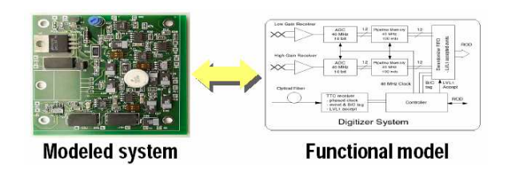

</div>
</split-slide>

- 🔑 **Todo modelo es incompleto a propósito.** La pregunta correcta no es «¿está completo?» sino «¿sirve para lo que lo necesito?»

---

## Tres maneras de describir lo mismo

<steps>
<step>

### 1️⃣ Con código

[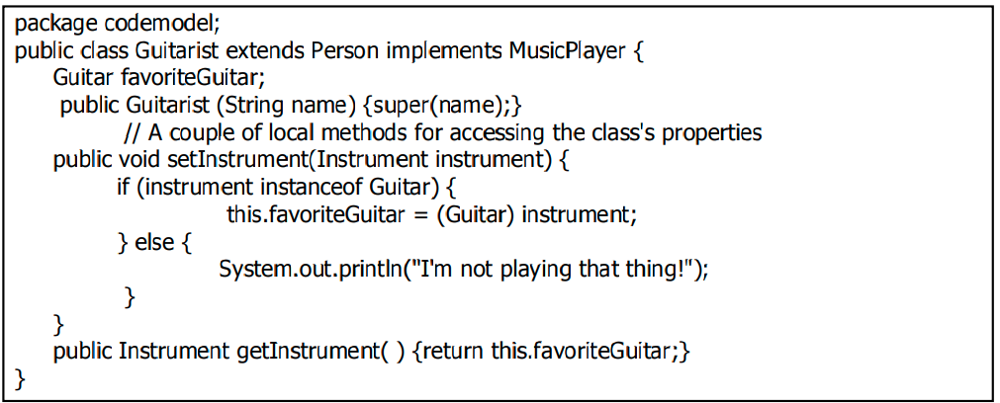](../assets/ads-uml-modelo-codigo.png)

- Representa **solo la lógica** e ignora el resto · El ser humano lo interpreta **muy lentamente** · No facilita la comunicación

</step>
<step>

### 2️⃣ Con lenguaje natural

[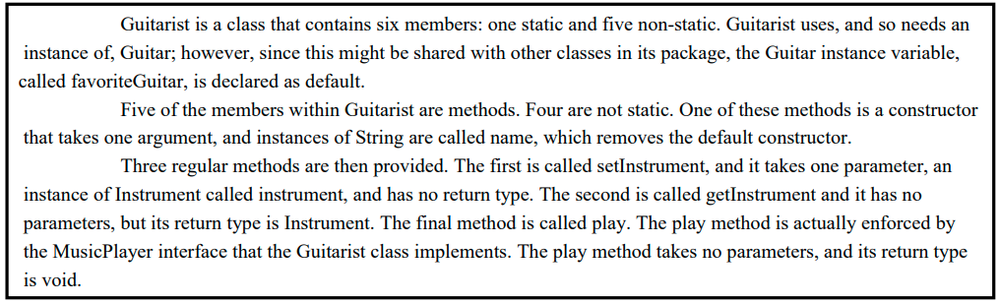](../assets/ads-uml-modelo-natural.png)

- Es **ambigua y confusa** · Es **lenta** de interpretar · Es **difícil de procesar** por herramientas

</step>
<step>

### 3️⃣ Con un modelo visual

[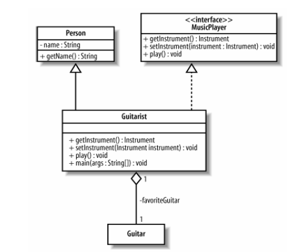](../assets/ads-uml-modelo-visual.png)

- **No es ambigua** (una vez conocida la semántica) · Es **rápida** de interpretar · Es **fácil de procesar** por herramientas

</step>
</steps>

---

## ¿Qué es UML?

- **UML** = *Unified Modeling Language* — Lenguaje Unificado de Modelado
- Es un **lenguaje de modelado visual de propósito general**, orientado a objetos
- Impulsado y mantenido por el **[Object Management Group (OMG)](https://www.omg.org)**

<div class="grid">
<div>

### 🌐 Estándar
Independiente de cualquier fabricante comercial o herramienta
</div>
<div>

### 🔀 Unificado
Agrupa notaciones y conceptos de distintos métodos orientados a objetos previos
</div>
<div>

### 🧭 De propósito general
No está atado a un dominio: sirve para banca, salud, videojuegos o control industrial
</div>
</div>

- La versión vigente es **UML 2.5.1** (OMG, diciembre de 2017)

---

## De dónde viene UML

| Año | Hito |
|:--|:--|
| **1990-1994** | Tres métodos OO compiten: **Booch**, **OMT** (Rumbaugh) y **OOSE** (Jacobson). Notaciones incompatibles entre sí |
| **1995-1996** | Los «tres amigos» se reúnen en Rational y fusionan sus notaciones |
| **1997** | El **OMG adopta UML 1.1** como estándar |
| **2005** | **UML 2.0**: reescritura mayor, se formaliza la semántica y aparecen los fragmentos combinados |
| **2017** | **UML 2.5.1**, la versión vigente: texto reescrito para eliminar contradicciones internas |

<div class="grid">
<div>

### 💡 Por qué importa la historia
Explica por qué hay **varias formas** de dibujar lo mismo: son herencias de los tres métodos originales
</div>
<div>

### ⚠️ Consecuencia práctica
Las herramientas no son idénticas. Acuerden **una convención de equipo** y respétenla
</div>
</div>

---

## Los cinco propósitos de UML

<split-slide style="--left: 44%; --right: 56%;">
<div>

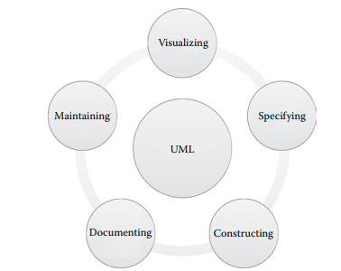

> UML sirve para **visualizar, especificar, construir, documentar y mantener** sistemas, independientemente de la metodología, pero siempre con una perspectiva orientada a objetos
</div>
<div>

### 👁️ Visualizar
Detrás de cada símbolo hay una **semántica bien definida**; trasciende lo que puede expresar un lenguaje de programación

### 📝 Especificar
Construir modelos **precisos, no ambiguos y completos** del análisis, diseño e implementación

### 🏗️ Construir
Correspondencia con lenguajes (Java, C#) y bases de datos (relacionales, OO)

### 📚 Documentar
Arquitectura, requisitos, pruebas, planificación y gestión de versiones

### 🔧 Mantener
Ubicar **dónde** cambiar y entender el **efecto** del cambio en el resto
</div>
</split-slide>

---

## Construir: ingeniería directa e inversa

<split-slide style="--left: 50%; --right: 50%;">
<div>

### ➡️ Ingeniería directa
**Modelo UML → código**

- La herramienta genera el **esqueleto**: clases, atributos, firmas de operaciones, relaciones
- Nunca genera la lógica de negocio
- Útil al arrancar un módulo nuevo
</div>
<div>

### ⬅️ Ingeniería inversa
**Código → modelo UML**

- La herramienta lee el código y **reconstruye** el diagrama de clases
- Útil para entender un sistema heredado que nadie documentó
- Cuidado: produce diagramas enormes e ilegibles si no se filtra
</div>
</split-slide>

- ⚠️ El riesgo del **modelo desincronizado**: si el diagrama y el código divergen, el diagrama miente. O se mantiene, o se borra

---

## Conceptos de modelado

| Concepto | Definición |
|:--|:--|
| **Sistema** | Colección de elementos, posiblemente divididos en subsistemas, organizados para lograr un propósito. Se describe con un conjunto de modelos |
| **Modelo** | Simplificación completa y autoconsistente de la realidad, creada para comprender mejor un sistema |
| **Vista** | Proyección de la organización y estructura de un modelo, centrada en **un aspecto**. Incluye un subconjunto de los elementos del modelo |
| **Diagrama** | Representación gráfica de un conjunto de elementos del modelo y sus relaciones. Es un **grafo conexo** de nodos (elementos) y arcos (relaciones) |

- 🔑 La jerarquía es: **sistema → modelos → vistas → diagramas**
- El **modelo** es el repositorio único; los **diagramas** son ventanas hacia él. Por eso una herramienta UML seria mantiene la consistencia entre diagramas

---

## Propiedades de un buen modelo

<steps>
<step>

- Un modelo captura las propiedades **estructurales** (estáticas) y de **comportamiento** (dinámicas) de un sistema
- Describe **completamente** los aspectos relevantes al propósito del modelo, y **al nivel de detalle apropiado**
- Cada modelo es completo **desde un punto de vista**; entre modelos existen relaciones de **trazabilidad**

</step>
<step>

### La paradoja del código

> El **código fuente** es el modelo más detallado del sistema — y además es ejecutable. Sin embargo, se requieren otros modelos.

<div class="grid">
<div>

### ❓ ¿Por qué?
Porque el código responde **cómo**, pero no **por qué** ni **con qué arquitectura**
</div>
<div>

### 🔍 Nivel de detalle
Leer 80 000 líneas para saber si dos módulos se hablan es un método pésimo
</div>
<div>

### 👥 Audiencia
El usuario, el arquitecto y la persona que prueba **no leen código**
</div>
</div>

</step>
</steps>

---

## Vistas arquitecturales: el modelo 4+1

<split-slide style="--left: 52%; --right: 48%;">
<div>

[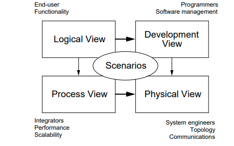](../assets/ads-uml-4mas1.png)

> Kruchten, P. (1995). *Architectural Blueprints — The «4+1» View Model of Software Architecture*
</div>
<div>

- Durante el desarrollo, el sistema debe verse desde **varias perspectivas**
- Diferentes personas lo miran de formas diferentes en momentos diferentes
- La **arquitectura** se organiza mejor a través de **vistas interrelacionadas**
- Cada vista es una **proyección** del modelo centrada en un aspecto particular

- 💡 El «+1» son los **escenarios** (casos de uso): amarran las otras cuatro vistas y sirven para validarlas
</div>
</split-slide>

---

## Las cinco vistas

| Vista | Qué captura | Para quién | Diagramas estáticos |
|:--|:--|:--|:--|
| **Casos de uso** | La funcionalidad **tal como la perciben los usuarios**; no la organización real del software | Usuarios, analistas, pruebas | Casos de uso |
| **Diseño** *(lógica)* | Clases, interfaces y colaboraciones del **dominio del problema y de la solución** | Diseño | Clases, objetos |
| **Interacción** *(procesos)* | El **flujo de control**, concurrencia y sincronización. Rendimiento y escalabilidad | Integradores | Clases, objetos |
| **Implementación** *(desarrollo)* | Los **artefactos** que se ensamblan y ponen en producción; correspondencia clase ↔ archivo | Programación, gestión | Componentes, estructura compuesta |
| **Despliegue** *(física)* | Nodos y enlaces de la **topología de hardware** donde se ejecuta el sistema | Ingeniería de sistemas | Despliegue |

- En **todas** las vistas, los aspectos **dinámicos** se documentan igual: diagramas de **interacción**, **estados** y **actividades**

---

## El modelo UML de un sistema

<steps>
<step>

Por tanto, el modelo UML de un sistema consiste en:

<div class="grid">
<div>

### 🗄️ Un conjunto de elementos
Definen estructura, comportamiento y funcionalidad, agrupados en **una base de datos única**
</div>
<div>

### 🖼️ Múltiples diagramas
Presentan esos conceptos para introducirlos, editarlos y hacerlos comprensibles
</div>
<div>

### 🔭 Agrupados en vistas
Cada vista enfocada a un **aspecto particular** del sistema
</div>
</div>

- ⚠️ Gestionar un modelo UML requiere una **herramienta específica** que mantenga la consistencia: si renombras una clase, debe renombrarse en los 12 diagramas donde aparece

</step>
<step>

### Herramientas de uso común

| Herramienta | Nota |
|:--|:--|
| **Visual Paradigm** | Muy completa, versión *Community* gratuita para uso no comercial |
| **StarUML** | Ligera, de escritorio |
| **draw.io / diagrams.net** | Gratuita: dibuja UML, pero **no** mantiene un modelo consistente |
| **PlantUML / Mermaid** | Diagramas **como texto**, versionables en Git |
| **Enterprise Architect** | Estándar en entornos corporativos grandes |

- 💡 Para el curso: cualquiera sirve, pero valoren las que guardan el **modelo**, no solo el dibujo

</step>
</steps>

---

## Actividad 2: ¿qué vista responde la pregunta?

<div class="grid">
<div>

### Preguntas
1. ¿Qué pasa si el servidor de base de datos se cae?
2. ¿Qué puede hacer un estudiante en el sistema?
3. ¿Qué clases participan en «matricular curso»?
4. ¿En qué orden se llaman los objetos al pagar?
5. ¿Qué archivos hay que desplegar para la versión 2.1?
</div>
<div>

### Vistas
- **A.** Casos de uso
- **B.** Diseño
- **C.** Interacción / procesos
- **D.** Implementación
- **E.** Despliegue

- ⏱️ 5 minutos · <spoiler>1-E, 2-A, 3-B, 4-C, 5-D</spoiler>
</div>
</div>

---

<!-- _class: cover -->
<style scoped>
section {
  --cover: url(../assets/img_00059_.png);
}
</style>
# Diagramas UML
## Contenidos
- La taxonomía de los 14 diagramas
- Estructura vs. comportamiento
- Cuáles usaremos en el curso

---

## Los catorce diagramas de UML 2.5.1

[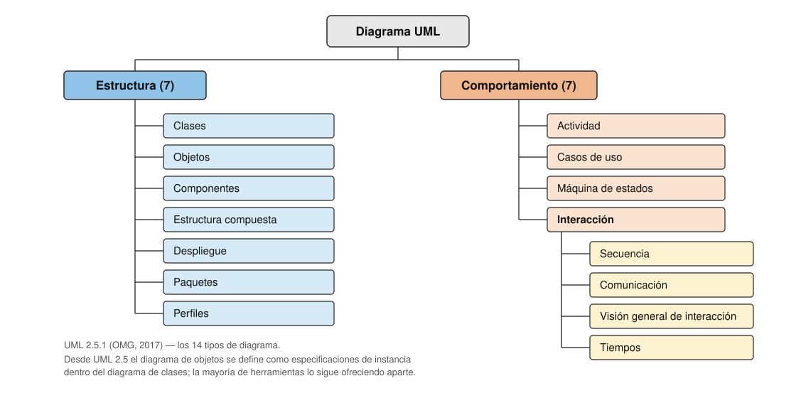](../assets/ads-uml-taxonomia.svg)

- Nadie usa los catorce. En la práctica, **cinco o seis** cubren el 95 % de las necesidades

---

## Estructura vs. comportamiento

<split-slide style="--left: 50%; --right: 50%;">
<div>

### 🏛️ Diagramas de estructura
Describen **lo que hay**, en reposo: qué piezas existen y cómo se relacionan.

- **Clases** — conceptos y sus relaciones
- **Objetos** — una foto de instancias concretas
- **Paquetes** — agrupación y dependencias
- **Componentes** — piezas y contratos
- **Despliegue** — dónde corre cada cosa
- **Estructura compuesta** — el interior de una clase
- **Perfiles** — cómo extender el propio UML
</div>
<div>

### ⚡ Diagramas de comportamiento
Describen **lo que pasa**, en el tiempo: cómo el sistema responde y evoluciona.

- **Casos de uso** — qué se puede hacer
- **Actividad** — el flujo de un proceso
- **Máquina de estados** — el ciclo de vida de un objeto
- **Interacción**:
  - **Secuencia** — orden de mensajes en el tiempo
  - **Comunicación** — estructura de los enlaces
  - **Visión general de interacción** · **Tiempos**
</div>
</split-slide>

---

## Qué usaremos en el curso

| Diagrama | Cuándo | Pregunta que responde |
|:--|:--|:--|
| **Casos de uso** | Requerimientos | ¿Qué puede hacer cada actor? |
| **Actividad** | Análisis del negocio y del caso de uso | ¿Cuál es el flujo del proceso y quién hace qué? |
| **Clases** *(dominio)* | Análisis | ¿Cuáles son los conceptos del negocio y cómo se relacionan? |
| **Secuencia** | Diseño | ¿En qué orden colaboran los objetos para realizar un caso de uso? |
| **Clases** *(diseño)* | Diseño | ¿Qué clases de software y con qué responsabilidades? |
| **Paquetes** | Arquitectura | ¿Cómo se organiza el sistema y qué depende de qué? |
| **Componentes / despliegue** | Arquitectura | ¿Qué piezas se instalan y en qué máquinas? |

- 🔑 Regla práctica: **dibuja un diagrama solo si hay una decisión que tomar o comunicar**. Si nadie lo va a leer, no lo dibujes

---

<!-- _class: cover -->
<style scoped>
section {
  --cover: url(../assets/img_00053_.png);
}
</style>
# Diagrama de paquetes
## Contenidos
- Qué es y para qué sirve
- Notación y anidamiento
- Tipos de dependencia
- Arquitectura en capas y ciclos

---

## ¿Qué es un diagrama de paquetes?

<split-slide style="--left: 52%; --right: 48%;">
<div>

- Un **paquete** es un mecanismo de propósito general para **agrupar elementos** del modelo y darles un **espacio de nombres**
- El diagrama de paquetes muestra esos grupos y las **dependencias** entre ellos
- Es el diagrama de más alto nivel: se lee **antes** que cualquier diagrama de clases
</div>
<div>

### Para qué sirve
- Ver la **arquitectura lógica** de un vistazo
- Detectar **acoplamiento indeseado** entre partes
- Repartir el trabajo del equipo: un paquete, una persona o un grupo
- Definir el **orden de construcción**: primero lo que no depende de nadie
</div>
</split-slide>

- 💡 Cualquier elemento UML puede vivir en un paquete: clases, casos de uso, componentes y hasta otros paquetes

---

## Notación del diagrama de paquetes

[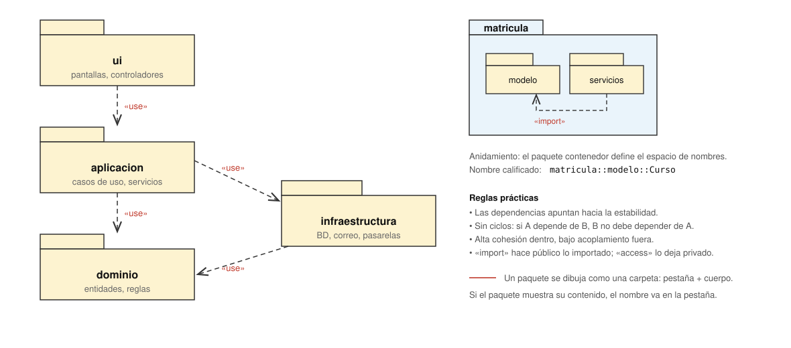](../assets/ads-uml-paquetes.svg)

---

## Tipos de dependencia entre paquetes

| Estereotipo | Significado | Efecto en el espacio de nombres |
|:--|:--|:--|
| **«use»** | El paquete origen **usa** elementos del destino. Es la dependencia genérica | Ninguno: hay que calificar los nombres |
| **«import»** | Importa los elementos **públicos** del destino | Los nombres quedan disponibles **y públicos** hacia afuera |
| **«access»** | Igual que *import*, pero lo importado queda **privado** | Los nombres se usan dentro, **no se reexportan** |
| **«merge»** | Fusiona el contenido del destino en el origen | Se usa sobre todo al definir **perfiles** y metamodelos |

<div class="grid">
<div>

### 📖 Cómo se lee
`A ---▸ B` significa **«A necesita a B»**: si B cambia, A puede romperse. B no sabe que A existe
</div>
<div>

### ⚠️ Visibilidad
Los elementos de un paquete pueden ser `+` públicos o `-` privados. Solo lo público cruza la frontera
</div>
</div>

---

## Arquitectura en capas y ciclos

<steps>
<step>

### La regla de oro: las dependencias apuntan hacia abajo

| Capa | Depende de | Nunca depende de |
|:--|:--|:--|
| **Presentación** (`ui`) | Aplicación | Infraestructura directamente |
| **Aplicación** | Dominio, Infraestructura *(por interfaz)* | Presentación |
| **Dominio** | **Nadie** | Ninguna otra capa |
| **Infraestructura** | Dominio | Presentación, Aplicación |

- 🔑 El **dominio no depende de nada**: es la parte que debe sobrevivir al cambio de framework, de base de datos y de interfaz

</step>
<step>

### El pecado capital: la dependencia cíclica

<div class="grid">
<div>

### 🚫 Ciclo
`facturacion ➜ clientes ➜ facturacion`

No se puede compilar, probar ni desplegar uno sin el otro. En la práctica son **un solo paquete** mal partido
</div>
<div>

### ✅ Cómo se rompe
Extraer lo compartido a un **tercer paquete**, o invertir la dependencia con una **interfaz** en el paquete de abajo
</div>
<div>

### 🔍 Cómo se detecta
Cualquier herramienta lo reporta. En Java: *jdeps*; en .NET: *NDepend*; en JS: *madge*
</div>
</div>

</step>
</steps>

---

## Actividad 3: organiza en paquetes

- Un sistema de biblioteca tiene estas clases:

> `PantallaPrestamo` · `Libro` · `Ejemplar` · `Socio` · `Prestamo` · `Multa` · `RepositorioLibros` · `ConexionBD` · `ServicioCorreo` · `GestorPrestamos` · `ControladorWeb` · `PoliticaDeMulta`

<split-slide style="--left: 50%; --right: 50%;">
<div>

### Qué hacer
1. Agrupen las clases en los paquetes `ui`, `aplicacion`, `dominio` e `infraestructura`
2. Dibujen las **dependencias** entre paquetes
3. Verifiquen que **ninguna flecha sale del dominio**
</div>
<div>

### Preguntas de control
- ¿`PoliticaDeMulta` es dominio o aplicación? ¿Por qué?
- Si `GestorPrestamos` necesita enviar un correo, ¿cómo evitan que `aplicacion` dependa de `infraestructura`?
- ¿Hay algún ciclo?
</div>
</split-slide>

- ⏱️ 15 minutos

---

## Posible Solución

<hidden label="Solución">


<split-slide style="--left: 50%; --right: 50%;">
<div>

## ui

- PantallaPrestamo
- ControladorWeb
</div>
<div>

## aplicacion

- GestorPrestamos
  
</div>
</split-slide>


<split-slide style="--left: 50%; --right: 50%;">
<div>

## dominio

- Libro
- Ejemplar
- Socio
- Prestamo
- Multa
- PoliticaDeMulta
- RepositorioLibros (la interfaz, no la implementación)
</div>
<div>

## infraestructura

- ConexionBD
- ServicioCorreo
- RepositorioLibrosJPA / RepositorioLibrosSQL (la implementación concreta de la interfaz del dominio)
</div>
</split-slide>

</hidden>

---

<!-- _class: cover -->
<style scoped>
section {
  --cover: url(../assets/img_00054_.png);
}
</style>
# Diagrama de clases
## Contenidos
- Modelo de dominio y clases conceptuales
- Notación de clase, atributos y operaciones
- Asociación, roles, multiplicidad
- Herencia, interfaces, agregación y composición
- Cómo se construye · Caso de estudio

---

## ¿Qué es un diagrama de clases?

<split-slide style="--left: 50%; --right: 50%;">
<div>

- Un diagrama de clases es un diagrama **estático** que describe la **estructura** de un sistema mostrando sus **clases**, **atributos**, **operaciones** y las **relaciones** entre ellos
- Es el diagrama UML más usado, y el único que casi todo equipo mantiene vivo
</div>
<div>

[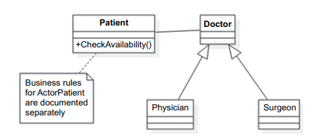](../assets/ads-uml-clases-ejemplo.png)

> *Class diagram*. Unhelkar (2018)
</div>
</split-slide>

- ⚠️ El mismo diagrama sirve para **dos cosas muy distintas**: modelar el **dominio del problema** o modelar las **clases de software**. Nunca los mezclen en un mismo dibujo

---

## Modelo de dominio vs. diagrama de clases de diseño

<split-slide style="--left: 50%; --right: 50%;">
<div>

### 🌱 Modelo de dominio
*Análisis · vocabulario del negocio*

- Muestra **clases conceptuales** significativas del dominio del problema
- **No** muestra componentes de software, ni clases de software, ni responsabilidades
- Solo **nombre**, **atributos** y **asociaciones**
- Sin operaciones, sin tipos de datos, sin visibilidad

> *Gestión académica:* `Alumno`, `Docente`, `Asignatura`, `Horario`
</div>
<div>

### 🏗️ Diagrama de clases de diseño
*Diseño · vocabulario de la solución*

- Muestra **clases de software** que se van a programar
- Aparecen operaciones con firma completa, visibilidad, tipos, interfaces
- Aparecen clases que **no existen en el negocio**: controladores, repositorios, fábricas
- Se ajusta a un lenguaje y a un framework
</div>
</split-slide>

- 🔑 El modelo de dominio es la **entrada** del diseño, no su borrador

---

## La clase conceptual

<steps>
<step>

- Informalmente, una clase conceptual es **una idea, cosa u objeto**
- Formalmente se puede considerar en tres términos:

<div class="grid">
<div>

### 🔤 Símbolo
Las **palabras o imágenes** que representan la clase conceptual

`Venta`
</div>
<div>

### 📖 Definición
El **concepto**: qué significa

*«Una venta representa el hecho de una transacción de compra; sucede un día y a una hora»*
</div>
<div>

### 📦 Extensión
El **conjunto de objetos** que pertenecen a la clase

`Venta-1`, `Venta-2`, `Venta-3`
</div>
</div>

</step>
<step>

### El error más caro del análisis

<div class="grid">
<div>

### 🚫 Confundir símbolo y definición
Dos personas dicen «cliente» y piensan cosas distintas. El modelo parece correcto y no lo es
</div>
<div>

### ✅ La solución
Un **glosario**: cada clase conceptual con su definición en una frase, acordada con el usuario
</div>
</div>

- 💡 Si el equipo no puede escribir la definición de una clase en una frase, esa clase todavía no se entiende

</step>
</steps>

---

## Notación de clase

[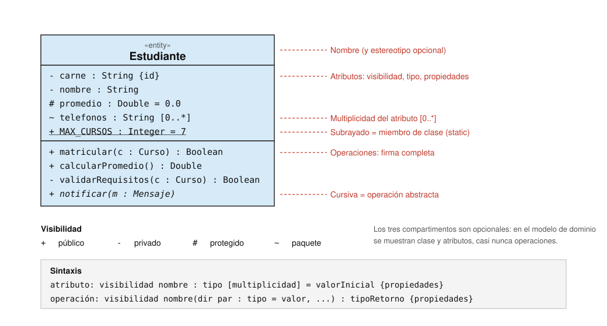](../assets/ads-uml-clase-notacion.svg)

---

## Notación resumida

<split-slide style="--left: 55%; --right: 45%;">
<div>

[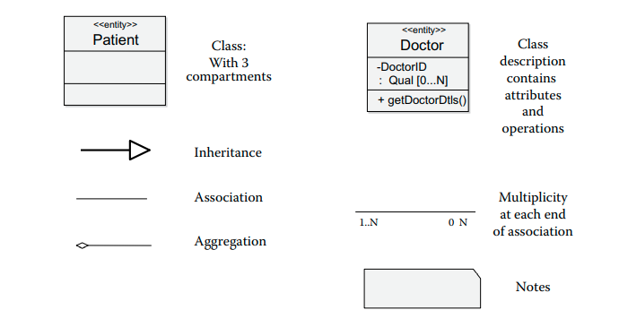](../assets/ads-uml-clases-notacion.png)

> *Notations diagram*. Unhelkar (2018)
</div>
<div>

### Los tres compartimentos

1. **Nombre** — sustantivo en singular, en `PascalCase`. Obligatorio
2. **Atributos** — las propiedades. Opcional
3. **Operaciones** — los servicios. Opcional

- En el **modelo de dominio** se muestran solo los dos primeros
- El compartimento vacío no significa «no tiene»: significa «no lo estoy mostrando»
</div>
</split-slide>

---

## Clase y objeto

<split-slide style="--left: 50%; --right: 50%;">
<div>

### La clase: el molde

```
┌────────────────────┐
│       Cuenta       │
├────────────────────┤
│ numeroCuenta       │
│ saldo              │
│ fechaApertura      │
│ saldoPromedio      │
├────────────────────┤
│ abrir()            │
│ consignar()        │
│ suspender()        │
│ sobregirar()       │
└────────────────────┘
```
</div>
<div>

### El objeto: la instancia

```
┌────────────────────┐
│  miCuenta : Cuenta │
├────────────────────┤
│ numeroCuenta = 881 │
│ saldo = 45000      │
└────────────────────┘
```

- El nombre del objeto va **subrayado** y con el formato `nombre : Clase`
- Se puede omitir el nombre (`: Cuenta`) o la clase (`miCuenta`)
- Los objetos viven en el **diagrama de objetos**: una **foto** del sistema en un instante
</div>
</split-slide>

---

## Atributos

- Un **atributo** es una propiedad de una clase; describe el **rango de valores** que esa propiedad podrá contener en los objetos de la clase

| Elemento de la sintaxis | Ejemplo | Cuándo se usa |
|:--|:--|:--|
| **Visibilidad** | `-` `+` `#` `~` | Diseño. En dominio se omite |
| **Nombre** | `saldoDisponible` | Siempre. `camelCase`, sustantivo |
| **Tipo** | `: Double` | Diseño. En dominio, solo si aclara |
| **Multiplicidad** | `[0..*]` | Cuando el atributo es una colección |
| **Valor inicial** | `= 0.0` | Cuando hay un valor por omisión con significado |
| **Propiedades** | `{readOnly}` `{id}` `{unique}` | Para restricciones que no se ven en el tipo |

- ⚠️ **¿Atributo o clase?** Si la «propiedad» tiene identidad propia, historia o atributos suyos, es una **clase asociada**, no un atributo. `direccion` como texto es un atributo; `Direccion` con provincia, cantón y distrito es una clase

---

## Enlaces y asociaciones

<split-slide style="--left: 50%; --right: 50%;">
<div>

- Las entidades del mundo real **se relacionan** con otras entidades
- A las relaciones entre **objetos** se les llama **enlaces** *(links)*
- A las relaciones entre **clases** se les llama **asociaciones**

| Nivel | Ejemplo |
|:--|:--|
| Clases | `Docente` **imparte** `Asignatura` |
| Objetos | `Alonso` **imparte** `Análisis de Sistemas` |
</div>
<div>

[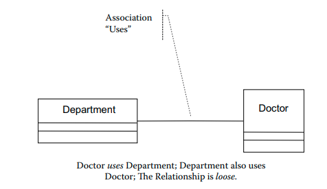](../assets/ads-uml-asociacion.png)

> *Association relationship*. Unhelkar (2018)
</div>
</split-slide>

- 🔑 Una asociación es **estructural**: significa que existe un vínculo que persiste, no una llamada puntual entre objetos

---

## Nombre, roles y navegabilidad

[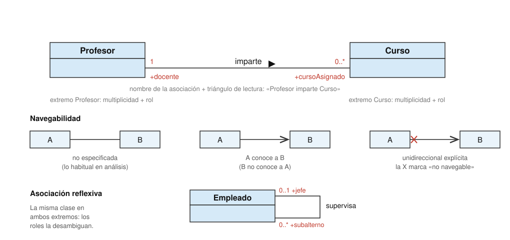](../assets/ads-uml-asociacion-roles.svg)

---

## Cómo nombrar bien una asociación

<div class="grid">
<div>

### 🏷️ Nombre de la asociación
Un **verbo** en tercera persona, con el triángulo que indica la dirección de lectura

`Profesor` ▶ *imparte* ▶ `Curso`
</div>
<div>

### 🎭 Nombre de rol
Un **sustantivo** que dice **qué papel juega** esa clase en la relación

`Profesor` juega el rol de `+docente`
</div>
<div>

### ❓ Cuándo usar cada uno
El nombre de asociación aclara **la relación**; el rol aclara **el extremo**. Con uno suele bastar
</div>
</div>

- ⚠️ Nombres a evitar: `tiene`, `es`, `asociado con`, `relacionado con`. No aportan nada
- 💡 Prueba de calidad: leer el diagrama en voz alta debe producir una **frase del negocio** que el usuario apruebe

---

## Multiplicidad

<split-slide style="--left: 40%; --right: 60%;">
<div>

| Notación | Significado |
|:--|:--|
| `1` | Exactamente uno |
| `0..1` | Cero o uno *(opcional)* |
| `*` o `0..*` | Cero o muchos |
| `1..*` | Uno o muchos |
| `1..4` | Entre uno y cuatro |
| `2, 5, 8` | Exactamente 2, 5 u 8 |

- Se lee **cruzado**: la multiplicidad del extremo `Curso` dice **cuántos cursos** se relacionan con **un** profesor
</div>
<div>

[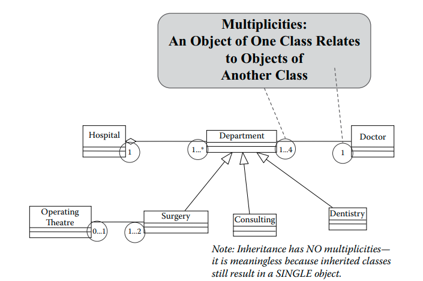](../assets/ads-uml-multiplicidad.png)

> *Multiplicities in class diagrams*. Unhelkar (2018)
</div>
</split-slide>

- ⚠️ La **herencia no lleva multiplicidad**: carece de sentido, porque las clases heredadas siguen resultando en **un solo objeto**

---

## Clase asociación

<split-slide style="--left: 48%; --right: 52%;">
<div>

[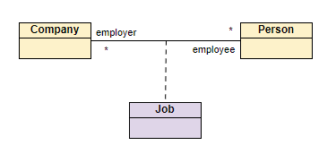](../assets/ads-uml-clase-asociacion.png)

- Clase que representa **propiedades y operaciones propias de la relación**, no de ninguno de los dos extremos
- Se dibuja unida a la asociación con una **línea discontinua**
</div>
<div>

### Cuándo aparece
- Casi siempre en asociaciones **muchos a muchos** que necesitan guardar datos propios

| Asociación | Clase asociación | Sus datos |
|:--|:--|:--|
| `Company` — `Person` | `Job` | salario, puesto |
| `Estudiante` — `Curso` | `Matricula` | fecha, nota |
| `Producto` — `Parte` | `Definicion` | cantidad |

- ❓ ¿Dónde pondrías la **nota** de un estudiante en un curso? <spoiler>en la clase asociación `Matricula`: no es del estudiante ni del curso, es de la relación</spoiler>
</div>
</split-slide>

---

## Generalización y especialización

<split-slide style="--left: 50%; --right: 50%;">
<div>

- Es una relación entre una clase (**subclase**) que es un **subtipo** de otra clase (**superclase**)
- Indica que la subclase **hereda** los atributos y operaciones especificados por la superclase
- Notación: línea **continua** con **triángulo hueco** apuntando a la superclase

[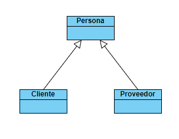](../assets/ads-uml-generalizacion.png)

*Generalización: aumento de abstracción*
</div>
<div>

[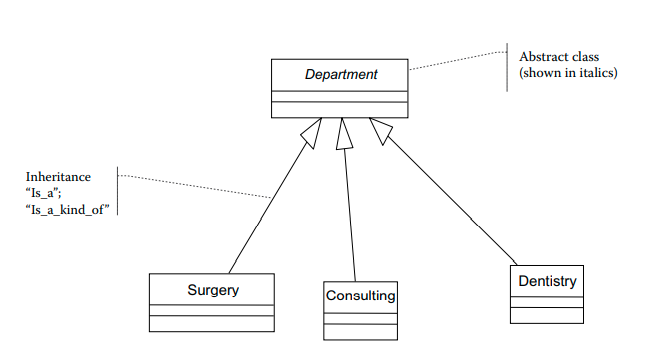](../assets/ads-uml-herencia.png)

> *The inheritance relationship*. Unhelkar (2018)

[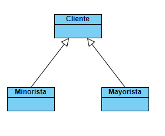](../assets/ads-uml-especializacion.png)

*Especialización: abstracción descendente*
</div>
</split-slide>

---

## Dos caminos hacia la jerarquía

<div class="grid">
<div>

### ⬆️ Generalización
**De lo concreto a lo abstracto.** Veo `Cliente` y `Proveedor`, noto que comparten cédula, razón social y correo, y **extraigo** `AgenteComercial`

*Aumento de abstracción*
</div>
<div>

### ⬇️ Especialización
**De lo abstracto a lo concreto.** Tengo `Cliente` y descubro que hay reglas distintas para `Minorista` y `Mayorista`, así que **derivo** las subclases

*Abstracción descendente*
</div>
</div>

- 🧪 **La prueba del «es un»**: `Minorista` **es un** `Cliente` ✅ · `Pedido` **es un** `Cliente` 🚫
- ⚠️ Si la subclase **no usa** buena parte de lo heredado, o necesita anular operaciones para «desactivarlas», la jerarquía está mal planteada: probablemente sea **composición**, no herencia
- La clase **abstracta** se escribe en *cursiva*: no se instancia, solo define lo común

---

## Interfaces y realización

[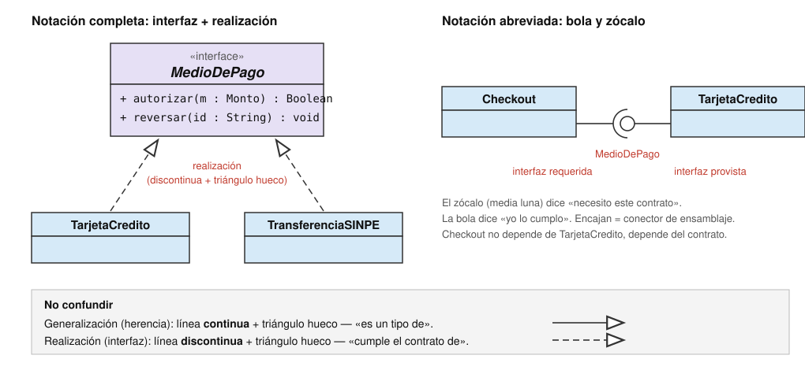](../assets/ads-uml-interfaces.svg)

---

## Por qué importan las interfaces

<steps>
<step>

### Una interfaz es un contrato
- Declara **qué operaciones** hay que ofrecer, **sin decir cómo**
- No tiene atributos ni implementación
- Una clase puede realizar **varias** interfaces, aunque solo herede de una superclase

| Elemento | Notación | Semántica |
|:--|:--|:--|
| **Interfaz** | Clase con estereotipo `«interface»`, nombre en cursiva | El contrato |
| **Realización** | Línea **discontinua** + triángulo **hueco** | «Cumplo este contrato» |
| **Bola** *(lollipop)* | Círculo con línea | Interfaz **provista** |
| **Zócalo** *(socket)* | Media luna con línea | Interfaz **requerida** |

</step>
<step>

### El efecto en el diseño

<div class="grid">
<div>

### 🔌 Sustituibilidad
Agregar `PagoConSINPE` no obliga a tocar `Checkout`: basta con que realice `MedioDePago`
</div>
<div>

### 🧪 Comprobabilidad
En las pruebas se sustituye la implementación real por una falsa que cumple el mismo contrato
</div>
<div>

### 🧭 Inversión de dependencias
El paquete de arriba define la interfaz; el de abajo la implementa. La flecha de dependencia **se invierte**
</div>
</div>

- 💡 Es el mecanismo que permite que el **dominio no dependa de la infraestructura** (recuerden el diagrama de paquetes)

</step>
</steps>

---

## Agregación simple

<split-slide style="--left: 50%; --right: 50%;">
<div>

- Relación entre unas **clases componentes** y una clase **ensamble completo**
- Notación: **rombo hueco** en el extremo del todo
- La existencia de las partes es **independiente** de la existencia del todo *(vínculo débil)*

> Una computadora está compuesta por un monitor, la caja del sistema, uno o ningún ratón y un teclado

- Si desarmo la PC, el monitor **sigue existiendo** y puedo conectarlo a otra
</div>
<div>

[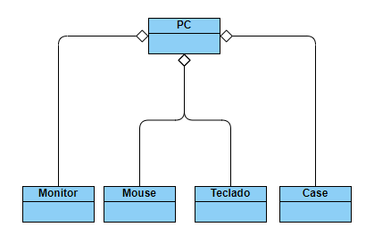](../assets/ads-uml-agregacion.png)
</div>
</split-slide>

---

## Composición

<split-slide style="--left: 58%; --right: 42%;">
<div>

- Es una agregación **fuerte**: la existencia de las partes **depende** de la existencia del todo
- Notación: **rombo relleno** en el extremo del todo
- La parte pertenece a **un solo** todo a la vez, y muere con él

| Regla | Agregación | Composición |
|:--|:--|:--|
| **Rombo** | Hueco ◇ | Relleno ◆ |
| **Vínculo** | Débil | Fuerte |
| **Si muere el todo** | La parte sobrevive | La parte **se elimina** |
| **¿Se puede compartir?** | Sí | No |
| **Ejemplo** | `Equipo` ◇— `Jugador` | `Factura` ◆— `Linea` |
</div>
<div>

[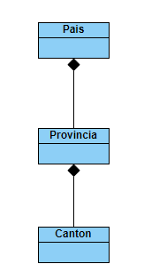](../assets/ads-uml-composicion.png)

- Un `Canton` no existe fuera de su `Provincia`
</div>
</split-slide>

- ❓ ¿`Pedido` y `LineaDePedido`? <spoiler>composición</spoiler> · ¿`Curso` y `Estudiante`? <spoiler>asociación simple: el estudiante existe sin el curso</spoiler>

---

## Resumen de relaciones

| Relación | Notación | Se lee | Fuerza |
|:--|:--|:--|:--|
| **Asociación** | Línea continua | «se relaciona con» | Estructural |
| **Agregación** | Línea + rombo **hueco** ◇ | «tiene» / «es parte de» | Débil |
| **Composición** | Línea + rombo **relleno** ◆ | «se compone de» | Fuerte |
| **Generalización** | Línea continua + triángulo hueco △ | «es un tipo de» | Herencia |
| **Realización** | Línea **discontinua** + triángulo hueco △ | «cumple el contrato de» | Contrato |
| **Dependencia** | Línea **discontinua** + flecha abierta ➤ | «usa» / «necesita» | Muy débil, puntual |

<div class="grid">
<div>

### 📏 De más a menos acoplamiento
Composición → Agregación → Asociación → Dependencia
</div>
<div>

### 💡 En caso de duda
Usen **asociación simple**. Agregación y composición son decisiones que hay que poder justificar
</div>
</div>

---

## Cómo se construye un diagrama de clases

<steps>
<step>

### Los cinco pasos

<div class="grid">
<div>

### 1️⃣ Identificar las clases
Los **sustantivos** del enunciado y de los casos de uso
</div>
<div>

### 2️⃣ Identificar asociaciones
Los **verbos** que conectan esos sustantivos
</div>
<div>

### 3️⃣ Identificar atributos
Los sustantivos que **describen** a otra clase en lugar de tener vida propia
</div>
<div>

### 4️⃣ Organizar usando herencia
Buscar lo **común** entre clases y extraerlo
</div>
<div>

### 5️⃣ Verificar el modelo
Leerlo en voz alta con el usuario y recorrer los casos de uso
</div>
</div>

</step>
<step>

### El método de sustantivos y verbos

| En el texto | Candidato a... | Ejemplo |
|:--|:--|:--|
| Sustantivo con **identidad e historia** | **Clase** | *«un **pedido** tiene una fecha»* |
| Sustantivo que **describe** a otro | **Atributo** | *«un pedido tiene una **fecha**»* |
| **Verbo** entre dos sustantivos | **Asociación** | *«un vendedor **realiza** una venta»* |
| Verbo con un **actor** como sujeto | **Operación** o caso de uso | *«el cajero **cobra** la factura»* |
| Adjetivo que crea **subtipos** | **Generalización** | *«clientes **minoristas** y **mayoristas**»* |
| Frase «**está formado por**» | Agregación / composición | *«un producto **se forma con** partes»* |

- ⚠️ Es un método de **arranque**, no un algoritmo: el resultado siempre se depura con el usuario

</step>
</steps>

---

## Errores frecuentes en diagramas de clases

<div class="grid">
<div>

### 🚫 Modelar la base de datos
Llaves foráneas, tablas intermedias e `id` por todos lados. Eso es un **modelo relacional**, no un modelo de dominio
</div>
<div>

### 🚫 Clases con nombre de verbo
`GestionarPedido`, `ProcesarPago`. Son **casos de uso** o servicios, no conceptos del dominio
</div>
<div>

### 🚫 Herencia por «reutilizar código»
Si no pasa la prueba del «es un», es composición
</div>
<div>

### 🚫 El diagrama de 80 clases
Ilegible = inservible. Partir por **paquetes** y mostrar una vista por tema
</div>
<div>

### 🚫 Asociaciones sin multiplicidad
La multiplicidad es donde vive la **regla de negocio**. Sin ella el diagrama dice muy poco
</div>
<div>

### 🚫 Clase «Sistema» o «Datos»
Nombres que no significan nada suelen esconder que no se entendió el dominio
</div>
</div>

---

## Caso de estudio: empresa de fabricación

<steps>
<step>

### El enunciado (1 de 2)

- Un **producto** tiene un nombre y un precio base. Un producto **se forma con** muchas **partes** y cada parte puede formar muchos productos. La **definición** de cada producto especifica **qué cantidad** de cada parte forma a un producto dado
- Un **vendedor** tiene un apellido, nombre y un porcentual de comisión
- Tanto un **cliente** como un **proveedor** tienen los datos de todo **agente comercial**: cédula, razón social, email, teléfono y dirección. Además un proveedor tiene un **plazo de pago** y un cliente un **porcentual de descuento**

</step>
<step>

### El enunciado (2 de 2)

- Una **parte** puede ser **comprada** a muchos proveedores y un proveedor puede proveer muchas partes. Cada **compra** de una parte tiene una **fecha** y una **cantidad**
- Una **venta** se realiza entre cualquier vendedor y cualquier cliente, y este puede comprar cualquier producto. De una venta se quiere saber su **fecha**
- **No se pueden vender productos que están formados por una única parte**, esto es, no se permite vender productos sin elaborar

</step>
<step>

### Pistas para resolverlo

<div class="grid">
<div>

### 🧬 Herencia
¿Qué comparten `Cliente` y `Proveedor`? → ahí está `AgenteComercial`
</div>
<div>

### 🔗 Clases asociación
Tres relaciones muchos-a-muchos necesitan datos propios: `Definicion`, `Compra` y la venta de productos
</div>
<div>

### 📏 Restricción
La última frase **no se dibuja**: es una restricción `{...}` o una nota
</div>
</div>

</step>
</steps>

---

## Actividad 4: modela la empresa de fabricación

<split-slide style="--left: 50%; --right: 50%;">
<div>

### Qué entregar
1. El **diagrama de clases** del dominio, con atributos
2. Todas las **multiplicidades**
3. Las **clases asociación** que hagan falta
4. La restricción del último párrafo, como nota
</div>
<div>

### Preguntas de control
- ¿`Definicion` es una clase asociación o una clase normal? ¿Por qué?
- ¿La relación `Producto`—`Parte` es asociación, agregación o composición?
- ¿`Venta` conecta dos clases o tres?
- ¿Quedó algún atributo repetido en dos clases? Si es así, falta una generalización
</div>
</split-slide>

- ⏱️ 25 minutos · en grupos

---

## Caso de fabricación: una solución posible

<hidden label="Solución">

[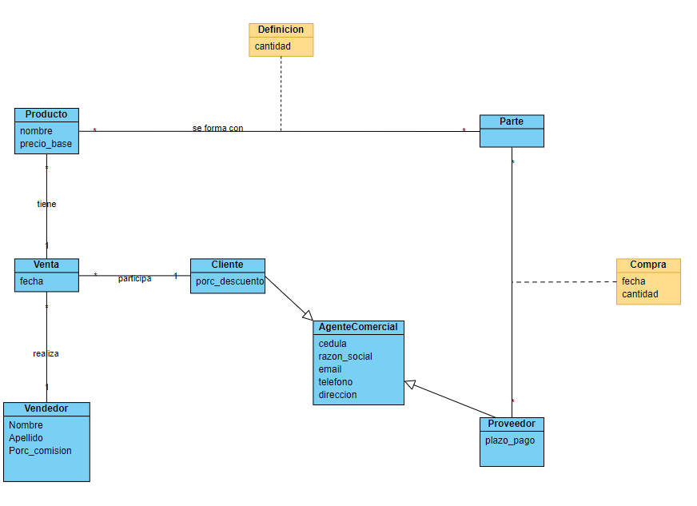](../assets/ads-uml-caso-fabricacion.png)

</hidden>

---

<!-- _class: cover -->
<style scoped>
section {
  --cover: url(../assets/img_00055_.png);
}
</style>
# Diagramas de interacción
## Contenidos
- Qué modelan y cuándo se usan
- Diagrama de secuencia
- Fragmentos combinados
- Diagrama de comunicación

---

## ¿Qué son los diagramas de interacción?

<split-slide style="--left: 52%; --right: 48%;">
<div>

- Modelan **cómo colaboran los objetos** para lograr algo: qué mensajes se envían y en qué orden
- Son la **realización** de un caso de uso: el paso del *qué* al *cómo*
- UML define cuatro: **secuencia**, **comunicación**, visión general de interacción y tiempos. Los dos primeros son los que se usan a diario
</div>
<div>

### De dónde salen
1. Se toma **un escenario** de un caso de uso (el flujo básico, o una alternativa concreta)
2. Se identifican los **objetos** que participan
3. Se reparte la responsabilidad: **quién sabe qué** y **quién hace qué**
4. El resultado alimenta el **diagrama de clases de diseño**: cada mensaje recibido es una **operación** de la clase receptora
</div>
</split-slide>

- 🔑 Un diagrama de interacción muestra **un escenario**, no todos los caminos posibles del caso de uso

---

## Diagrama de secuencia

[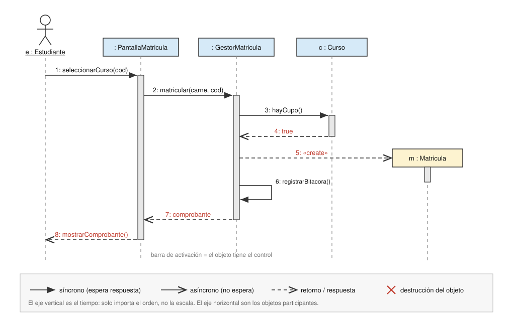](../assets/ads-uml-secuencia.svg)

---

## Elementos del diagrama de secuencia

| Elemento | Notación | Qué significa |
|:--|:--|:--|
| **Línea de vida** *(lifeline)* | Caja arriba + línea discontinua vertical | Un participante: objeto, actor o sistema externo |
| **Barra de activación** | Rectángulo delgado sobre la línea de vida | El participante **tiene el control** en ese lapso |
| **Mensaje síncrono** | Flecha con punta **rellena** | Quien envía **espera** la respuesta antes de seguir |
| **Mensaje asíncrono** | Flecha con punta **abierta** | Quien envía **continúa** sin esperar |
| **Retorno** | Flecha **discontinua** abierta | La respuesta. Se dibuja solo si aporta información |
| **Creación** | Flecha discontinua `«create»` hacia la caja | El objeto **nace** en ese punto; su caja se dibuja más abajo |
| **Destrucción** | ✕ al final de la línea de vida | El objeto **deja de existir** |
| **Auto-mensaje** | Flecha que sale y vuelve al mismo participante | El objeto se llama a sí mismo |

- El eje **vertical** es el tiempo (importa el **orden**, no la escala); el **horizontal**, los participantes

---

## Fragmentos combinados

[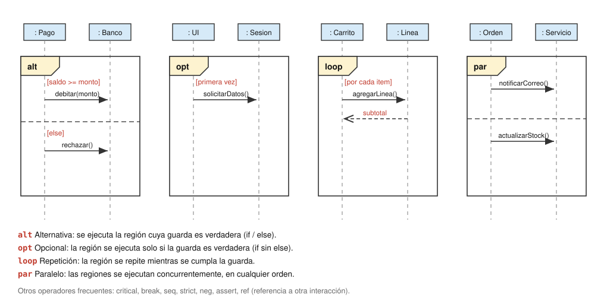](../assets/ads-uml-fragmentos.svg)

---

## Diagrama de comunicación

[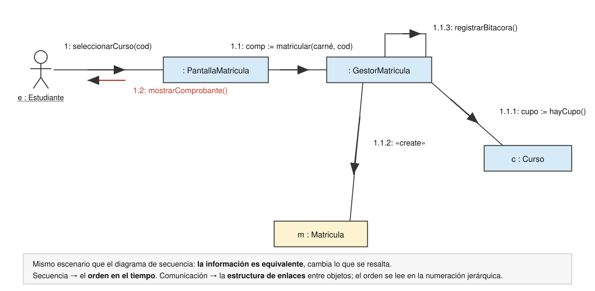](../assets/ads-uml-comunicacion.svg)

---

## Secuencia vs. comunicación

<split-slide style="--left: 50%; --right: 50%;">
<div>

### ⏱️ Secuencia
**Resalta el tiempo**

- El orden se lee de arriba abajo, sin esfuerzo
- Ideal para explicar **un escenario complejo** con condiciones y ciclos
- Soporta fragmentos combinados (`alt`, `loop`, `par`)
- Se vuelve inmanejable con muchos participantes
- **Es el que se usa el 90 % de las veces**
</div>
<div>

### 🕸️ Comunicación
**Resalta la estructura**

- Muestra **quién está conectado con quién**: los enlaces
- Bueno para detectar objetos con **demasiadas conexiones** (mal diseño)
- El orden se lee en la **numeración jerárquica** (`1`, `1.1`, `1.1.1`)
- Se satura rápido si hay muchos mensajes
</div>
</split-slide>

- 🔑 **Son semánticamente equivalentes**: una herramienta puede convertir uno en otro sin perder información
- 💡 Elige por la pregunta: *¿en qué orden pasa?* → secuencia · *¿quién habla con quién?* → comunicación

---

<!-- _class: cover -->
<style scoped>
section {
  --cover: url(../assets/img_00048_.png);
}
</style>
# Despliegue y componentes
## Contenidos
- Diagrama de despliegue: la arquitectura física
- Diagrama de componentes: las piezas lógicas
- Cuándo vale la pena dibujarlos

---

## Diagrama de despliegue

[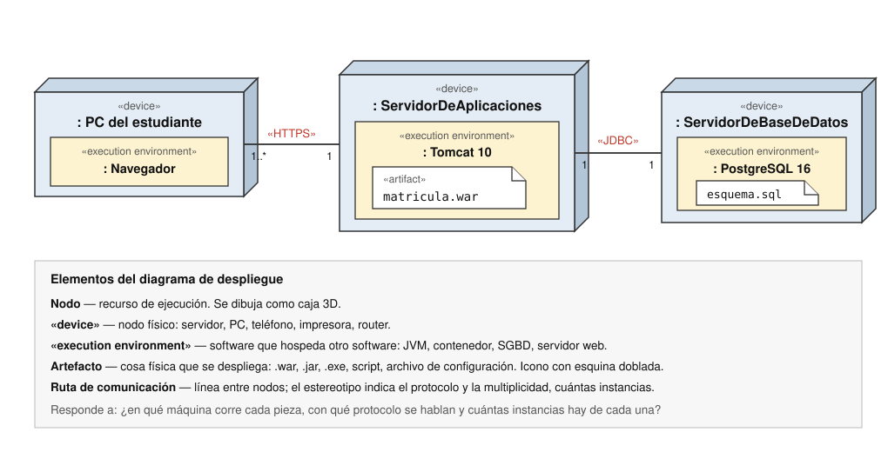](../assets/ads-uml-despliegue.svg)

---

## Cuándo vale la pena un diagrama de despliegue

<div class="grid">
<div>

### ✅ Sí, cuando…
- El sistema es **distribuido**: varias máquinas, varios servicios
- Hay **requisitos no funcionales** de disponibilidad, latencia o escalado
- Hay que explicarle la topología a **operaciones** o a seguridad
- Se está diseñando el **plan de despliegue** o el diagrama de red
</div>
<div>

### 🚫 No hace falta cuando…
- Todo corre en **una sola máquina** y nadie lo va a discutir
- El diagrama solo repetiría lo que ya dice un `docker-compose.yml`
- Se dibuja «porque toca», sin que nadie tenga una decisión que tomar
</div>
</div>

| Pregunta del negocio | Lo que se ve en el diagrama |
|:--|:--|
| «¿Aguanta 5 000 usuarios?» | La multiplicidad `1..*` en el nodo de aplicación → hay balanceo |
| «¿Y si se cae la base de datos?» | Un solo nodo de BD sin réplica → punto único de falla |
| «¿Los datos viajan cifrados?» | El estereotipo de la ruta de comunicación: `«HTTPS»` vs `«HTTP»` |

---

## Diagrama de componentes

[](../assets/ads-uml-componentes.svg)

---

## Componentes, clases, paquetes y nodos

| Diagrama | Unidad | Responde | Nivel |
|:--|:--|:--|:--|
| **Clases** | Clase | ¿Qué conceptos hay y cómo se relacionan? | Detalle lógico |
| **Paquetes** | Paquete | ¿Cómo se agrupa el modelo y qué depende de qué? | Organización lógica |
| **Componentes** | Componente | ¿Qué piezas reemplazables hay y qué contratos ofrecen? | Arquitectura lógica |
| **Despliegue** | Nodo + artefacto | ¿Dónde se instala cada pieza y con qué protocolo se hablan? | Arquitectura física |

<div class="grid">
<div>

### 🧩 Componente vs. paquete
El **paquete** solo agrupa. El **componente** además **encapsula**: expone interfaces y esconde su interior
</div>
<div>

### 📦 Componente vs. artefacto
El componente es la **pieza lógica** (`GestionMatricula`); el artefacto es el **archivo físico** que la contiene (`matricula.war`)
</div>
</div>

---

<!-- _class: cover -->
<style scoped>
section {
  --cover: url(../assets/img_00036_.png);
}
</style>
# Actividad y máquinas de estado
## Contenidos
- Diagrama de actividad: el flujo del proceso
- Notación y elementos
- Casos de estudio
- Máquinas de estado: el ciclo de vida de un objeto

---

## Diagrama de actividad: conceptos

<split-slide style="--left: 52%; --right: 48%;">
<div>

- Los diagramas de actividad modelan el **flujo, o proceso**, en un sistema. Por lo tanto, se parecen a los diagramas de flujo
- El modelado de un flujo se puede realizar a **tres niveles**:

<div class="grid">
<div>

### 🏢 Proceso de negocio
Cómo trabaja la organización
</div>
<div>

### 📄 Dentro de un caso de uso
El flujo básico y sus alternativas
</div>
<div>

### 🔀 Entre casos de uso
Cómo se encadenan varios
</div>
</div>
</div>
<div>

### Por qué se usa tanto
- Es el **único** diagrama UML que un usuario no técnico entiende sin explicación previa
- Hace visibles los **traspasos** entre áreas, que es donde se pierde el tiempo en los procesos reales
- Sirve igual para **documentar el proceso actual** que para **proponer el mejorado**
</div>
</split-slide>

---

## Notación del diagrama de actividad

[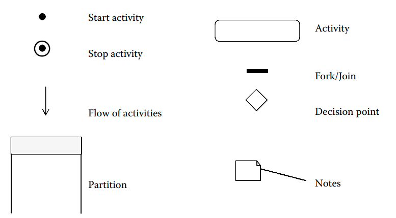](../assets/ads-uml-act-notacion.png)

> *Notación del diagrama de actividades*. Unhelkar (2018)

---

## Elementos, uno por uno

<steps>
<step>

### Actividad / acción *(activity / action state)*
- Representa algún tipo de **procesamiento**: «Vender producto», «Reservar libro», «Seleccionar tipo de combustible»
- Una **actividad** es susceptible de descomponerse en varias sub-actividades, que se detallan aparte en otro diagrama de actividad
- Algunos autores distinguen entre **actividades** y **acciones**: las segundas son **atómicas**, no pueden descomponerse

- 💡 Nombre en formato **verbo + objeto**: `Registrar pedido`, no `Pedido` ni `Registro`

</step>
<step>

### Estado inicial y estado final

<div class="grid">
<div>

### ⚫ Estado inicial
Identifica el **origen** de las transiciones por las que va a pasar el flujo. Un diagrama de actividades tiene **un solo** estado inicial
</div>
<div>

### ⦿ Estado final
Es el **último eslabón** del flujo de transiciones. Puede haber **varios** en un mismo diagrama
</div>
</div>

### Transición *(control-flow)*
- Refleja el **paso de una actividad a otra**; indica así la **precedencia** entre dos actividades
- Se dibuja como una flecha simple. Si sale de una decisión, lleva una **guarda** entre corchetes

</step>
<step>

### Decisión *(if)*
- En base a una **condición** se procesará una acción u otra
- Notación: **rombo**. Cada rama sale etiquetada con su guarda: `[hay cupo]` / `[else]`
- Las guardas deben ser **excluyentes** y **cubrir todos los casos**

### Regiones o particiones *(swimlanes)*
- Permiten identificar las **responsabilidades de los diferentes actores** en un caso de uso
- Las actividades y el flujo se van **particionando** de manera que queda claro qué acción debe ejecutar cada actor
- 🔑 Cada flecha que **cruza** de una calle a otra es un **traspaso**: ahí vive el riesgo y el retraso del proceso

</step>
<step>

### Acciones concurrentes *(fork / join)*
- Son actividades que pueden ocurrir **en paralelo**
- El **fork** (barra gruesa que se abre) divide el flujo; el **join** (barra que se cierra) lo vuelve a unir

> En un lavado de autos, una vez lavada la carrocería hay personas encargadas de lustrar el interior y de dar brillo a las ruedas

- El **join** implica que las actividades posteriores deben **sincronizar** las tareas ejecutadas en paralelo: lustrar el interior y lavar las ruedas deben **completarse ambas** para que siga la acción siguiente
- ⚠️ Todo lo que se abre con un `fork` debe cerrarse con un `join`

</step>
</steps>

---

## Ejemplo: registro de un paciente

[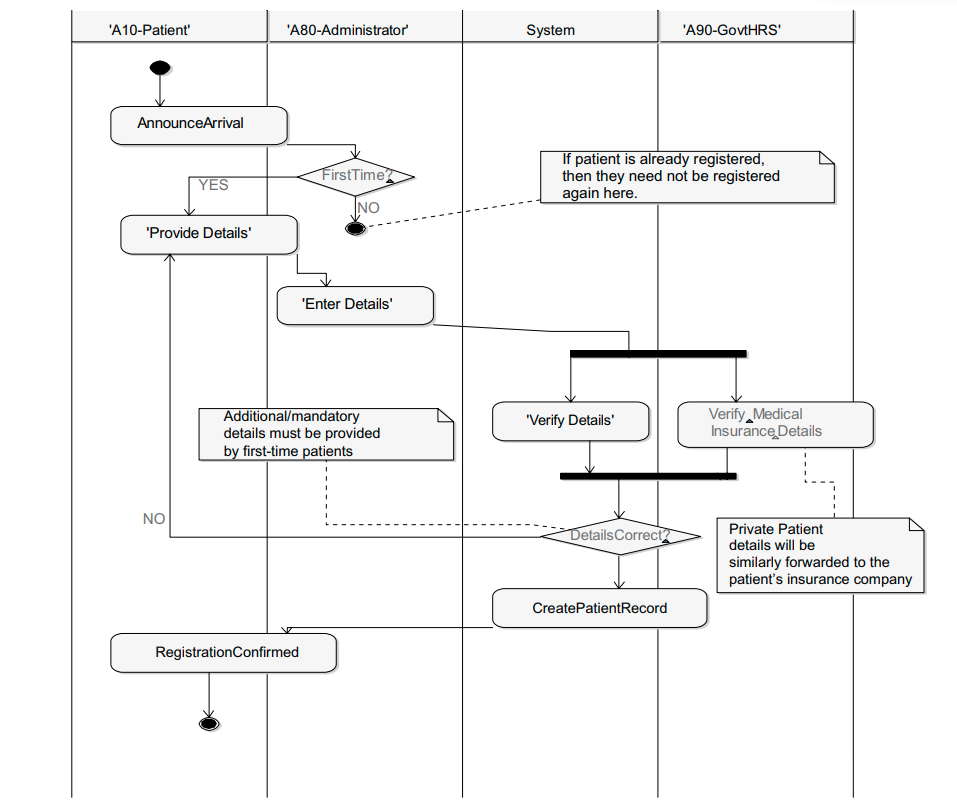](../assets/ads-uml-act-paciente.png)

> *RegistersPatient activity diagram*. Unhelkar (2018)

---

## Caso de estudio: cuenta corriente

<steps>
<step>

### El escenario
- Vamos a modelar el **pago de un cliente** a través de un cajero por mostrador
- El cajero **identifica al cliente** en la cuenta corriente del sistema, seleccionando el criterio de búsqueda:

[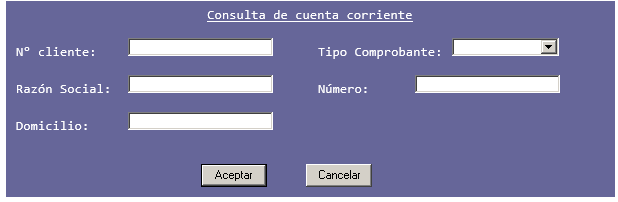](../assets/ads-uml-act-cc-pantalla1.png)

</step>
<step>

### El cliente elige cómo pagar
- El cajero le indica los **comprobantes pendientes de pago**; entonces el cliente elige el **medio de pago** y los comprobantes a cancelar:

[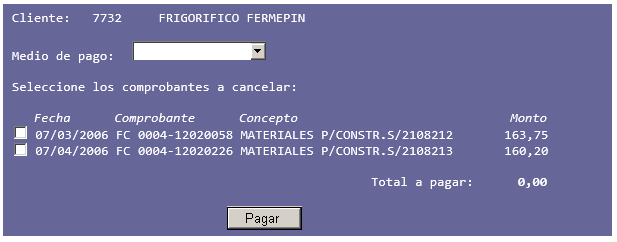](../assets/ads-uml-act-cc-pantalla2.png)

</step>
<step>

### Lo que hace el sistema
- Si el medio de pago es **tarjeta de crédito**, el sistema debe informar al sistema externo *«Tarjeting System»*
- Además el sistema:
  - **Aplicará los comprobantes pagados** —actualizará los montos pendientes de cada comprobante— generando el **recibo** correspondiente
  - **Actualizará la deuda** del cliente
  - **Notificará a contabilidad** para generar el asiento que refleje el pago en la contabilidad

</step>
<step>

### El método para construirlo
1. Encontrar los **actores** de este caso de uso y qué **responsabilidades** cumplen → serán las **calles**
2. Identificar las **actividades/acciones** que componen el caso de uso: si hay **concurrencia** (forks), **decisiones** (ifs) y cuál es el **orden** que sigue cada una (flujos de control)
3. Identificar si alguna de las acciones **recibe o produce un objeto**

- 💡 Posiblemente **todas** las acciones generan algún tipo de objeto —un recibo, un criterio de selección, un asiento contable— pero solo se muestran los objetos que **sea importante mostrar**

</step>
</steps>

---

## Actividad 5: construye el diagrama de cuenta corriente

<split-slide style="--left: 50%; --right: 50%;">
<div>

### Qué hacer
1. Definan las **calles**: ¿cuántos actores intervienen?
2. Coloquen las actividades en la calle de quien las ejecuta
3. Marquen la **decisión** del medio de pago
4. Muestren el objeto **Recibo** donde se produce
</div>
<div>

### Preguntas de control
- ¿El *Tarjeting System* es una calle o una actividad?
- ¿Las tres acciones finales del sistema son **secuenciales** o van en un `fork`?
- ¿Cuántas flechas **cruzan** de una calle a otra?
</div>
</split-slide>

- ⏱️ 20 minutos

---

## Cuenta corriente: una solución posible

<hidden label="Solución">

[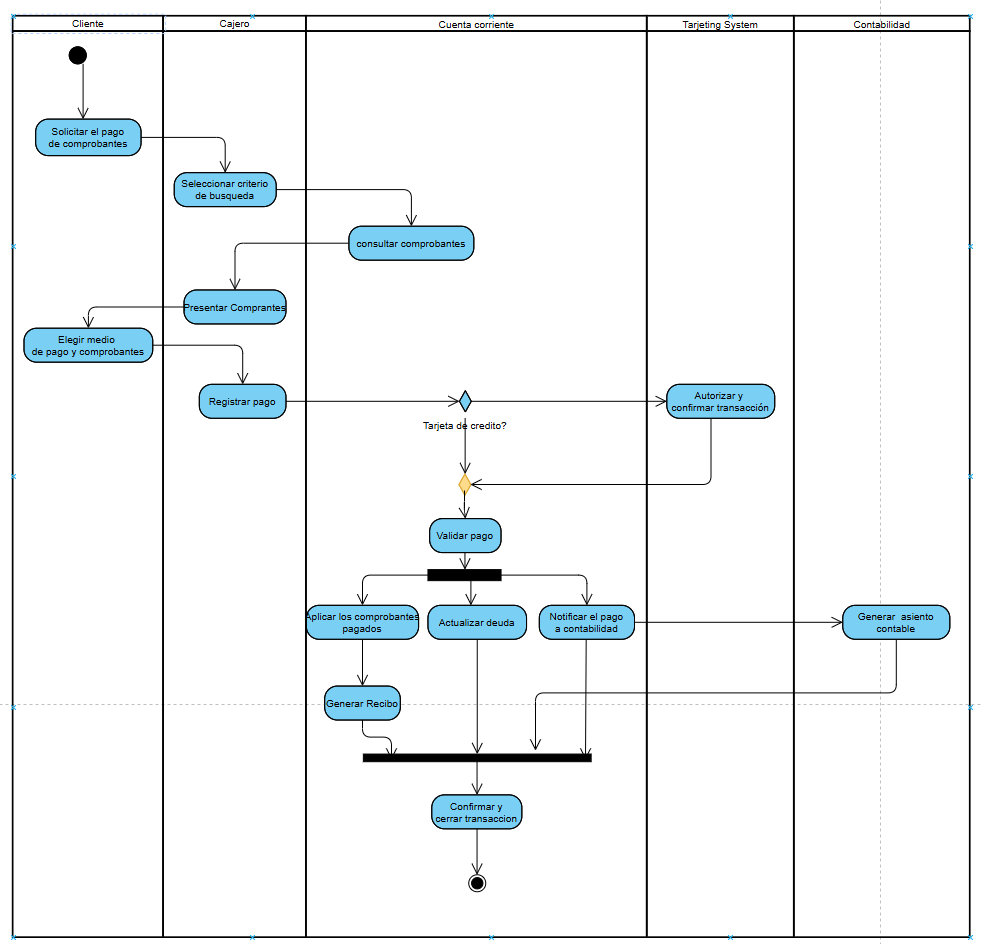](../assets/da-cuenta-corriente-cajero.png)

</hidden>

---

## Concurrencia: el caso del *fast food*

<steps>
<step>

### El escenario
- El diagrama de actividades también resulta útil para mostrar **transiciones simultáneas**. Pensemos cómo es la operación de un local de comida rápida:
  1. Hacemos el **pedido** al cajero, en base a las 213 promociones posibles de hamburguesas con papas fritas
  2. El cajero hace el pedido por altavoz, o bien se lanza en una carrera meteórica para **llenar la gaseosa**, **recibir la hamburguesa**, **capturar las papas fritas**, **emitir el ticket** y, al mismo tiempo, **cobrarnos** — ¡eso es lo que se dice concurrencia!
  3. Por último, nos pregunta si queremos **agregar aderezos** y nos da la bandeja con sonrisa angelical

</step>
<step>

### La solución
- Tomaremos como una **acción atómica** la preparación de la comida. Lo que interesa es cómo mostrar las actividades que **se superponen en el tiempo**

[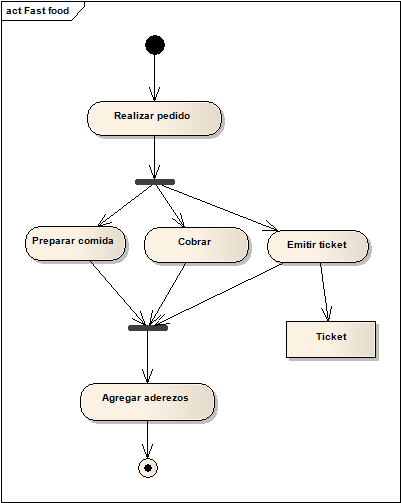](../assets/ads-uml-act-fastfood.png)

</step>
</steps>

---

## ¿Quién lo hace y para quién?

| Pregunta | Respuesta |
|:--|:--|
| **¿Quién hace** el diagrama de actividad? | La persona **analista funcional** |
| **¿Para quién** es? | Puede servir para el **usuario final**: no estamos explicando técnicamente cómo resolver el problema. Es útil para mostrar los **actores** que intervienen en cada caso de uso y su **responsabilidad** |
| **¿Y para quien programa?** | Le sirve como **visión general** del proceso, como explicación funcional del código que va a desarrollar — pero no mucho más que eso |
| **¿Cuándo** conviene hacerlo? | Cuando queramos **analizar un proceso** —para entenderlo o para mejorarlo— sin necesidad de bajar al detalle de cómo implementarlo |

- 💡 Es el diagrama con mejor relación **esfuerzo / valor** en las primeras reuniones con el usuario

---

## Máquina de estados

[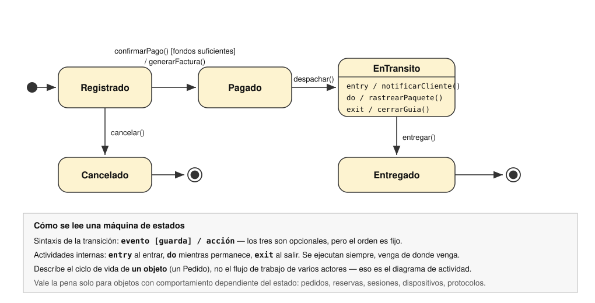](../assets/ads-uml-estados.svg)

---

## Elementos de la máquina de estados

| Elemento | Notación | Qué significa |
|:--|:--|:--|
| **Estado** | Rectángulo redondeado | Una **situación** en la vida del objeto en la que satisface una condición o espera un evento |
| **Estado inicial** | Círculo relleno ⚫ | Dónde empieza la vida del objeto. Solo uno |
| **Estado final** | Círculo con anillo ⦿ | Fin del ciclo de vida. Puede haber varios |
| **Transición** | Flecha entre estados | El paso de un estado a otro |
| **Evento** | `confirmarPago()` | El **disparador** de la transición |
| **Guarda** | `[fondos suficientes]` | **Condición** que debe cumplirse para que la transición ocurra |
| **Acción** | `/ generarFactura()` | Lo que se **ejecuta** durante la transición |
| **Actividades internas** | `entry` · `do` · `exit` | Al **entrar**, **mientras permanece** y al **salir** del estado |

- Sintaxis completa de una transición: `evento [guarda] / acción` — los tres son opcionales, el orden no

---

## Estados compuestos e historia

<steps>
<step>

### Estado compuesto
- Un estado puede **contener** su propia máquina de estados
- Evita la explosión de transiciones: si desde cualquier subestado se puede `cancelar()`, se dibuja **una sola** transición desde el borde del estado compuesto

```
┌─ EnProceso ─────────────────────────────┐
│  ⚫→ Pagado ──despachar()──▸ EnTransito  │
└─────────────────────────────────────────┘
        │ cancelar()
        ▼
    Cancelado
```

</step>
<step>

### Otros elementos útiles

<div class="grid">
<div>

### 🕘 Pseudoestado de historia (H)
Al volver a entrar en un estado compuesto, **retoma el subestado** donde se quedó
</div>
<div>

### 🔀 Transición automática
Sin evento: se dispara **al terminar** la actividad `do` del estado
</div>
<div>

### 🔁 Auto-transición
Sale y vuelve al mismo estado: **sí** ejecuta `exit` y `entry` otra vez
</div>
</div>

- ⚠️ Cuidado con el **estado implícito en un atributo**: si tienen un campo `estado` de tipo texto con ocho valores posibles y condicionales por todas partes, esa es exactamente la señal de que hacía falta esta máquina de estados

</step>
</steps>

---

## Actividad vs. máquina de estados

<split-slide style="--left: 50%; --right: 50%;">
<div>

### 🔀 Diagrama de actividad
**El flujo de un proceso**

- El sujeto es **el proceso**: varios actores participan
- Los nodos son **acciones** que alguien ejecuta
- Las particiones dicen **quién hace qué**
- Se lee de arriba abajo, como un procedimiento
- *«¿Cómo se tramita una matrícula?»*
</div>
<div>

### 🔵 Máquina de estados
**El ciclo de vida de un objeto**

- El sujeto es **un solo objeto**: `Pedido`, `Reserva`, `Sesion`
- Los nodos son **situaciones** en que se encuentra
- Las transiciones dicen **qué evento** lo cambia
- No hay orden global: hay eventos que llegan
- *«¿Por qué estados pasa un pedido?»*
</div>
</split-slide>

- ❓ *«Modelar cómo se procesa una devolución, con el almacén y contabilidad»* → <spoiler>actividad</spoiler>
- ❓ *«Modelar en qué situaciones puede estar una reserva de hotel»* → <spoiler>máquina de estados</spoiler>

---

## Cómo se conecta todo

| Diagrama | Momento | Entrada | Salida que alimenta a... |
|:--|:--|:--|:--|
| **Casos de uso** | Requerimientos | Visión, personas interesadas | Actividad · Secuencia |
| **Actividad** | Análisis | Flujo del caso de uso | Operaciones · Máquina de estados |
| **Clases (dominio)** | Análisis | Sustantivos del caso de uso | Clases de diseño |
| **Secuencia / comunicación** | Diseño | Un escenario del caso de uso | **Operaciones** de las clases de diseño |
| **Máquina de estados** | Diseño | Clases con comportamiento dependiente del estado | Reglas de validación |
| **Paquetes** | Arquitectura | Clases de diseño | Estructura del código |
| **Componentes** | Arquitectura | Paquetes e interfaces | Despliegue |
| **Despliegue** | Arquitectura | Componentes y artefactos | Plan de instalación |

<div class="grid">
<div>

### 🧵 El hilo conductor
**Trazabilidad**: cada diagrama se justifica en el anterior. Un diagrama huérfano sobra
</div>
<div>

### ⚠️ La prueba final
Si borro este diagrama, ¿alguien lo echa de menos? Si la respuesta es no, no debió existir
</div>
</div>

---

## Referencias

<style scoped>
ul { font-size: 0.86rem; }
ul li { margin-block: 0.2em; }
</style>

- Object Management Group (2017). *[OMG Unified Modeling Language (OMG UML), Version 2.5.1](https://www.omg.org/spec/UML/2.5.1/)*. {Especificación oficial}
- Unhelkar, B. (2018). *Software Engineering with UML*. CRC Press. {Notación de clases, actividades y ejemplos}
- Dennis, A., Haley Wixom, B., Tegarden, D. (2015). *Systems Analysis & Design: An Object-Oriented Approach with UML*. Wiley, 5a. edición.
- Kruchten, P. (1995). *[Architectural Blueprints — The «4+1» View Model of Software Architecture](https://www.cs.ubc.ca/~gregor/teaching/papers/4+1view-architecture.pdf)*. IEEE Software, 12(6).
- Booch, G., Rumbaugh, J., Jacobson, I. (2005). *The Unified Modeling Language User Guide*. 2da. edición. Addison-Wesley.
- Larman, C. (2004). *Applying UML and Patterns*. 3ra. edición. Prentice Hall. {Modelo de dominio, realización de casos de uso}
- Fowler, M. (2003). *UML Distilled*. 3ra. edición. Addison-Wesley. {Referencia breve de notación}
- Martin, R. C. (2017). *Clean Architecture*. Prentice Hall. {Dependencias entre paquetes y capas}
- [UML Diagrams](https://www.uml-diagrams.org/) — referencia en línea de la notación, diagrama por diagrama.
- [Visual Paradigm — UML Guide](https://www.visual-paradigm.com/guide/uml-unified-modeling-language/) — tutoriales y ejemplos por tipo de diagrama.

<script src="../assets/steps.js"></script>
<script src="../assets/image-modal.js"></script>
<script src="../assets/hidden.js"></script>
